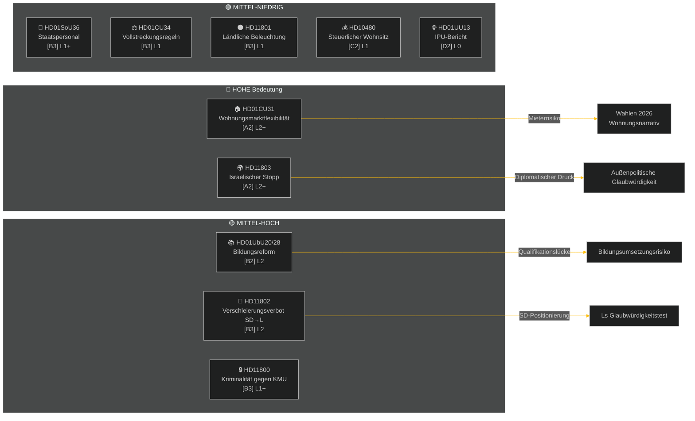

# Zusammenfassung — Wochenbericht 2026-05-09

**Klassifizierung**: ÖFFENTLICH | **Zuverlässigkeit**: MITTEL-HOCH [B2] | **Horizont**: T+72h / T+7d
**Autor**: Riksdagsmonitor AI Intelligence System | **Riksmöte**: 2025/26

---

## BLUF (Kernaussage)

Die Woche vom 2.–9. Mai 2026 brachte einen Cluster inländischer Gesetzgebung zu Wohnungswesen, Bildung, Sozialschutz und Rechtsstaatlichkeit hervor, während außenpolitische Interpellationen eine scharfe parteiübergreifende Kluft über die Beschlagnahme eines unter schwedischer Flagge fahrenden Schiffes durch Israel in internationalen Gewässern offenbarten. Mit den schwedischen Wahlen 2026 noch etwa 16 Wochen entfernt, ist bei jeder größeren Debatte politische Signalisierung für den Wahlkampf über den unmittelbaren Gesetzgebungszweck hinaus erkennbar.

**Leitende Einschätzung**: Die Tidö-Koalition (M, SD, KD, L) absolviert einen Gesetzgebungssprint mit dem Ziel, wichtige politische Erfolge vor der Sommerpause und den Wahlen im September 2026 zu sichern. Das Wohnungsmarktflexibilitätspaket (HD01CU31), die Lehrerqualifikationsreform (HD01UbU28) und die Verbesserung der Personalplanung in der Sozialversicherung (HD01SoU36) stärken gemeinsam das Regierungsnarrativ der „Reformproduktion". Jedoch bedrohen der Israel/Gaza-Flottenvorfall (HD11803), die ländliche Straßenbeleuchtungskontroverse (HD11801) und SDs Verschleierungsverbots-Interpellation (HD11802) die öffentliche Kommunikation der Koalition und könnten die Opposition energetisieren.

---

## Top-5 Was-bedeutet-das-Einschätzungen

| # | Einschätzung | Vertrauen | Horizont |
|---|----------|-----------|---------|
| J1 | HD01CU31 Wohnungsflexibilitätsreform **dominiert die politischen Medien der Woche** und berührt direkt Millionen schwedischer Mieter; Opposition (S, V, MP) verstärkt Mieterhöhungsrisiken | HOCH [A2] | T+72h |
| J2 | HD11803 (Israelis stoppen Schweden) **setzt Außenministerin unter Druck**, außerhalb parlamentarischer Verfahren öffentlich zu erklären; die parteiübergreifende Forderung ist bipartisan | HOCH [A2] | T+72h |
| J3 | HD11802 (Verschleierungsverbot, SD→L) **enthüllt Vorwahlpositionierung zur Identitätspolitik** seitens SD gegenüber Ls Integrationsrekord; L-Minister Mohamsson steht einem Glaubwürdigkeitstest früherer Äußerungen gegenüber | MITTEL [B3] | T+7d |
| J4 | HD01UbU28 (Lehrerqualifikationen im 10-Jahres-Schulsystem) **trifft auf Umsetzungswiderstand** — Schulbetreiber haben keine Personalpipeline zur Erfüllung neuer Kompetenzanforderungen | MITTEL [B3] | T+7d |
| J5 | HD11801 (Abbau ländlicher Straßenbeleuchtung) **energetisiert ländlichen Wahlkreisdruck** auf KD- und C-Abgeordnete; ländliche Koalitionsunterstützung ist eine strukturelle Schwachstelle vor den Wahlen | MITTEL [B3] | T+7d |

---

## Dokumenten-Geheimdienstkarte

---

## Makroökonomischer Kontext

**IWF WEO Apr-2026 (SWE)** — Status: verschlechtert (WEO/FM Datamapper betriebsbereit; SDMX 404):
- BIP-Wachstum 2026: **~1,2%** (Erholung bleibt gedämpft)
- Arbeitslosigkeit: **~8,1%** (strukturelles Plateau oberhalb von Pre-Pandemic-Ziel)
- Leitzins (Riksbanken): **2,25%** (Zinssenkungszyklus Jun-2025 weitgehend abgeschlossen)
- Haushaltssaldonziel: innerhalb EU-Stabilitätspakt-Grenzen

Das anhaltend schwache Wachstumsumfeld unterstreicht die politische Bedeutung der Wohnungserschwinglichkeit (CU31) und ländlicher Dienstleistungskürzungen (HD11801), da das verfügbare Haushaltseinkommen unter Druck bleibt. SDs Verschleierungsverbots-Interpellation (HD11802) ist darauf ausgerichtet, identitätspolitische Ängste zu kanalisieren, die in schwachen Wachstumszyklen stärker werden.

---

## Geheimdienstanalyse: Leserhilfe

Diese Analyse umfasst **6 Ausschussberichte** (bet) und **5 parlamentarische Fragen/Interpellationen** (fråga/interpellation) aus dem Riksmöte 2025/26. Alle Dokumente abgerufen über riksdag-regering MCP am 2026-05-09; Daten vom 2026-05-08 (1-tägiger Rückblick). Für dieses Datum wurden keine Abstimmungen (voteringar) registriert.

**Zentrale Unsicherheit**: Die Wochendokumente sind Ausschussberichte in der Debattenphase — endgültige Plenarüberweisungen sind noch nicht erfasst. Ergebniszuverlässigkeit hängt von Koalitionsdisziplin und potenziellen Dissidentenmotionen ab.

---

*Quelle: riksdag-regering MCP | IWF WEO-2026-04 | Riksdagsmonitor Wochenbericht 2026-05-09*

<!-- source-sha: 3b789b190efe65d2af879b1da666d37f948938a3 -->
