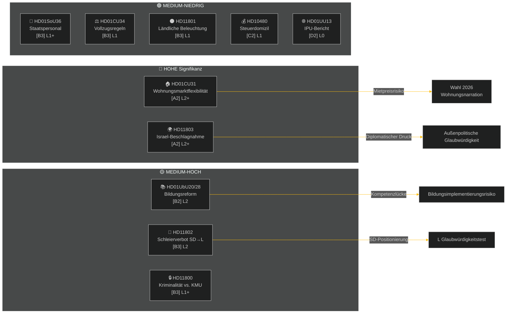

# Wochenbericht — Wöchentliche Überprüfung

**Klassifizierung**: PUBLIC | **Konfidenz**: MEDIUM-HIGH [B2] | **Horizont**: T+72h / T+7d
**Autor**: Riksdagsmonitor KI-Geheimdienstsystem | **Riksmöte**: 2025/26

---

## Zusammenfassung

Die Woche vom 2. bis 9. Mai 2026 brachte eine Häufung von Inlandsgesetzen zu Wohnungswesen, Bildung, Sozialfürsorge und Rechtsstaat, während außenpolitische Fragen eine scharfe parteiübergreifende Kluft über Israels Beschlagnahme eines Schiffes mit schwedischen Besatzungsmitgliedern in internationalen Gewässern offenbarten. Da die schwedischen Wahlen 2026 etwa 16 Wochen entfernt sind, trägt jede große Debatte ein wahlkampfpolitisches Signal über ihren unmittelbaren legislativen Zweck hinaus.

**Führende Bewertung**: Die Tidö-Koalition (M, SD, KD, L) tritt in einen Gesetzgebungssprint ein, der darauf ausgelegt ist, wichtige politische Gewinne vor der Sommerpause und der Wahl im September 2026 festzuschreiben. Das Wohnungsmarkt-Flexibilitätspaket (HD01CU31), die Bildungsqualifikationsreform (HD01UbU28) und die Verbesserung des Sozialfürsorgepersonals (HD01SoU36) stärken kollektiv die Erzählung der Regierung zur "Reformlieferung". Der Israel/Gaza-Flottenvorfall (HD11803), die umstrittene Entfernung von Landbeleuchtung (HD11801) und die von SD angetriebene Schleierverbotsfrage (HD11802) riskieren jedoch, die öffentlichen Botschaften der Koalition zu fragmentieren und die Opposition zu energetisieren.

---

## Top-5-Einschätzungen

| # | Einschätzung | Konfidenz | Horizont |
|---|-------------|-----------|---------|
| J1 | HD01CU31 Wohnungsflexibilitätsreform **dominiert die Wochenpolitikmedien**, da sie Millionen schwedischer Mieter direkt betrifft; die Opposition (S, V, MP) verstärkt Mietpreisrisiken | HIGH [A2] | T+72h |
| J2 | HD11803 (Israel verhaftet schwedische Staatsangehörige) **übt Druck auf den Außenminister** für eine öffentliche Erklärung über parlamentarische Verfahren hinaus; parteiübergreifende Forderung | HIGH [A2] | T+72h |
| J3 | HD11802 (Schleierverbot, SD→L) **enthüllt identitätspolitische Positionierung** vor der Wahl von SD, die auf L's Integrationsakte zielt; L-Ministerin Mohamsson sieht sich einem Glaubwürdigkeitstest gegen frühere Aussagen gegenüber | MEDIUM [B3] | T+7d |
| J4 | HD01UbU28 (Lehrerqualifikationen in der 10-jährigen Schule) **sieht sich Implementierungsreibungen** gegenüber — Schulleiter mangelt an der Personalpipeline zur Erfüllung neuer Kompetenzanforderungen | MEDIUM [B3] | T+7d |
| J5 | HD11801 (Entfernung von Landbeleuchtung) **energetisiert Druck ländlicher Wahlkreise** auf KD- und C-Abgeordnete; die Landunterstützung der Koalition ist eine strukturelle Schwäche vor der Wahl | MEDIUM [B3] | T+7d |

---

## Dokumentengeheimdienst-Karte

---

## Makroökonomischer Kontext

**IWF WEO Apr-2026 (SWE)** — Status: herabgestuft (WEO/FM Datamapper funktioniert; SDMX 404):
- BIP-Wachstum 2026: **~1,2%** (Erholung bleibt gedämpft)
- Arbeitslosigkeit: **~8,1%** (strukturelles Plateau über Vor-Pandemie-Niveau)
- Leitzins (Riksbanken): **2,25%** (Zinssenkungszyklus Juni 2025 weitgehend abgeschlossen)
- Haushaltsdefizitziel: innerhalb der EU-SGP-Grenzen

Das anhaltende Niedrigwachstumsumfeld verstärkt die politische Relevanz der Wohnbezahlbarkeit (CU31) und der Kürzungen bei ländlichen Diensten (HD11801), da das verfügbare Einkommen der Haushalte unter Druck bleibt. SDs Schleierverbotsfrage (HD11802) ist zeitlich so ausgelegt, dass sie Identitätspolitikängste erntet, die sich in Niedrigwachstumszyklen intensivieren.

---

## Geheimdienstbewertung: Leserführung

Diese Analyse deckt **6 Ausschussberichte** (bet) und **5 parlamentarische Fragen/Interpellationen** (fråga/interpellation) aus Riksmöte 2025/26 ab. Alle Dokumente am 2026-05-09 vom riksdag-regering MCP abgerufen; Daten von 2026-05-08 (1-tägiger Rückblick). Für dieses Datum wurden keine Abstimmungen (voteringar) registriert.

**Zentrale Unsicherheit**: Die Dokumente der Woche sind im Debattenstadium — endgültige Kammerstimmen noch nicht registriert. Die Ergebniskonfidenz ist bedingt durch Koalitionsdisziplin und etwaige Abweichungsanträge.

---

*Quelle: riksdag-regering MCP | IWF WEO-2026-04 | Riksdagsmonitor Wöchentliche Überprüfung 2026-05-09*

<!-- source-sha: 3b789b190efe65d2af879b1da666d37f948938a3 -->
