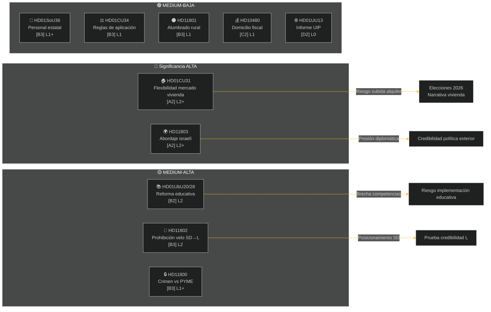

# Informe Semanal — Revisión Semanal

**Clasificación**: PUBLIC | **Nivel de confianza**: MEDIUM-HIGH [B2] | **Horizonte**: T+72h / T+7d
**Autor**: Sistema de Inteligencia IA Riksdagsmonitor | **Riksmöte**: 2025/26

---

## Resumen Ejecutivo

La semana del 2 al 9 de mayo de 2026 produjo un conjunto de leyes nacionales sobre vivienda, educación, asistencia social y estado de derecho, mientras que las cuestiones de política exterior revelaron una aguda brecha transpartidista sobre el abordaje por Israel de un barco con miembros de la tripulación sueca en aguas internacionales. Con las elecciones suecas de 2026 a aproximadamente 16 semanas, cada gran debate lleva una señal de campaña electoral más allá de su propósito legislativo inmediato.

**Evaluación principal**: La coalición Tidö (M, SD, KD, L) entra en un sprint legislativo diseñado para consolidar las principales ganancias políticas antes de las vacaciones de verano y las elecciones de septiembre de 2026. El paquete de flexibilidad del mercado de la vivienda (HD01CU31), la reforma de calificaciones educativas (HD01UbU28) y la mejora del personal de asistencia social (HD01SoU36) fortalecen colectivamente la narrativa del gobierno sobre la "entrega de reformas". Sin embargo, el incidente de la flotilla Israel/Gaza (HD11803), la controvertida eliminación del alumbrado rural (HD11801) y la cuestión del velo impulsada por el SD (HD11802) corren el riesgo de fragmentar los mensajes públicos de la coalición y energizar a la oposición.

---

## Top-5 Evaluaciones

| # | Evaluación | Confianza | Horizonte |
|---|-----------|-----------|----------|
| J1 | La reforma de flexibilidad de vivienda HD01CU31 **dominará los medios políticos de la semana** ya que afecta directamente a millones de inquilinos suecos; la oposición (S, V, MP) amplificará los riesgos de subida de alquileres | HIGH [A2] | T+72h |
| J2 | HD11803 (Israel arresta a ciudadanos suecos) **presionará al ministro de Asuntos Exteriores** para una declaración pública más allá del procedimiento parlamentario; demanda transpartidista | HIGH [A2] | T+72h |
| J3 | HD11802 (prohibición del velo, SD→L) **revela el posicionamiento político de identidad** antes de las elecciones del SD apuntando al historial de integración de L; la ministra L Mohamsson enfrenta una prueba de credibilidad contra declaraciones anteriores | MEDIUM [B3] | T+7d |
| J4 | HD01UbU28 (calificaciones docentes en la escuela de 10 años) **encontrará fricciones de implementación** — los directores escolares carecen del flujo de personal para cumplir con los nuevos requisitos de competencia | MEDIUM [B3] | T+7d |
| J5 | HD11801 (eliminación del alumbrado rural) **energizará la presión de los distritos rurales** sobre los representantes KD y C; el apoyo rural de la coalición es una vulnerabilidad estructural antes de las elecciones | MEDIUM [B3] | T+7d |

---

## Mapa de Inteligencia Documental

---

## Contexto Macroeconómico

**FMI WEO abr-2026 (SWE)**: Crecimiento PIB 2026 **~1,2%**, desempleo **~8,1%**, tipo de interés Riksbanken **2,25%**. El prolongado entorno de bajo crecimiento amplifica la relevancia política de la asequibilidad de la vivienda (CU31) y los recortes rurales (HD11801) porque los ingresos disponibles de los hogares siguen bajo presión.

---

## Evaluación de Inteligencia: Guía de Lectura

Este análisis cubre **6 informes de comisión** (bet) y **5 preguntas parlamentarias/interpelaciones** (fråga/interpellation) del Riksmöte 2025/26. Todos los documentos recuperados del riksdag-regering MCP el 2026-05-09; datos del 2026-05-08 (lookback 1 día). No se registraron votos (voteringar) para esta fecha.

**Incertidumbre central**: Los documentos de la semana están en etapa de debate — los votos finales en cámara aún no registrados. La confianza en los resultados está condicionada a la disciplina de la coalición y a las posibles mociones de desviación.

---

*Fuente: riksdag-regering MCP | FMI WEO-2026-04 | Riksdagsmonitor Revisión Semanal 2026-05-09*

<!-- source-sha: 3b789b190efe65d2af879b1da666d37f948938a3 -->
