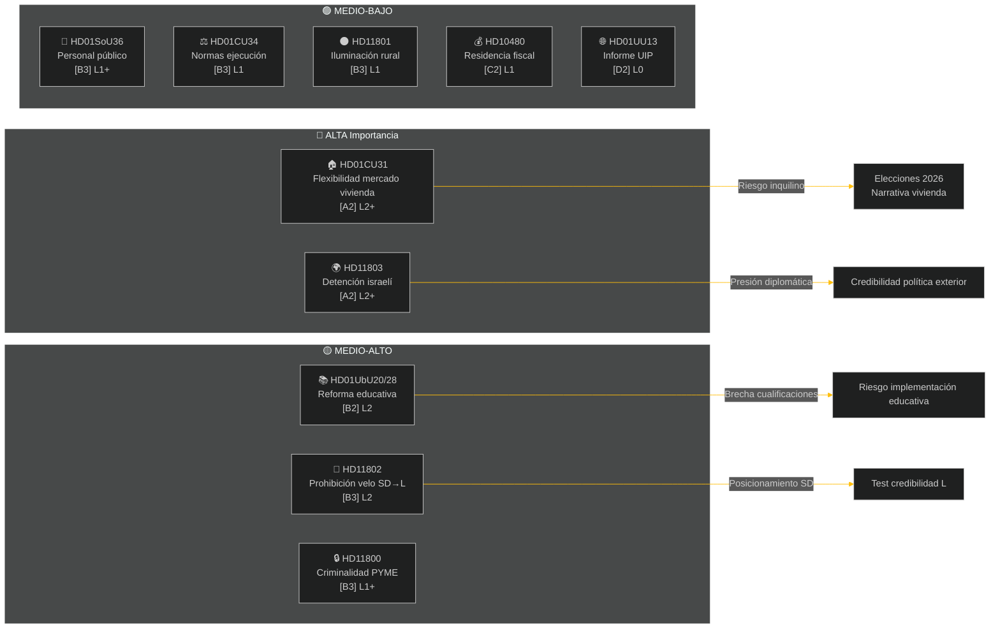

# Resumen ejecutivo — Revisión semanal 2026-05-09

**Clasificación**: PÚBLICO | **Fiabilidad**: MEDIO-ALTO [B2] | **Horizonte**: T+72h / T+7d
**Autor**: Riksdagsmonitor AI Intelligence System | **Riksmöte**: 2025/26

---

## BLUF (Mensaje central)

La semana del 2 al 9 de mayo de 2026 generó un conjunto de legislación doméstica sobre vivienda, educación, seguridad social y estado de derecho, mientras que las interpelaciones de política exterior revelaron una profunda división interpartidista en torno a la incautación por parte de Israel de un barco con bandera sueca en aguas internacionales. Con las elecciones suecas de 2026 a aproximadamente 16 semanas de distancia, cada gran debate lleva señalización electoral más allá del propósito legislativo inmediato.

**Evaluación directriz**: La coalición Tidö (M, SD, KD, L) lleva a cabo un sprint legislativo orientado a consolidar logros políticos importantes antes del receso veraniego y las elecciones de septiembre de 2026. El paquete de flexibilidad del mercado de la vivienda (HD01CU31), la reforma de las cualificaciones docentes (HD01UbU28) y la mejora de la planificación de personal en la seguridad social (HD01SoU36) refuerzan conjuntamente el relato gubernamental de «producción de reformas». Sin embargo, el incidente naval Israel/Gaza (HD11803), la polémica sobre la iluminación rural (HD11801) y la interpelación del SD sobre el velo (HD11802) amenazan con fragmentar la comunicación pública de la coalición y energizar a la oposición.

---

## Top-5 Evaluaciones «¿Qué significa esto?»

| # | Evaluación | Confianza | Horizonte |
|---|----------|-----------|---------|
| J1 | La reforma de flexibilidad de vivienda HD01CU31 **domina los medios políticos de la semana** al afectar directamente a millones de inquilinos suecos; la oposición (S, V, MP) amplifica los riesgos de subidas de alquiler | ALTO [A2] | T+72h |
| J2 | HD11803 (israelíes detienen a suecos) **presiona a la ministra de Asuntos Exteriores** para que haga una declaración pública fuera del procedimiento parlamentario; la demanda es bipartidista | ALTO [A2] | T+72h |
| J3 | HD11802 (prohibición del velo, SD→L) **revela posicionamiento preelectoral en política identitaria** por parte del SD frente al historial de integración del L; la ministra L Mohamsson enfrenta un test de credibilidad sobre declaraciones previas | MEDIO [B3] | T+7d |
| J4 | HD01UbU28 (cualificaciones docentes en el sistema escolar de 10 años) **encuentra resistencia a la implementación** — los operadores escolares carecen de cartera de personal para satisfacer los nuevos requisitos de competencias | MEDIO [B3] | T+7d |
| J5 | HD11801 (supresión de iluminación vial rural) **energiza la presión electoral rural** sobre diputados KD y C; el apoyo rural a la coalición es una vulnerabilidad estructural antes de las elecciones | MEDIO [B3] | T+7d |

---

## Mapa de inteligencia documental

---

## Contexto macroeconómico

**FMI WEO Abr-2026 (SWE)** — Estado: deteriorado (WEO/FM Datamapper operativo; SDMX 404):
- Crecimiento PIB 2026: **~1,2 %** (la recuperación sigue siendo moderada)
- Desempleo: **~8,1 %** (meseta estructural por encima del objetivo pre-pandemia)
- Tipo de interés de referencia (Riksbanken): **2,25 %** (ciclo de recortes jun-2025 en gran medida finalizado)
- Objetivo de saldo presupuestario: dentro de los límites del Pacto de Estabilidad de la UE

El entorno de crecimiento persistentemente débil subraya la relevancia política de la asequibilidad de la vivienda (CU31) y los recortes en servicios rurales (HD11801), dado que la renta disponible de los hogares sigue bajo presión. La interpelación del SD sobre el velo (HD11802) está diseñada para canalizar la ansiedad de política identitaria que se amplifica en ciclos de crecimiento débil.

---

## Análisis de inteligencia: Guía para el lector

Este análisis cubre **6 informes de comisión** (bet) y **5 preguntas/interpelaciones parlamentarias** (fråga/interpellation) del Riksmöte 2025/26. Todos los documentos extraídos vía MCP riksdag-regering el 2026-05-09; datos del 2026-05-08 (retrospectiva de 1 día). No se registraron votos (voteringar) para esa fecha.

**Incertidumbre clave**: Los documentos de la semana son informes de comisión en fase de debate — las votaciones plenarias finales aún no han sido registradas. La fiabilidad de los resultados depende de la disciplina de coalición y las posibles mociones disidentes.

---

*Fuente: MCP riksdag-regering | FMI WEO-2026-04 | Riksdagsmonitor Revisión semanal 2026-05-09*

<!-- source-sha: 3b789b190efe65d2af879b1da666d37f948938a3 -->
