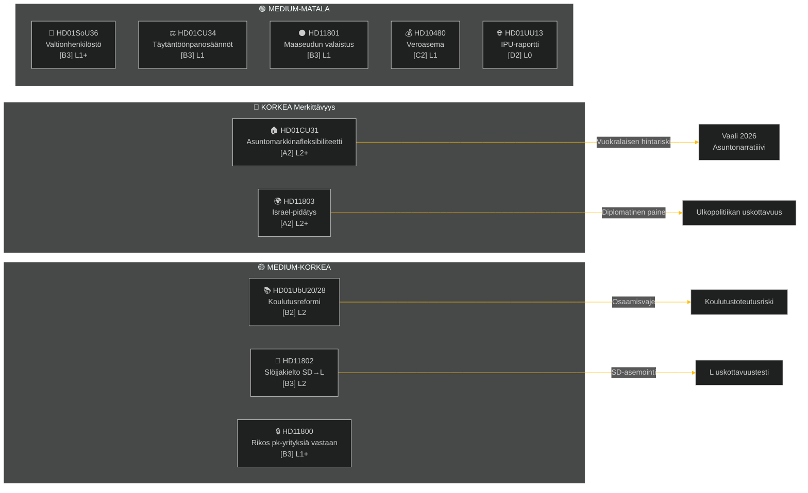

# Viikkoyhteenveto — Viikkoarviointi

**Luokittelu**: PUBLIC | **Luottamustaso**: MEDIUM-HIGH [B2] | **Horisontti**: T+72h / T+7d
**Tekijä**: Riksdagsmonitor AI-tiedustelupalvelu | **Riksmöte**: 2025/26

---

## Tiivistelmä

Viikko 2.–9. toukokuuta 2026 tuotti joukon asumisen, koulutuksen, sosiaalihuollon ja oikeusvaltion inrikeslakeja, kun ulkopoliittiset kysymykset paljastivat terävän puolueiden välisen kuilun Israelin pidätettyä kansainvälisillä vesillä aluksen, jonka miehistössä oli ruotsalaisia. Ruotsin vuoden 2026 vaalien ollessa noin 16 viikon päässä kantaa jokainen suuri debatti vaalipoliittisen signaalin välittömän lainsäädännöllisen tarkoituksensa tuolle puolen.

**Johtava arvio**: Tidö-koalitio (M, SD, KD, L) käynnistää lainsäädäntösprintin, jonka tarkoituksena on lukita tärkeimmät poliittiset saavutukset ennen kesälomaa ja syyskuun 2026 vaalia. Asuntomarkkinafleksibiliteettipaketti (HD01CU31), opettajankoulutuspätevyysreformi (HD01UbU28) ja sosiaalihuollon henkilöstön parantaminen (HD01SoU36) vahvistavat yhdessä hallituksen "uudistusten toimeenpano" -narratiivia. Israel/Gaza-flotillaincidentti (HD11803), maaseudun valaistusontroverssi (HD11801) ja SD-vetoinen slöjjakieltoasio (HD11802) saattavat kuitenkin hajauttaa koalition julkiset viestit ja energisoida opposition.

---

## Top-5-johtopäätökset

| # | Arvio | Luottamustaso | Horisontti |
|---|-------|---------------|-----------|
| J1 | HD01CU31 asuntofleksibiliteettireformi **hallitsee viikon poliittista mediaa**, sillä se vaikuttaa suoraan miljooniin ruotsalaisiin vuokralaisiin; oppositio (S, V, MP) vahvistaa vuokrankorotusriskejä | HIGH [A2] | T+72h |
| J2 | HD11803 (Israel pidätti ruotsalaisia kansalaisia) **asettaa ulkoministerin paineisiin** antaa julkinen lausunto parlamentaarisen menettelyn ulkopuolella; puolueiden välinen vaatimus | HIGH [A2] | T+72h |
| J3 | HD11802 (slöjjakielto, SD→L) **paljastaa identiteettipolitiikan asemoinnin** ennen vaalia, SD kohdistaa L:n integraatiorekisteriä; L-ministeri Mohamsson kohtaa uskottavuustestin aiempia lausuntojaan vastaan | MEDIUM [B3] | T+7d |
| J4 | HD01UbU28 (opettajapätevyydet 10-vuotisessa koulussa) **kohtaa toteutushaasteita** — koulunpitäjiltä puuttuu henkilöstöputki uusien pätevyysvaatimusten täyttämiseksi | MEDIUM [B3] | T+7d |
| J5 | HD11801 (maaseudun valaistuksen poisto) **energisoi maaseutuvaalipiirien paineen** KD- ja C-kansanedustajille; koalition maaseutukannatus on rakenteellinen haavoittuvuus ennen vaalia | MEDIUM [B3] | T+7d |

---

## Asiakirjatiedustelupaikka

---

## Makrotaloudellinen Konteksti

**IMF WEO huhtikuu-2026 (SWE)** — tila: heikentynyt (WEO/FM Datamapper toimii; SDMX 404):
- BKT-kasvu 2026: **~1,2%** (toipuminen pysyy vaimeana)
- Työttömyys: **~8,1%** (rakenteellinen tasanko pre-pandemia-tason yläpuolella)
- Ohjauskorko (Riksbanken): **2,25%** (kesäkuun 2025 koronlaskusykli pitkälti päättynyt)
- Budjettivajeen tavoite: EU:n vakaus- ja kasvusopimuksen rajoissa

Pitkittynyt matalankasvun ympäristö vahvistaa asumisen kohtuuhintaisuuden (CU31) ja maaseudun palveluiden leikkausten (HD11801) poliittista merkitystä, koska kotitalouksien käytettävissä olevat tulot pysyvät paineessa. SD:n slöjjakieltoasio (HD11802) on ajoitettu keräämään identiteettipolitiikan ahdistuksia, jotka voimistuvat matalankasvun sykleissä.

---

## Tiedusteluarviointi: Lukuohje

Tämä analyysi kattaa **6 valiokuntabetänkandea** (bet) ja **5 parlamentaarista kysymystä/interpellaatiota** (fråga/interpellation) riksmötestä 2025/26. Kaikki asiakirjat haettu riksdag-regering MCP:stä 2026-05-09; data 2026-05-08:sta (1 päivän lookback). Tälle päivämäärälle ei rekisteröity äänestyksiä (voteringar).

**Keskeinen epävarmuus**: Viikon asiakirjat ovat väitelavasteusvaiheen valiokuntabetänkandeita — lopulliset täysistuntoäänestykset eivät vielä rekisteröity. Tuloskonfidenssi on ehdollinen koalition kurille ja mahdollisille poikkeamismotioille.

---

*Lähde: riksdag-regering MCP | IMF WEO-2026-04 | Riksdagsmonitor Viikkoarviointi 2026-05-09*

<!-- source-sha: 3b789b190efe65d2af879b1da666d37f948938a3 -->
