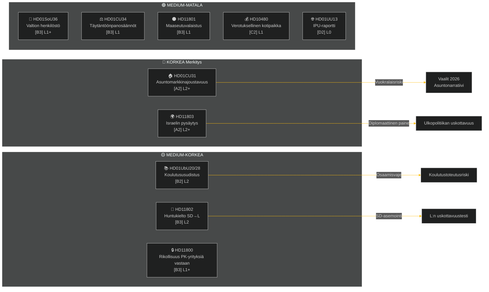

# Toimeenpaneva tiivistelmä — Viikkoarviointi 2026-05-09

**Luokitus**: JULKINEN | **Luotettavuus**: MEDIUM-KORKEA [B2] | **Horisontti**: T+72h / T+7d
**Kirjoittaja**: Riksdagsmonitor AI Intelligence System | **Riksmöte**: 2025/26

---

## BLUF (Ydinviesti)

Viikolla 2.–9. toukokuuta 2026 syntyi klusteri asumiseen, koulutukseen, sosiaaliturvaan ja oikeusvaltioon liittyvää kotimaista lainsäädäntöä, kun samalla ulkopoliittiset kysymykset paljastivat terävän puoluerajat ylittävän kuilun Israelin Ruotsin lipun alla purjehtivan aluksen valtauksesta kansainvälisillä vesillä. Ruotsin vuoden 2026 vaalien ollessa noin 16 viikon päässä jokaisessa suuressa debatissa on vaalipoliittinen signalointi välittömän lainsäädäntötarkoituksen lisäksi.

**Johtava arvio**: Tidö-koalitio (M, SD, KD, L) aloittaa lainsäädäntösprintin, jonka tavoitteena on lukita tärkeät politiikkavoitot ennen kesätaukoa ja syyskuun 2026 vaaleja. Asuntomarkkinoiden joustavuuspaketti (HD01CU31), opetuksen pätevyysuudistus (HD01UbU28) ja sosiaaliturvaan henkilöstösuunnittelun parantaminen (HD01SoU36) vahvistavat yhdessä hallituksen "uudistustuottaminen"-narratiivia. Kuitenkin Israel/Gaza-laivastotapaus (HD11803), maaseudun valaistuskohu (HD11801) ja SD:n huntukieltokysymys (HD11802) vaarantavat koalition julkisen viestinnän hajottamisen ja opposition energisoinnin.

---

## Top-5 Mitä-tämä-tarkoittaa-arviot

| # | Arvio | Luotettavuus | Horisontti |
|---|----------|-----------|---------|
| J1 | HD01CU31 asuntojoustavuusuudistus **dominoi viikon poliittista mediaa** suoraan vaikuttaen miljooniin ruotsalaisiin vuokralaisiin; oppositio (S, V, MP) vahvistaa vuokrankorotusriskejä | HIGH [A2] | T+72h |
| J2 | HD11803 (Israelin ruotsalaisten pysäyttäminen) **painostaa ulkoministerin** antamaan julkisen lausunnon parlamentaarisen menettelyn ulkopuolella; puoluerajat ylittävä vaatimus on bipartisaaninen | HIGH [A2] | T+72h |
| J3 | HD11802 (huntukielto, SD→L) **paljastaa ennakovaalit identiteettipolitiikan asemoinnin** SD:n puolelta kohdistuen L:n integraatiorekordiin; L-ministeri Mohamsson kohtaa uskottavuustestin aiemmista lausunnoista | MEDIUM [B3] | T+7d |
| J4 | HD01UbU28 (opettajapätevyydet 10-vuotisessa koulussa) **kohtaa toteutusvastusta** — kouluoperaattoreilla ei ole henkilöstöpipeline uusien osaamiskravaatiusten täyttämiseksi | MEDIUM [B3] | T+7d |
| J5 | HD11801 (maaseutuvalaistuksen poistaminen) **energisoi maaseutu-vaalipiiripainetta** KD- ja C-kansanedustajien kohdalla; hallituskoalition maaseutukannatus on rakenteellinen haavoittuvuus ennen vaaleja | MEDIUM [B3] | T+7d |

---

## Asiakirjatiedustelukartta

---

## Makrotaloudellinen konteksti

**IMF WEO Apr-2026 (SWE)** — tila: heikentynyt (WEO/FM Datamapper toimiva; SDMX 404):
- BKT-kasvu 2026: **~1,2%** (elpyminen pysyy vaimeana)
- Työttömyys: **~8,1%** (rakenteellinen tasanko yli ennakkokohdeminen tason)
- Ohjauskorko (Riksbanken): **2,25%** (kesäkuun 2025 korkolaskusykli suurelta osin päättynyt)
- Budjettivajeen tavoite: EU:n vakaus- ja kasvusopimuksen rajoissa

Pitkittynyt heikkokasvu-ympäristö korostaa asumisen kohtuuhintaisuuden (CU31) ja maaseudun palveluleikkausten (HD11801) poliittista merkitystä, koska kotitalouksien käytettävissä oleva tulo pysyy paineessa. SD:n huntukieltokysy (HD11802) on ajoitettu keräämään identiteettipolitiikkaan liittyvää ahdistusta, joka voimistuu heikkokasvu-sykleissä.

---

## Tiedusteluanalyysi: Lukijaopas

Tämä analyysi kattaa **6 valiokunnan mietintöä** (bet) ja **5 parlamentin kysymystä/interpellaatiota** (fråga/interpellation) riksmöteltä 2025/26. Kaikki asiakirjat haettu riksdag-regering MCP:ltä 2026-05-09; data 2026-05-08:lta (1 päivän takaisinkatselma). Tälle päivämäärälle ei rekisteröity äänestyksiä (voteringar).

**Keskeinen epävarmuus**: Viikon asiakirjat ovat debaattivaiheen valiokuntamietintöjä — lopulliset täysistuntoäänestykset vielä rekisteröimättä. Tulosluotettavuus on riippuvainen koalitionkuripuudista ja mahdollisista poikkeamismotioista.

---

*Lähde: riksdag-regering MCP | IMF WEO-2026-04 | Riksdagsmonitor Viikkoarviointi 2026-05-09*

<!-- source-sha: 3b789b190efe65d2af879b1da666d37f948938a3 -->
