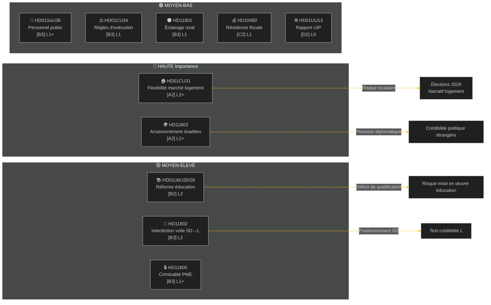

# Synthèse exécutive — Bilan hebdomadaire 2026-05-09

**Classification**: PUBLIC | **Fiabilité**: MOYEN-ÉLEVÉ [B2] | **Horizon**: T+72h / T+7d
**Auteur**: Riksdagsmonitor AI Intelligence System | **Riksmöte**: 2025/26

---

## BLUF (Message essentiel)

La semaine du 2 au 9 mai 2026 a produit un ensemble de législation intérieure portant sur le logement, l'éducation, la protection sociale et l'État de droit, tandis que des interpellations de politique étrangère ont révélé un clivage interpartis marqué concernant l'arraisonnement par Israël d'un navire battant pavillon suédois en eaux internationales. À environ 16 semaines des élections suédoises de 2026, chaque grand débat comporte une dimension de signalement électoral au-delà de l'objectif législatif immédiat.

**Évaluation directrice**: La coalition Tidö (M, SD, KD, L) effectue un sprint législatif visant à consolider des acquis politiques importants avant la pause estivale et les élections de septembre 2026. Le paquet de flexibilité du marché du logement (HD01CU31), la réforme des qualifications enseignantes (HD01UbU28) et l'amélioration de la planification des effectifs dans la protection sociale (HD01SoU36) renforcent conjointement le récit gouvernemental de « production de réformes ». Cependant, l'incident naval Israël/Gaza (HD11803), la controverse sur l'éclairage rural (HD11801) et l'interpellation du SD sur le voile (HD11802) risquent de fragmenter la communication publique de la coalition et d'énergiser l'opposition.

---

## Top-5 Évaluations « Qu'est-ce que cela signifie »

| # | Évaluation | Confiance | Horizon |
|---|----------|-----------|---------|
| J1 | La réforme de flexibilité du logement HD01CU31 **domine les médias politiques de la semaine** en touchant directement des millions de locataires suédois ; l'opposition (S, V, MP) amplifie les risques de hausse des loyers | ÉLEVÉ [A2] | T+72h |
| J2 | HD11803 (arraisonnement israélien de Suédois) **contraint la ministre des Affaires étrangères** à s'exprimer publiquement hors procédure parlementaire ; la demande est bipartisane | ÉLEVÉ [A2] | T+72h |
| J3 | HD11802 (interdiction du voile, SD→L) **révèle un positionnement pré-électoral sur la politique identitaire** de la part du SD vis-à-vis du bilan d'intégration du L ; la ministre L Mohamsson fait face à un test de crédibilité sur ses déclarations antérieures | MOYEN [B3] | T+7d |
| J4 | HD01UbU28 (qualifications enseignantes dans le système d'école décennale) **rencontre une résistance à la mise en œuvre** — les opérateurs scolaires n'ont pas de filière RH pour satisfaire les nouvelles exigences de compétences | MOYEN [B3] | T+7d |
| J5 | HD11801 (suppression de l'éclairage routier rural) **suscite une pression électorale rurale** sur les députés KD et C ; le soutien rural à la coalition est une vulnérabilité structurelle avant les élections | MOYEN [B3] | T+7d |

---

## Carte de renseignement documentaire

---

## Contexte macroéconomique

**FMI WEO Avr-2026 (SWE)** — État : dégradé (WEO/FM Datamapper opérationnel ; SDMX 404) :
- Croissance PIB 2026 : **~1,2 %** (la reprise reste atone)
- Chômage : **~8,1 %** (plateau structurel au-dessus de la cible pré-pandémie)
- Taux directeur (Riksbanken) : **2,25 %** (cycle de baisse des taux juin 2025 largement achevé)
- Objectif de solde budgétaire : dans les limites du Pacte de stabilité de l'UE

L'environnement de croissance durablement faible souligne la pertinence politique de l'accessibilité au logement (CU31) et des coupes dans les services ruraux (HD11801), alors que le revenu disponible des ménages reste sous pression. L'interpellation du SD sur le voile (HD11802) est conçue pour canaliser une anxiété de politique identitaire qui s'amplifie lors des cycles de croissance faible.

---

## Analyse de renseignement : Guide de lecture

Cette analyse couvre **6 rapports de commission** (bet) et **5 questions/interpellations parlementaires** (fråga/interpellation) du Riksmöte 2025/26. Tous les documents ont été extraits via le MCP riksdag-regering le 2026-05-09 ; données du 2026-05-08 (rétrospective d'1 jour). Aucun vote (voteringar) enregistré pour cette date.

**Incertitude clé** : Les documents de la semaine sont des rapports de commission en phase de débat — les votes finaux en séance plénière n'ont pas encore été enregistrés. La fiabilité des résultats dépend de la discipline de coalition et des éventuelles motions dissidentes.

---

*Source : MCP riksdag-regering | FMI WEO-2026-04 | Riksdagsmonitor Bilan hebdomadaire 2026-05-09*

<!-- source-sha: 3b789b190efe65d2af879b1da666d37f948938a3 -->
