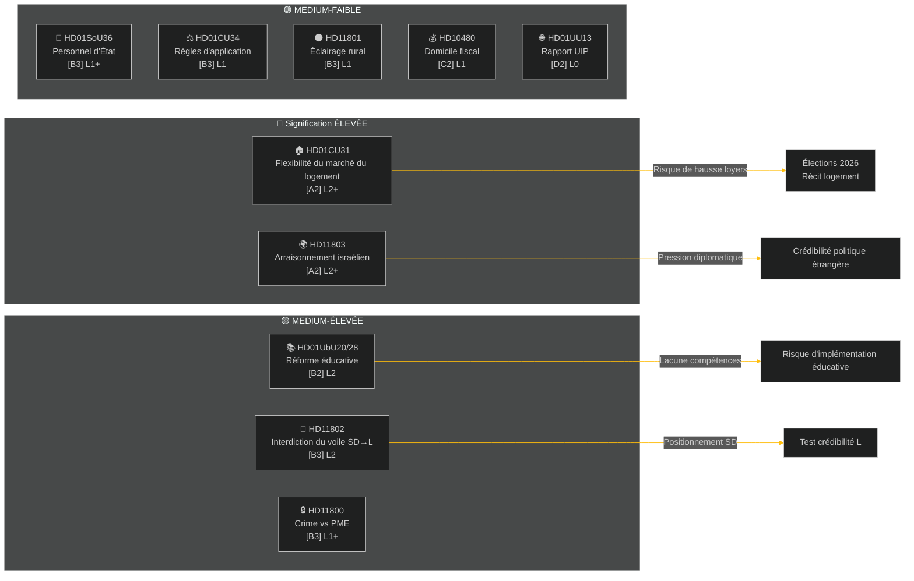

# Rapport Hebdomadaire — Revue Hebdomadaire

**Classification**: PUBLIC | **Niveau de confiance**: MEDIUM-HIGH [B2] | **Horizon**: T+72h / T+7d
**Auteur**: Système de renseignement IA Riksdagsmonitor | **Riksmöte**: 2025/26

---

## Résumé

La semaine du 2 au 9 mai 2026 a produit une grappe de lois intérieures sur le logement, l'éducation, la protection sociale et l'état de droit, tandis que les questions de politique étrangère ont révélé un fossé transpartisan aigu concernant l'arraisonnement par Israël d'un navire avec des membres d'équipage suédois en eaux internationales. Avec les élections suédoises 2026 à environ 16 semaines, chaque grand débat porte un signal de campagne électorale au-delà de son objectif législatif immédiat.

**Évaluation principale**: La coalition Tidö (M, SD, KD, L) entre dans un sprint législatif conçu pour verrouiller les gains politiques clés avant les vacances d'été et les élections de septembre 2026. Le paquet de flexibilité du marché du logement (HD01CU31), la réforme des qualifications éducatives (HD01UbU28) et l'amélioration du personnel de protection sociale (HD01SoU36) renforcent collectivement le récit du gouvernement sur la "livraison des réformes". Cependant, l'incident de la flottille Israël/Gaza (HD11803), la controverse sur la suppression de l'éclairage rural (HD11801) et la question du voile intégral portée par le SD (HD11802) risquent de fragmenter les messages publics de la coalition et d'énergiser l'opposition.

---

## Top-5 Évaluations

| # | Évaluation | Confiance | Horizon |
|---|-----------|-----------|--------|
| J1 | La réforme de flexibilité du logement HD01CU31 **dominera les médias politiques de la semaine** car elle affecte directement des millions de locataires suédois ; l'opposition (S, V, MP) amplifiera les risques de hausse des loyers | HIGH [A2] | T+72h |
| J2 | HD11803 (Israël arrête des citoyens suédois) **exercera une pression sur le ministre des Affaires étrangères** pour une déclaration publique au-delà de la procédure parlementaire ; demande transpartisane | HIGH [A2] | T+72h |
| J3 | HD11802 (interdiction du voile, SD→L) **révèle le positionnement politique identitaire** avant les élections de SD ciblant le bilan d'intégration de L ; la ministre L Mohamsson fait face à un test de crédibilité contre ses précédentes déclarations | MEDIUM [B3] | T+7d |
| J4 | HD01UbU28 (qualifications des enseignants dans l'école à 10 ans) **rencontrera des frictions d'implémentation** — les directeurs d'école manquent du pipeline de personnel pour satisfaire les nouvelles exigences de compétences | MEDIUM [B3] | T+7d |
| J5 | HD11801 (suppression de l'éclairage rural) **énergisera la pression des circonscriptions rurales** sur les représentants KD et C ; le soutien rural de la coalition est une vulnérabilité structurelle avant les élections | MEDIUM [B3] | T+7d |

---

## Carte de Renseignement Documentaire

---

## Contexte Macroéconomique

**FMI WEO avr-2026 (SWE)** : Croissance PIB 2026 **~1,2%**, chômage **~8,1%**, taux directeur Riksbanken **2,25%**. Le faible croissance prolongée renforce la pertinence politique de l'accessibilité au logement (CU31) et des coupes rurales (HD11801) car le revenu disponible des ménages reste sous pression.

---

## Évaluation du Renseignement : Guide de Lecture

Cette analyse couvre **6 rapports de commission** (bet) et **5 questions parlementaires/interpellations** (fråga/interpellation) du Riksmöte 2025/26. Tous les documents récupérés depuis riksdag-regering MCP le 2026-05-09 ; données du 2026-05-08 (lookback 1 jour). Aucun vote (voteringar) enregistré pour cette date.

**Incertitude centrale** : Les documents de la semaine sont au stade du débat — votes finaux en chambre pas encore enregistrés. La confiance dans les résultats est conditionnelle à la discipline de la coalition et aux éventuelles motions de déviation.

---

*Source : riksdag-regering MCP | FMI WEO-2026-04 | Riksdagsmonitor Revue Hebdomadaire 2026-05-09*

<!-- source-sha: 3b789b190efe65d2af879b1da666d37f948938a3 -->
