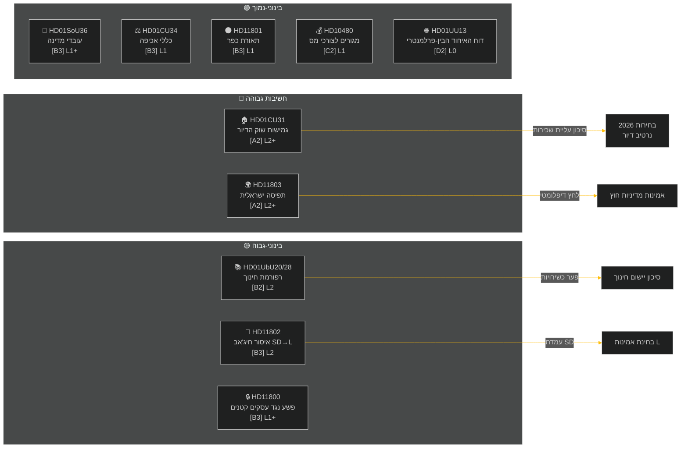

<!-- dir: rtl -->
---
title: "הדוח השבועי — סקירה שבועית 2026-05-09"
date: 2026-05-09
subfolder: weekly-review
slug: weekly-review-2026-05-09
language: he
classification: PUBLIC
konfidensgrad: MEDIUM-HIGH [B2]
author: James Pether Sörling
---

# הדוח השבועי — סקירה שבועית 2026-05-09

**סיווג**: PUBLIC | **רמת אמינות**: MEDIUM-HIGH [B2] | **אופק**: T+72h / T+7d
**מחבר**: מערכת מודיעין AI Riksdagsmonitor | **Riksmöte**: 2025/26

---

## סיכום מנהלים

השבוע שבין 2-9 במאי 2026 הניב אשכול של חוקים מקומיים בתחומי הדיור, החינוך, הרווחה החברתית ושלטון החוק, בעוד שסוגיות מדיניות חוץ חשפו פער חד בין-מפלגתי בנוגע לתפיסת ספינה עם אנשי צוות שוודים בידי ישראל במים הבינלאומיים. עם בחירות שבדיה 2026 כ-16 שבועות בלבד קדימה, כל ויכוח גדול נושא אות קמפיין בחירות מעבר לתכליתו החקיקתית המיידית.

**הערכה מובילה**: קואליציית Tidö (M, SD, KD, L) נכנסת לספרינט חקיקתי שתוכנן לנעול רווחים מדיניים מרכזיים לפני חופשת הקיץ ובחירות ספטמבר 2026. חבילת גמישות שוק הדיור (HD01CU31), רפורמת ההסמכות החינוכית (HD01UbU28) ושיפור כוח האדם לרווחה חברתית (HD01SoU36) מחזקות יחד את הנרטיב של הממשלה על "מסירת רפורמות". עם זאת, תקרית הציי ישראל/עזה (HD11803), פרשת הסרת תאורת הכפר השנויה במחלוקת (HD11801) ושאלת איסור הרעלה שהוביל SD (HD11802) מסכנות לפצל את המסרים הציבוריים של הקואליציה ולהניע את האופוזיציה.

---

## 5 הערכות מובילות

| # | הערכה | אמינות | אופק |
|---|-------|--------|------|
| J1 | רפורמת גמישות הדיור HD01CU31 **תשלוט בתקשורת הפוליטית של השבוע** שכן היא משפיעה ישירות על מיליוני שוכרים שוודים; האופוזיציה (S, V, MP) תגביר את הסיכונים לעליית שכירות | HIGH [A2] | T+72h |
| J2 | HD11803 (ישראל עוצרת אזרחים שוודים) **ילחץ על שר החוץ** להצהרה ציבורית מעבר להליך הפרלמנטרי; דרישה בין-מפלגתית | HIGH [A2] | T+72h |
| J3 | HD11802 (איסור חיג'אב, SD→L) **חושף עמדות פוליטיות זהות** לפני הבחירות של SD המכוון לרקורד האינטגרציה של L; שרת L מוהמסון מתמודדת עם בחינת אמינות מול הצהרותיה הקודמות | MEDIUM [B3] | T+7d |
| J4 | HD01UbU28 (כשירויות מורים בבית ספר 10 שנים) **יתמודד עם חיכוכי יישום** — מנהלי בתי ספר חסרים צינור כוח אדם לעמידה בדרישות הכשירות החדשות | MEDIUM [B3] | T+7d |
| J5 | HD11801 (הסרת תאורת כפר) **יפעיל לחץ מאזורי בחירה כפריים** על נציגי KD ו-C; תמיכת הקואליציה הכפרית היא פגיעות מבנית לפני הבחירות | MEDIUM [B3] | T+7d |

---

## מפת מודיעין מסמכים

---

## הקשר מאקרו-כלכלי

**קרן המטבע הבינלאומית WEO אפריל-2026 (SWE)** — מצב: מוגבל (WEO/FM Datamapper פועל; SDMX 404):
- צמיחת תמ"ג 2026: **~1.2%** (ההתאוששות נשארת מדוכאת)
- אבטלה: **~8.1%** (פלטו מבני מעל לרמה שלפני המגפה)
- ריבית (Riksbanken): **2.25%** (מחזור הפחתת ריבית יוני 2025 הושלם במידה רבה)
- יעד גירעון תקציבי: בגבולות הסכם היציבות והצמיחה של האיחוד האירופי

הסביבה הממושכת של צמיחה נמוכה מגבירה את הרלוונטיות הפוליטית של סבירות הדיור (CU31) וקיצוצים בשירותים כפריים (HD11801) מכיוון שההכנסה הפנויה של משקי הבית נשארת תחת לחץ. שאלת הרעלה של SD (HD11802) תוזמנה לקצור חרדת פוליטיקת זהות שמתגברת במחזורי צמיחה נמוכה.

---

## הערכת מודיעין: מדריך קריאה

ניתוח זה מכסה **6 דוחות ועדה** (bet) ו**5 שאלות פרלמנטריות/אינטרפלציות** (fråga/interpellation) מ-Riksmöte 2025/26. כל המסמכים אוחזרו מ-riksdag-regering MCP ב-2026-05-09; נתונים מ-2026-05-08 (חיפוש לאחור ליום אחד). לא נרשמו הצבעות (voteringar) לתאריך זה.

**אי-ודאות מרכזית**: מסמכי השבוע נמצאים בשלב הדיון — הצבעות מליאה סופיות טרם נרשמו. אמינות התוצאה תלויה בדיסציפלינת הקואליציה ובתנועות סטייה פוטנציאליות.

---

*מקור: riksdag-regering MCP | קרן המטבע הבינלאומית WEO-2026-04 | Riksdagsmonitor סקירה שבועית 2026-05-09*

<!-- source-sha: 3b789b190efe65d2af879b1da666d37f948938a3 -->
