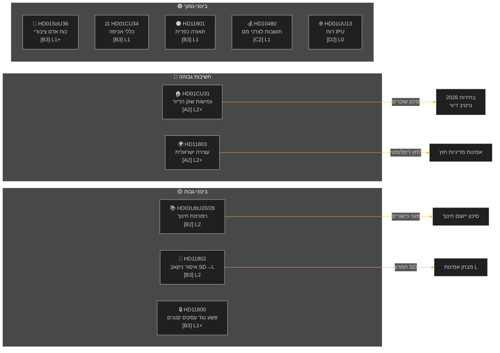

‏# תקציר מנהלים — סקירה שבועית 2026-05-09

**סיווג**: ציבורי | **אמינות**: בינוני-גבוה [B2] | **אופק**: T+72h / T+7d
**מחבר**: מערכת המודיעין של Riksdagsmonitor בבינה מלאכותית | **ריקסמוטה**: 2025/26

---

## BLUF (המסר המרכזי)

השבוע שבין 2–9 במאי 2026 הניב מקבץ חקיקה פנים-ארצית בתחומי הדיור, החינוך, הביטוח הלאומי ושלטון החוק, בעוד שאינטרפלציות במדיניות חוץ חשפו פער חד בין-מפלגתי סביב תפיסת ישראל של אונייה תחת דגל שבדי במים הבינלאומיים. עם הבחירות השבדיות 2026 הרחוקות כ-16 שבועות, כל דיון גדול נושא איתות בחירות מעבר למטרה החקיקתית המיידית.

**הערכה מנחה**: קואליציית טידו (M, SD, KD, L) עורכת ספרינט חקיקתי במטרה לנעול הישגים מדיניים חשובים לפני הפגרה הקיצית ובחירות ספטמבר 2026. חבילת גמישות שוק הדיור (HD01CU31), רפורמת כישורי המורים (HD01UbU28) ושיפור תכנון כוח האדם בביטוח הלאומי (HD01SoU36) מחזקות יחד את נרטיב הממשלה של "ייצור רפורמות". עם זאת, פרשת ישראל/עזה (HD11803), מחלוקת תאורת הכבישים הכפריים (HD11801) ואינטרפלציית SD בנושא הניקאב (HD11802) מאיימות לפצל את התקשורת הציבורית של הקואליציה ולעורר את האופוזיציה.

---

## 5 הערכות המובילות "מה זה אומר?"

| # | הערכה | ביטחון | אופק |
|---|----------|-----------|---------|
| J1 | רפורמת גמישות הדיור HD01CU31 **שולטת בתקשורת הפוליטית של השבוע** בהשפעה ישירה על מיליוני שוכרים שבדים; האופוזיציה (S, V, MP) מגבירה סיכוני העלאת שכר דירה | גבוה [A2] | T+72h |
| J2 | HD11803 (ישראלים עוצרים שבדים) **לוחץ על שרת החוץ** להצהיר פומבית מחוץ להליך הפרלמנטרי; הדרישה היא דו-מפלגתית | גבוה [A2] | T+72h |
| J3 | HD11802 (איסור ניקאב, SD→L) **חושף תמרון טרום-בחירות בפוליטיקת זהות** מצד SD מול שיא האינטגרציה של L; שרת L מוחמסון עומדת במבחן אמינות לגבי הצהרות קודמות | בינוני [B3] | T+7d |
| J4 | HD01UbU28 (כישורי מורים במערכת בית הספר ל-10 שנים) **נתקל בהתנגדות ביישום** — מפעילי בתי הספר חסרים צינור כוח אדם לעמוד בדרישות הכשירות החדשות | בינוני [B3] | T+7d |
| J5 | HD11801 (הסרת תאורת כביש כפרי) **מעורר לחץ בחירות כפרי** על חברי כנסת KD ו-C; תמיכת הקואליציה בכפרים היא פגיעות מבנית לקראת הבחירות | בינוני [B3] | T+7d |

---

## מפת מודיעין מסמכים

---

## הקשר מקרו-כלכלי

**IMF WEO אפר-2026 (SWE)** — מצב: מדורדר (WEO/FM Datamapper פעיל; SDMX 404):
- צמיחת תמ"ג 2026: **~1.2%** (ההתאוששות נשארת עמומה)
- אבטלה: **~8.1%** (רמה מבנית מעל יעד טרום-מגפה)
- ריבית מדיניות (Riksbanken): **2.25%** (מחזור הורדת ריבית יוני 2025 הסתיים ברובו)
- יעד מאזן תקציבי: בתוך גבולות אמנת היציבות האירופית

סביבת הצמיחה החלשה המתמשכת מדגישה את הרלוונטיות הפוליטית של מחיר הדיור (CU31) וקיצוצים בשירותים כפריים (HD11801), בעוד ההכנסה הפנויה של משקי בית נשארת תחת לחץ. אינטרפלציית הניקאב של SD (HD11802) מכוּונת לגייס חרדת פוליטיקת זהות המתעצמת במחזורי צמיחה חלשה.

---

## ניתוח מודיעין: מדריך לקוראים

ניתוח זה מכסה **6 דוחות ועדה** (bet) ו**5 שאלות/אינטרפלציות פרלמנטריות** (fråga/interpellation) מהריקסמוטה 2025/26. כל המסמכים נשלפו דרך MCP riksdag-regering ב-2026-05-09; נתונים מ-2026-05-08 (סקירה לאחור של יום אחד). לא נרשמו הצבעות (voteringar) לתאריך זה.

**אי-ודאות מרכזית**: מסמכי השבוע הם דוחות ועדה בשלב הדיון — הצבעות מליאה סופיות טרם נרשמו. מהימנות התוצאות תלויה בממשמעת הקואליציה ובהצעות מתנגדות אפשריות.

---

*מקור: riksdag-regering MCP | IMF WEO-2026-04 | Riksdagsmonitor סקירה שבועית 2026-05-09*

<!-- source-sha: 3b789b190efe65d2af879b1da666d37f948938a3 -->
