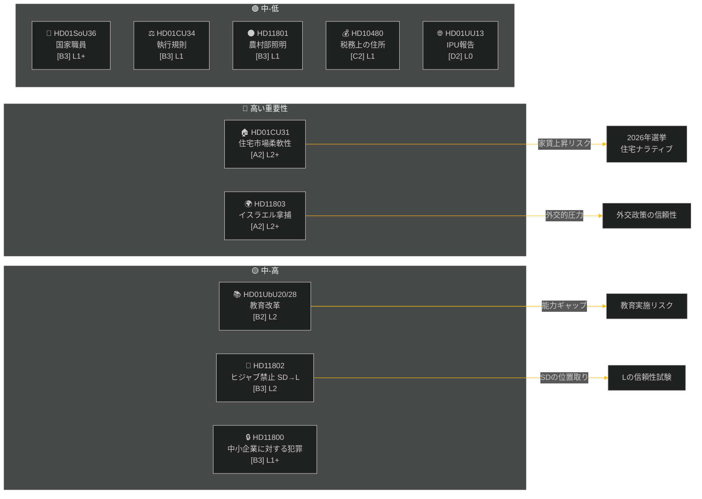

# 週次レポート — 週次レビュー 2026-05-09

**分類**: PUBLIC | **信頼度**: MEDIUM-HIGH [B2] | **時間軸**: T+72h / T+7d
**著者**: Riksdagsmonitor AI情報システム | **Riksmöte**: 2025/26

---

## エグゼクティブサマリー

2026年5月2日から9日の週は、住宅・教育・社会福祉・法の支配に関する国内法律のクラスターを産み出す一方、外交政策上の問題では、イスラエルが国際水域でスウェーデン人船員を乗せた船舶を拿捕したことをめぐり鋭い超党派の亀裂が浮き彫りとなった。2026年スウェーデン選挙まで約16週間と迫る中、主要な討論はいずれも直接の立法目的を超えた選挙運動上のシグナルを帯びている。

**主要評価**: Tidö連立政権(M, SD, KD, L)は、夏季休暇と2026年9月の選挙の前に主要な政策成果を確保するための立法スプリントに入っている。住宅市場柔軟性パッケージ(HD01CU31)、教育資格改革(HD01UbU28)、社会福祉スタッフ改善(HD01SoU36)は集合的に政府の「改革実施」ナラティブを強化する。しかし、イスラエル/ガザ艦隊事件(HD11803)、農村部照明撤去をめぐる論争(HD11801)、SDが主導するヒジャブ禁止問題(HD11802)は、連立のパブリックメッセージを分断し野党を活性化させるリスクをはらむ。

---

## トップ5評価

| # | 評価 | 信頼度 | 時間軸 |
|---|------|--------|--------|
| J1 | 住宅柔軟性改革HD01CU31は数百万人のスウェーデン人賃借人に直接影響するため**週の政治メディアを独占する**見込み；野党(S, V, MP)は家賃上昇リスクを増幅させる | HIGH [A2] | T+72h |
| J2 | HD11803(イスラエルがスウェーデン国民を拘束)は議会手続きを超えた公式声明を求め**外務大臣に圧力をかける**；超党派的要求 | HIGH [A2] | T+72h |
| J3 | HD11802(ヒジャブ禁止、SD→L)は選挙前にSDがLの統合実績を狙いとする**アイデンティティ政治的位置取りを露わにする**；L大臣モハムソンが過去の発言との信頼性試験に直面 | MEDIUM [B3] | T+7d |
| J4 | HD01UbU28(10年制学校における教員資格)は**実施の摩擦に直面する** — 学校長は新しい能力要件を満たすための人材パイプラインを欠いている | MEDIUM [B3] | T+7d |
| J5 | HD11801(農村部照明撤去)は**農村選挙区からKD・C代議士への圧力を活性化させる**；連立の農村支持は選挙前の構造的脆弱性 | MEDIUM [B3] | T+7d |

---

## ドキュメント情報マップ

---

## マクロ経済的背景

**IMF WEO 2026年4月 (SWE)** — ステータス：低下 (WEO/FM Datamaperは機能；SDMX 404)：
- GDP成長率2026年：**約1.2%**（回復は引き続き鈍い）
- 失業率：**約8.1%**（コロナ禍以前の水準を上回る構造的プラトー）
- 政策金利 (Riksbanken)：**2.25%**（2025年6月の利下げサイクルはほぼ完了）
- 財政赤字目標：EU安定成長協定の上限内

長引く低成長環境は、家計の可処分所得が依然として圧迫されているため、住宅の手頃さ(CU31)と農村サービスの削減(HD11801)の政治的関連性を増幅させる。SDのヒジャブ問題(HD11802)は、低成長サイクルで強まるアイデンティティ政治の不安を収穫するよう設計されたタイミングとなっている。

---

## 情報評価：読者ガイド

本分析はRiksmöte 2025/26の**委員会報告書6件**(bet)と**国会質問/質疑5件**(fråga/interpellation)を対象とする。すべての文書は2026-05-09にriksdagregeringMCPから取得；データは2026-05-08のもの(1日振り返り)。この日付では投票(voteringar)は記録されていない。

**中心的な不確実性**：今週の文書は審議段階 — 最終的な本会議投票はまだ記録されていない。結果の信頼度は連立の規律と離反動議の可能性に条件付けられている。

---

*出典：riksdag-regering MCP | IMF WEO-2026-04 | Riksdagsmonitor 週次レビュー 2026-05-09*

<!-- source-sha: 3b789b190efe65d2af879b1da666d37f948938a3 -->
