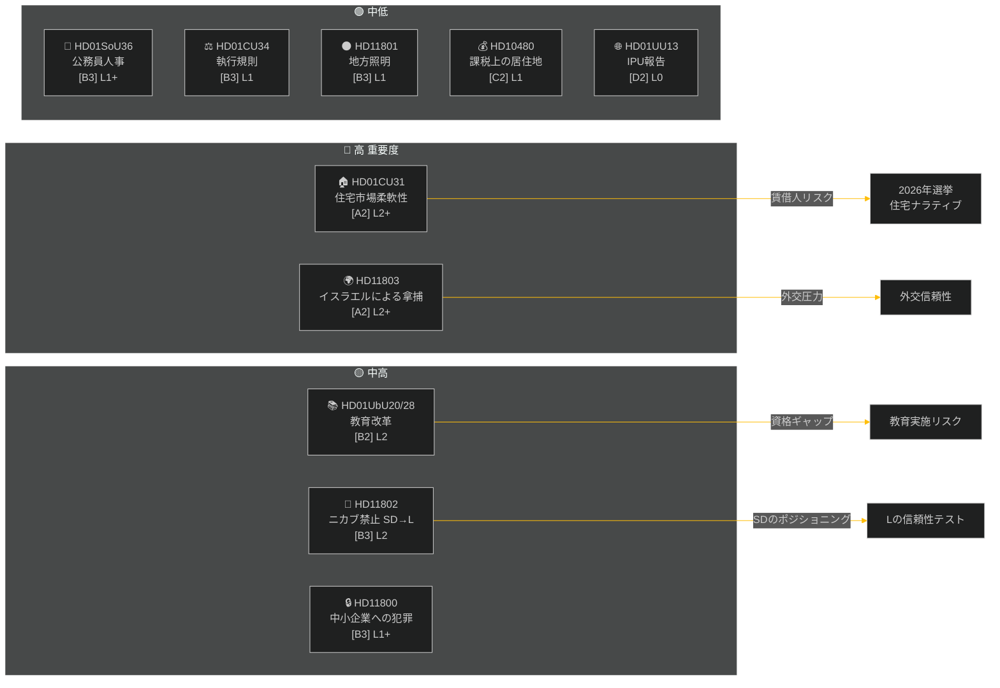

# エグゼクティブブリーフ — 週次レビュー 2026-05-09

**分類**: 公開 | **信頼度**: 中高 [B2] | **ホライズン**: T+72h / T+7d
**著者**: Riksdagsmonitor AIインテリジェンスシステム | **リクスモーテ**: 2025/26

---

## BLUF（核心メッセージ）

2026年5月2日から9日の週は、住宅、教育、社会保障、法の支配に関する国内立法のクラスターを生み出す一方、外交インタープレーションでは国際水域でイスラエルがスウェーデン旗を掲げた船を拿捕した件について鋭い超党派の亀裂を露呈した。2026年スウェーデン選挙まで約16週を残す中、主要な各討議は即座の立法目的を超えた選挙シグナリングを帯びている。

**主要評価**: ティドー連立（M, SD, KD, L）は、夏季休会と2026年9月選挙前に重要な政策上の成果を確保することを目標とした立法スプリントを実施中。住宅市場柔軟性パッケージ（HD01CU31）、教員資格改革（HD01UbU28）、社会保障での人員計画改善（HD01SoU36）が組み合わさって政府の「改革生産」ナラティブを補強。ただしイスラエル/ガザ艦隊事件（HD11803）、地方道路照明の論争（HD11801）、SDのニカブ禁止インタープレーション（HD11802）が連立の公式コミュニケーションを分断し野党を活性化させるリスクがある。

---

## トップ5「これは何を意味するか」評価

| # | 評価 | 信頼度 | ホライズン |
|---|----------|-----------|---------|
| J1 | HD01CU31住宅柔軟性改革は**今週の政治メディアを独占**し、数百万のスウェーデン人賃借人に直接影響；野党（S, V, MP）は家賃上昇リスクを増幅 | 高 [A2] | T+72h |
| J2 | HD11803（イスラエルがスウェーデン人を拿捕）は**外務大臣に対し議会手続き外での公式声明を圧力**；要求は超党派的 | 高 [A2] | T+72h |
| J3 | HD11802（ニカブ禁止、SD→L）はLのインテグレーション実績に対するSDの**選挙前アイデンティティ政治ポジショニングを暴露**；L大臣モハムソンは以前の発言に関する信頼性テストに直面 | 中 [B3] | T+7d |
| J4 | HD01UbU28（10年間学校制度の教員資格）は**実施抵抗に遭遇**——学校運営者は新しい能力要件を満たす人材パイプラインがない | 中 [B3] | T+7d |
| J5 | HD11801（地方道路照明の撤去）はKDとCの議員への**農村選挙区圧力を活性化**；農村連立支持は選挙前の構造的脆弱性 | 中 [B3] | T+7d |

---

## 文書インテリジェンスマップ

---

## マクロ経済的背景

**IMF WEO 2026年4月 (SWE)** — 状況: 悪化（WEO/FM Datamapper稼働中；SDMX 404）:
- 2026年GDP成長率: **約1.2%**（回復は依然として低調）
- 失業率: **約8.1%**（パンデミック前目標を上回る構造的高止まり）
- 政策金利（Riksbanken）: **2.25%**（2025年6月利下げサイクルはほぼ完了）
- 財政収支目標: EUの安定成長協定の範囲内

持続的な弱成長環境は、家計可処分所得が圧力下にある中、住宅の入手可能性（CU31）と農村サービス削減（HD11801）の政治的重要性を強調している。SDのニカブインタープレーション（HD11802）は、弱成長サイクルで増幅するアイデンティティ政治不安を活用するよう設計されている。

---

## インテリジェンス分析：読者ガイド

この分析はリクスモーテ2025/26の**6つの委員会報告書**（bet）と**5つの議会質問/インタープレーション**（fråga/interpellation）をカバーしている。全文書は2026-05-09にriksdag-regering MCPを通じて取得；データは2026-05-08（1日遡及）。この日付の投票（voteringar）は記録なし。

**主要な不確実性**: 今週の文書は討議段階の委員会報告書であり、本会議での最終採決は未記録。結果の信頼性は連立の規律と潜在的な離反動議に依存する。

---

*出典: riksdag-regering MCP | IMF WEO-2026-04 | Riksdagsmonitor 週次レビュー 2026-05-09*

<!-- source-sha: 3b789b190efe65d2af879b1da666d37f948938a3 -->
