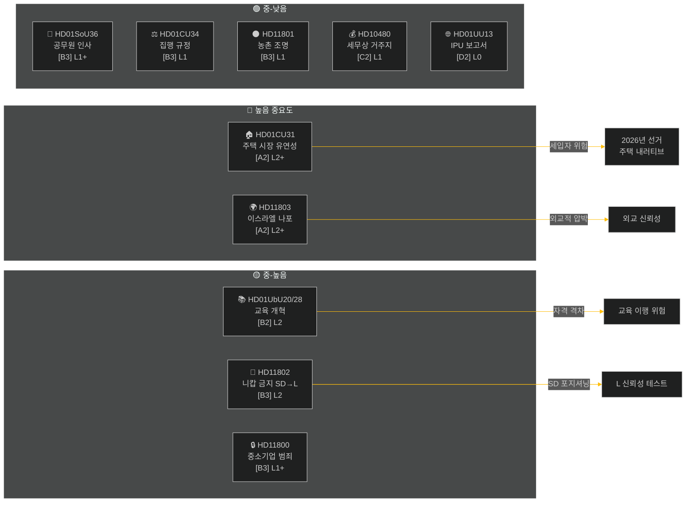

# 집행 요약 — 주간 검토 2026-05-09

**분류**: 공개 | **신뢰도**: 중-높음 [B2] | **호라이즌**: T+72h / T+7d
**저자**: Riksdagsmonitor AI 인텔리전스 시스템 | **릭스모테**: 2025/26

---

## BLUF (핵심 메시지)

2026년 5월 2일~9일 주간은 주택, 교육, 사회보장, 법치에 관한 국내 입법 클러스터를 생산하는 한편, 외교 인터펠레이션에서는 이스라엘이 공해상에서 스웨덴 국기를 단 선박을 나포한 사건을 둘러싸고 날카로운 초당파적 균열이 드러났다. 2026년 스웨덴 선거가 약 16주 남은 상황에서, 모든 주요 토론은 즉각적인 입법 목적을 넘어 선거 신호 발신을 담고 있다.

**주도적 평가**: 티도 연립(M, SD, KD, L)은 여름 휴회와 2026년 9월 선거 전에 중요한 정책 성과를 확보하는 것을 목표로 하는 입법 스프린트를 진행 중이다. 주택 시장 유연성 패키지(HD01CU31), 교사 자격 개혁(HD01UbU28), 사회보장 인력 계획 개선(HD01SoU36)이 결합되어 정부의 "개혁 생산" 내러티브를 강화한다. 그러나 이스라엘/가자 함대 사건(HD11803), 농촌 도로 조명 논란(HD11801), SD의 니캅 금지 인터펠레이션(HD11802)은 연립의 공식 커뮤니케이션을 분열시키고 야당을 활성화할 위험이 있다.

---

## 상위 5개 "이것이 의미하는 바" 평가

| # | 평가 | 신뢰도 | 호라이즌 |
|---|----------|-----------|---------|
| J1 | HD01CU31 주택 유연성 개혁은 수백만 스웨덴 세입자에게 직접 영향을 미치며 **이번 주 정치 미디어를 지배**; 야당(S, V, MP)은 임대료 인상 위험을 증폭 | 높음 [A2] | T+72h |
| J2 | HD11803(이스라엘이 스웨덴인 나포)은 **외무장관에게 의회 절차 밖에서 공식 성명을 발표하도록 압박**; 요구는 초당파적 | 높음 [A2] | T+72h |
| J3 | HD11802(니캅 금지, SD→L)는 L의 통합 실적에 대한 SD의 **선거 전 정체성 정치 포지셔닝을 폭로**; L 장관 모함손은 이전 발언에 대한 신뢰성 테스트에 직면 | 중간 [B3] | T+7d |
| J4 | HD01UbU28(10년제 학교 시스템 교사 자격)은 **이행 저항에 직면**—학교 운영자들은 새로운 역량 요건을 충족할 인력 파이프라인이 없음 | 중간 [B3] | T+7d |
| J5 | HD11801(농촌 도로 조명 철거)은 KD와 C 의원들에게 **농촌 선거구 압력을 활성화**; 농촌 연립 지지는 선거 전 구조적 취약점 | 중간 [B3] | T+7d |

---

## 문서 인텔리전스 맵

---

## 거시경제적 맥락

**IMF WEO 2026년 4월 (SWE)** — 상태: 악화 (WEO/FM Datamapper 작동 중; SDMX 404):
- 2026년 GDP 성장률: **~1.2%** (회복세 여전히 완만)
- 실업률: **~8.1%** (팬데믹 이전 목표를 상회하는 구조적 고원)
- 정책 금리 (Riksbanken): **2.25%** (2025년 6월 금리 인하 사이클 대부분 완료)
- 재정 수지 목표: EU 안정성장협약 한도 내

지속적인 저성장 환경은 가계 가처분 소득이 압박을 받는 상황에서 주택 가격 적정성(CU31)과 농촌 서비스 삭감(HD11801)의 정치적 중요성을 강조한다. SD의 니캅 인터펠레이션(HD11802)은 저성장 사이클에서 증폭되는 정체성 정치 불안을 활용하도록 설계되어 있다.

---

## 인텔리전스 분석: 독자 가이드

이 분석은 릭스모테 2025/26의 **위원회 보고서 6건**(bet)과 **의회 질의/인터펠레이션 5건**(fråga/interpellation)을 다룬다. 모든 문서는 2026-05-09에 riksdag-regering MCP를 통해 수집; 데이터는 2026-05-08(1일 소급 조회). 해당 날짜에 기록된 투표(voteringar) 없음.

**핵심 불확실성**: 주간 문서들은 토론 단계의 위원회 보고서이며, 최종 본회의 표결은 아직 기록되지 않았다. 결과 신뢰성은 연립의 기율과 잠재적인 이탈 동의에 달려 있다.

---

*출처: riksdag-regering MCP | IMF WEO-2026-04 | Riksdagsmonitor 주간 검토 2026-05-09*

<!-- source-sha: 3b789b190efe65d2af879b1da666d37f948938a3 -->
