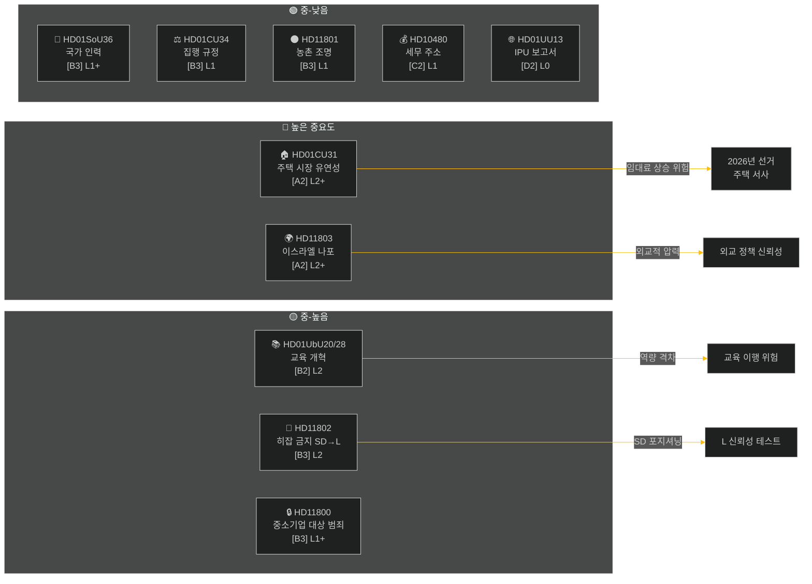

# 주간 보고서 — 주간 검토 2026-05-09

**분류**: PUBLIC | **신뢰 수준**: MEDIUM-HIGH [B2] | **시간적 지평**: T+72h / T+7d
**저자**: Riksdagsmonitor AI 정보 시스템 | **Riksmöte**: 2025/26

---

## 경영진 요약

2026년 5월 2일부터 9일까지의 주는 주택, 교육, 사회 복지, 법치주의 분야에서 일련의 국내 법률을 산출했으며, 외교 정책 문제에서는 이스라엘이 국제 수역에서 스웨덴 승무원이 탑승한 선박을 나포한 것에 대해 날카로운 초당적 균열을 드러냈다. 2026년 스웨덴 선거가 약 16주 앞으로 다가온 가운데, 모든 주요 논쟁은 즉각적인 입법 목적을 넘어선 선거 운동 신호를 담고 있다.

**주요 평가**: Tidö 연립정부(M, SD, KD, L)는 여름 방학과 2026년 9월 선거 전에 핵심 정책 성과를 확보하기 위한 입법 스프린트에 돌입하고 있다. 주택 시장 유연성 패키지(HD01CU31), 교육 자격 개혁(HD01UbU28), 사회 복지 인력 개선(HD01SoU36)은 집합적으로 정부의 "개혁 이행" 서사를 강화한다. 그러나 이스라엘/가자 함대 사건(HD11803), 논란이 되는 농촌 조명 제거(HD11801), SD 주도의 히잡 금지 문제(HD11802)는 연립의 공개 메시지를 분열시키고 야당을 활성화할 위험이 있다.

---

## 상위 5개 평가

| # | 평가 | 신뢰도 | 시간적 지평 |
|---|------|--------|-----------|
| J1 | 주택 유연성 개혁 HD01CU31은 수백만 스웨덴 세입자에게 직접 영향을 미치므로 **주간 정치 미디어를 장악할 것**; 야당(S, V, MP)은 임대료 상승 위험을 증폭시킬 것 | HIGH [A2] | T+72h |
| J2 | HD11803(이스라엘, 스웨덴 시민 억류)은 의회 절차를 넘어선 공개 성명을 위해 **외무장관에게 압력을 가할 것**; 초당적 요구 | HIGH [A2] | T+72h |
| J3 | HD11802(히잡 금지, SD→L)는 선거 전 SD가 L의 통합 실적을 겨냥한 **정체성 정치적 포지셔닝을 드러냄**; L 장관 모함손은 이전 발언에 대한 신뢰성 테스트에 직면 | MEDIUM [B3] | T+7d |
| J4 | HD01UbU28(10년 학교의 교사 자격)은 **구현 마찰에 직면할 것** — 학교장은 새로운 역량 요건을 충족하기 위한 인력 파이프라인이 부족 | MEDIUM [B3] | T+7d |
| J5 | HD11801(농촌 조명 제거)은 KD 및 C 의원에 대한 **농촌 선거구의 압력을 활성화할 것**; 연립의 농촌 지지는 선거 전 구조적 취약점 | MEDIUM [B3] | T+7d |

---

## 문서 정보 맵

---

## 거시경제적 맥락

**IMF WEO 2026년 4월 (SWE)** — 상태: 저하 (WEO/FM Datamapper 작동; SDMX 404):
- GDP 성장률 2026년: **약 1.2%** (회복세 계속 둔화)
- 실업률: **약 8.1%** (코로나19 이전 수준 위 구조적 안정기)
- 정책 금리 (Riksbanken): **2.25%** (2025년 6월 금리 인하 사이클 대부분 완료)
- 재정 적자 목표: EU 안정성장협약 한도 내

장기화된 저성장 환경은 가계 가처분 소득이 계속 압박을 받고 있어 주택 가격 접근성(CU31)과 농촌 서비스 삭감(HD11801)의 정치적 관련성을 증폭시킨다. SD의 히잡 문제(HD11802)는 저성장 사이클에서 강화되는 정체성 정치 불안을 수확하도록 설계된 타이밍이다.

---

## 정보 평가: 독자 가이드

본 분석은 Riksmöte 2025/26의 **위원회 보고서 6건**(bet)과 **국회 질문/대정부 질의 5건**(fråga/interpellation)을 다룬다. 모든 문서는 2026-05-09에 riksdag-regering MCP에서 가져옴; 2026-05-08 데이터 (1일 조회). 해당 날짜에 투표(voteringar)는 기록되지 않았다.

**핵심 불확실성**: 이번 주 문서들은 토론 단계 — 최종 본회의 투표가 아직 기록되지 않음. 결과 신뢰도는 연립의 규율과 잠재적 이탈 동의에 조건부.

---

*출처: riksdag-regering MCP | IMF WEO-2026-04 | Riksdagsmonitor 주간 검토 2026-05-09*

<!-- source-sha: 3b789b190efe65d2af879b1da666d37f948938a3 -->
