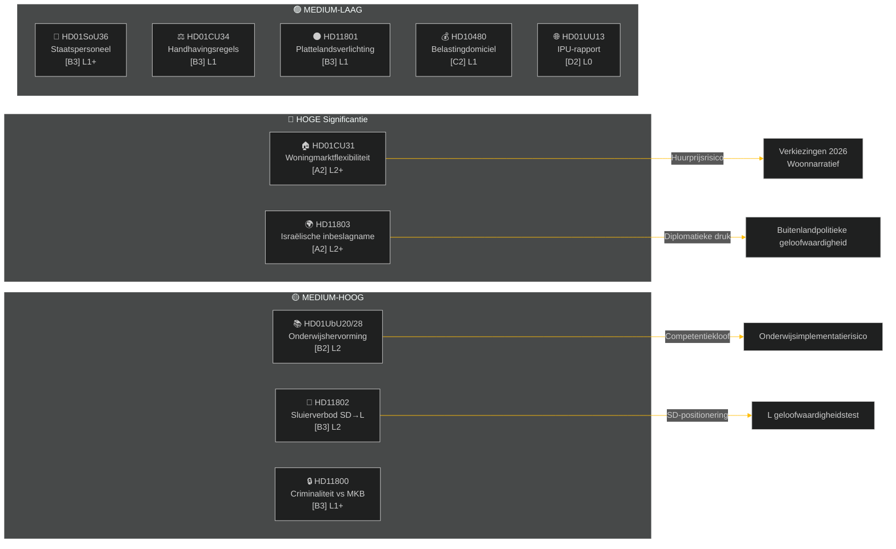

# Weekrapport — Wekelijkse Beoordeling

**Classificatie**: PUBLIC | **Betrouwbaarheidsniveau**: MEDIUM-HIGH [B2] | **Horizon**: T+72h / T+7d
**Auteur**: Riksdagsmonitor AI-inlichtingensysteem | **Riksmöte**: 2025/26

---

## Samenvatting

De week van 2 tot 9 mei 2026 produceerde een cluster van binnenlandse wetten over wonen, onderwijs, sociale zorg en rechtsstaat, terwijl buitenlandspolitieke kwesties een scherpe partijoverschrijdende kloof onthulden over de inbeslagname door Israël van een schip met Zweedse bemanningsleden in internationale wateren. Met de Zweedse verkiezingen van 2026 op ongeveer 16 weken draagt elk groot debat een verkiezingscampagnesignaal voorbij het directe wetgevende doel.

**Hoofdbeoordeling**: De Tidö-coalitie (M, SD, KD, L) treedt een wetgevingssprint in, ontworpen om cruciale politieke winst te verankeren voor de zomervakantie en de verkiezingen van september 2026. Het pakket voor flexibiliteit op de woningmarkt (HD01CU31), de onderwijskwalificatiereform (HD01UbU28) en de verbetering van het sociaalzorgpersoneel (HD01SoU36) versterken collectief het narratief van de regering over "hervormingslevering". De Israël/Gaza-vlootincident (HD11803), de controversiële verwijdering van plattelandsverlichting (HD11801) en de door SD aangedreven sluiervraag (HD11802) riskeren echter de publieke boodschappen van de coalitie te fragmenteren en de oppositie te energiseren.

---

## Top-5 Beoordelingen

| # | Beoordeling | Betrouwbaarheid | Horizon |
|---|-----------|-----------------|--------|
| J1 | HD01CU31 woningflexibiliteitshervorming **zal de weekpolitieke media domineren** omdat het direct miljoenen Zweedse huurders treft; de oppositie (S, V, MP) zal huurprijsrisico's versterken | HIGH [A2] | T+72h |
| J2 | HD11803 (Israël arresteert Zweedse staatsburgers) **zal de minister van Buitenlandse Zaken onder druk zetten** voor een openbare verklaring buiten parlementaire procedure; partijoverschrijdende eis | HIGH [A2] | T+72h |
| J3 | HD11802 (sluierverbod, SD→L) **onthult identiteitspolitiek positionering** voor de verkiezingen door SD gericht op L's integratiedossier; L-minister Mohamsson staat voor een geloofwaardigheidstest tegen eerdere uitspraken | MEDIUM [B3] | T+7d |
| J4 | HD01UbU28 (docentkwalificaties in de 10-jarige school) **zal implementatiewrijving ervaren** — schoolbeheerders missen de personeelspipeline om te voldoen aan nieuwe competentievereisten | MEDIUM [B3] | T+7d |
| J5 | HD11801 (verwijdering plattelandsverlichting) **zal druk van plattelandskiesdistricten energiseren** op KD- en C-volksvertegenwoordigers; de plattelandssteun van de coalitie is een structurele kwetsbaarheid voor de verkiezingen | MEDIUM [B3] | T+7d |

---

## Documentaire Inlichtingenkaart

---

## Macro-economische Context

**IMF WEO apr-2026 (SWE)** — status: gedegradeerd (WEO/FM Datamapper werkt; SDMX 404):
- BBP-groei 2026: **~1,2%** (herstel blijft gedempt)
- Werkloosheid: **~8,1%** (structureel plateau boven pre-pandemisch niveau)
- Beleidsrente (Riksbanken): **2,25%** (renteverlagingscyclus juni 2025 grotendeels voltooid)
- Begrotingstekortdoel: binnen EU-SGP-grenzen

De aanhoudende laaggroei-omgeving versterkt de politieke relevantie van de betaalbaarheid van woningen (CU31) en bezuinigingen op plattelandsdiensten (HD11801) omdat het beschikbare inkomen van huishoudens onder druk blijft. SD's sluierkwestie (HD11802) is getimed om identiteitspolitieke angst te oogsten die intensiveert in laaggroeicycli.

---

## Inlichtingenbeoordeling: Lezersgids

Deze analyse dekt **6 commissierapporten** (bet) en **5 parlementaire vragen/interpellaties** (fråga/interpellation) uit Riksmöte 2025/26. Alle documenten opgehaald van riksdag-regering MCP op 2026-05-09; data van 2026-05-08 (1-dag lookback). Voor deze datum werden geen stemmen (voteringar) geregistreerd.

**Centrale onzekerheid**: De documenten van de week bevinden zich in het debatsstadium — definitieve kamerstemmingen nog niet geregistreerd. De uitkomstbetrouwbaarheid is afhankelijk van coalitiediscipline en eventuele afwijkingsmotions.

---

*Bron: riksdag-regering MCP | IMF WEO-2026-04 | Riksdagsmonitor Wekelijkse Beoordeling 2026-05-09*

<!-- source-sha: 3b789b190efe65d2af879b1da666d37f948938a3 -->
