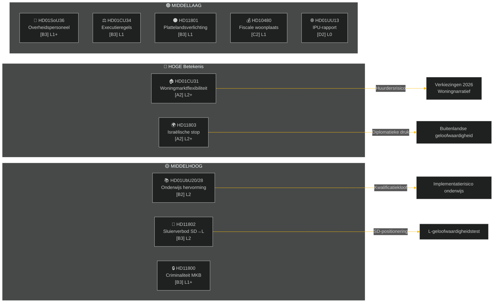

# Uitvoerende samenvatting — Wekelijks overzicht 2026-05-09

**Classificatie**: OPENBAAR | **Betrouwbaarheid**: MIDDELHOOG [B2] | **Horizon**: T+72h / T+7d
**Auteur**: Riksdagsmonitor AI Intelligence System | **Riksmöte**: 2025/26

---

## BLUF (Kernboodschap)

De week van 2–9 mei 2026 produceerde een cluster van binnenlandse wetgeving over huisvesting, onderwijs, sociale zekerheid en rechtsstaat, terwijl buitenlandse interpellaties een scherpe partijoverschrijdende kloof onthulden over de inbeslagname door Israël van een schip onder Zweedse vlag op internationale wateren. Met de Zweedse verkiezingen van 2026 nog zo'n 16 weken weg, draagt elk groot debat electorale signalering naast het onmiddellijke wetgevingsdoel.

**Leidende beoordeling**: De Tidö-coalitie (M, SD, KD, L) voert een wetgevingssprint uit met als doel belangrijke politieke successen veilig te stellen vóór de zomerpauze en de verkiezingen van september 2026. Het flexibiliteitspakket voor de woningmarkt (HD01CU31), de hervorming van onderwijskwalificaties (HD01UbU28) en de verbetering van personeelsplanning in de sociale zekerheid (HD01SoU36) versterken samen het regeringsnarrief van «hervormingsproductie». De Israël/Gaza-vlootincident (HD11803), de plattelandsverlichtingscontroverse (HD11801) en de interpellatie van SD over de sluier (HD11802) dreigen echter de publieke communicatie van de coalitie te fragmenteren en de oppositie te activeren.

---

## Top-5 'Wat-betekent-dit'-beoordelingen

| # | Beoordeling | Vertrouwen | Horizon |
|---|----------|-----------|---------|
| J1 | HD01CU31 woonflexibiliteitshervoming **domineert de politieke media van de week** door directe impact op miljoenen Zweedse huurders; oppositie (S, V, MP) versterkt huurverhogingsrisico's | HOOG [A2] | T+72h |
| J2 | HD11803 (Israëli's stoppen Zweden) **dwingt de minister van Buitenlandse Zaken** buiten parlementaire procedure een publieke verklaring af te leggen; de eis is bipartijdig | HOOG [A2] | T+72h |
| J3 | HD11802 (sluierverbod, SD→L) **onthult pre-electorale positionering over identiteitspolitiek** door SD tegenover L's integratierecord; L-minister Mohamsson staat voor een geloofwaardigheidstest over eerdere uitspraken | MIDDEL [B3] | T+7d |
| J4 | HD01UbU28 (onderwijskwalificaties in het 10-jarige schoolsysteem) **stuit op implementatieweerstand** — schooloperators missen de personeelspijplijn om aan nieuwe competentievereisten te voldoen | MIDDEL [B3] | T+7d |
| J5 | HD11801 (verwijdering plattelandswegenverlichting) **activeert verkiezingsdruk op het platteland** op KD- en C-Kamerleden; steun van de coalitie op het platteland is een structurele kwetsbaarheid voor de verkiezingen | MIDDEL [B3] | T+7d |

---

## Documentaire inlichtingenkaart

---

## Macro-economische context

**IMF WEO Apr-2026 (SWE)** — Status: verslechterd (WEO/FM Datamapper operationeel; SDMX 404):
- BBP-groei 2026: **~1,2%** (herstel blijft gematigd)
- Werkloosheid: **~8,1%** (structureel plateau boven pre-pandemisch doel)
- Beleidsrente (Riksbanken): **2,25%** (renteverlagingscyclus jun-2025 grotendeels voltooid)
- Begrotingssaldodoel: binnen EU-stabiliteits- en groeipactgrenzen

De aanhoudend zwakke groeiomgeving onderstreept de politieke relevantie van woningbetaalbaarheid (CU31) en bezuinigingen op plattelandsdiensten (HD11801), terwijl het beschikbare huishoudinkomen onder druk blijft. De sluierverbod-interpellatie van SD (HD11802) is gericht op het kanaliseren van identiteitspolitieke angst die in zwakke groeicycli versterkt.

---

## Inlichtingenanalyse: Lezersgids

Deze analyse omvat **6 commissierapporten** (bet) en **5 parlementaire vragen/interpellaties** (fråga/interpellation) van het Riksmöte 2025/26. Alle documenten opgehaald via riksdag-regering MCP op 2026-05-09; gegevens van 2026-05-08 (1-daagse terugblik). Geen stemmingen (voteringar) geregistreerd voor deze datum.

**Centrale onzekerheid**: De weekdocumenten zijn commissierapporten in de debatfase — definitieve plenaire stemmingen zijn nog niet geregistreerd. Resultaatbetrouwbaarheid hangt af van coalitiediscipline en mogelijke dissidenentiemotie.

---

*Bron: riksdag-regering MCP | IMF WEO-2026-04 | Riksdagsmonitor Wekelijks overzicht 2026-05-09*

<!-- source-sha: 3b789b190efe65d2af879b1da666d37f948938a3 -->
