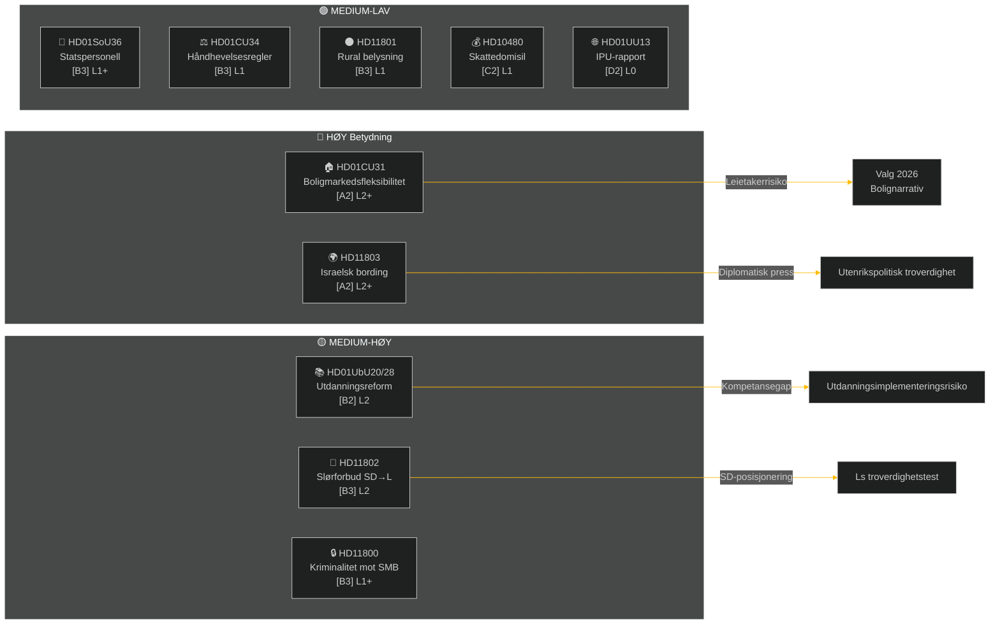

# Utøvende sammendrag — Ukentlig gjennomgang 2026-05-09

**Klassifisering**: OFFENTLIG | **Konfidens**: MEDIUM-HØY [B2] | **Horisont**: T+72h / T+7d
**Forfatter**: Riksdagsmonitor AI Intelligence System | **Riksmøte**: 2025/26

---

## BLUF (Bunnlinjens Konklusjon)

Uken 2.–9. mai 2026 produserte en klynge av innenlandsk lovgivning om bolig, utdanning, velferd og rettsstaten, mens utenrikspolitiske spørsmål avslørte en skarp tverrpartisk kløft om Israels bording av et svensk-bemannet fartøy i internasjonalt farvann. Med det svenske valget i 2026 omtrent 16 uker unna bærer enhver stor debatt valgkampsignalering utover sitt umiddelbare lovgivningsmessige formål.

**Ledende vurdering**: Tidø-koalisjonen (M, SD, KD, L) innleder en lovgivningsspurt utformet for å sementere viktige politiske seire før sommerferien og valget i september 2026. Boligmarkedsfleksibilitetspakken (HD01CU31), utdanningskvalifiseringsreformen (HD01UbU28) og forbedringen av velferdsbemanningen (HD01SoU36) styrker samlet regjeringens "reformlevering"-narrativ. Imidlertid risikerer Israel/Gaza-flåtehendelsen (HD11803), den rurale belysningskontroversen (HD11801) og SDs slørforbudsspørsmål (HD11802) å fragmentere koalisjonsens offentlige budskap og energisere opposisjonen.

---

## Topp-5 Hva-betyr-det-vurderinger

| # | Vurdering | Konfidens | Horisont |
|---|----------|-----------|---------|
| J1 | HD01CU31 boligfleksibilitetsreform **vil dominere ukens politiske media** da den direkte påvirker millioner av svenske leietakere; opposisjonen (S, V, MP) vil forsterke risiko for husleieøkninger | HIGH [A2] | T+72h |
| J2 | HD11803 (Israels bording av svenske statsborgere) **vil presse utenriksministeren** til å avgi en offentlig uttalelse utover parlamentarisk prosedyre; tverrpartisk etterspørsel er bipartisk | HIGH [A2] | T+72h |
| J3 | HD11802 (slørforbud, SD→L) **avslører forvalgsk identitetspolitisk posisjonering** av SD rettet mot Ls integrasjonsrekord; L-minister Mohamsson møter en troverdighetstest om tidligere uttalelser | MEDIUM [B3] | T+7d |
| J4 | HD01UbU28 (lærerkvalifiseringer i 10-årig skole) **vil møte implementeringsfriksjon** — skoleoperatører mangler personalpipelinen som trengs for å møte nye kompetansekrav | MEDIUM [B3] | T+7d |
| J5 | HD11801 (fjerning av rural belysning) **vil energisere distriktsvalgkretspress** på KD- og C-stortingsrepresentanter; regjeringens distriktsstøtte er en strukturell sårbarhet foran valget | MEDIUM [B3] | T+7d |

---

## Dokumentettretningskart

---

## Makroøkonomisk kontekst

**IMF WEO Apr-2026 (SWE)** — status: degradert (WEO/FM Datamapper funksjonell; SDMX 404):
- BNP-vekst 2026: **~1,2%** (gjenoppretting forblir dempet)
- Arbeidsledighet: **~8,1%** (strukturelt platå over førandemisk nivå)
- Styringsrente (Riksbanken): **2,25%** (junirentesskjæringssyklus 2025 i stor grad avsluttet)
- Budsjettunderskuddsmål: innenfor EUs SGP-grenser

Det langvarige lavvekstmiljøet forsterker den politiske relevansen av boligoverkommelighet (CU31) og rurale servicekutt (HD11801) fordi husholdningenes disponible inntekt forblir under press. SDs slørforbudsspørsmål (HD11802) er timet til å høste identitetspolitiske bekymringer som intensiveres i lavvekstsykluser.

---

## Etterretningsanalyse: Leseveiledning

Denne analysen dekker **6 komitérapporter** (bet) og **5 parlamentariske spørsmål/interpellasjoner** (fråga/interpellation) fra Riksmøte 2025/26. Alle dokumenter hentet fra riksdag-regering MCP 2026-05-09; data fra 2026-05-08 (1 dags tilbakeblikk). Ingen voteringar registrert for denne datoen.

**Nøkkelusikkerhet**: Ukens dokumenter er debattstadiekomitérapporter — endelige plenumsstemmer ennå ikke registrert. Resultatkonfidens er betinget av koalisjonsdisiplin og potensielle avvikelsesmotioner.

---

*Kilde: riksdag-regering MCP | IMF WEO-2026-04 | Riksdagsmonitor Ukentlig gjennomgang 2026-05-09*

<!-- source-sha: 3b789b190efe65d2af879b1da666d37f948938a3 -->
