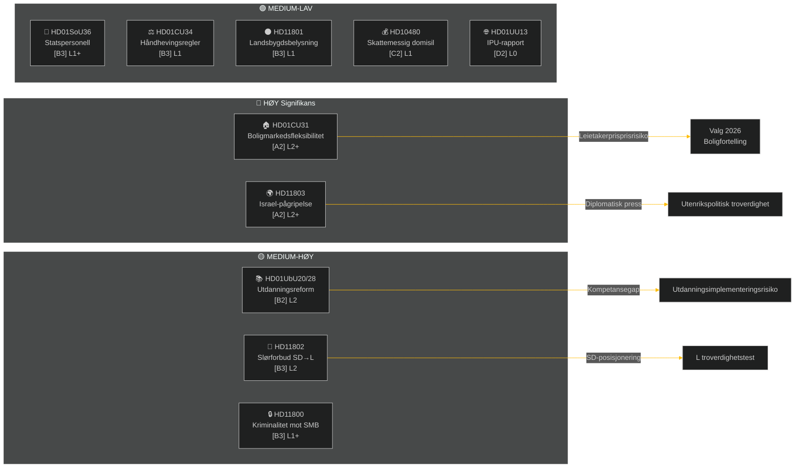

# Ukentlig Rapport — Ukentlig Gjennomgang

**Klassifisering**: PUBLIC | **Konfidensgrad**: MEDIUM-HIGH [B2] | **Horisont**: T+72h / T+7d
**Forfatter**: Riksdagsmonitor AI-etterretningssystem | **Riksmöte**: 2025/26

---

## Sammendrag

Uken 2–9. mai 2026 produserte en klynge av innenrikslover innen bolig, utdanning, sosial velferd og rettsstaten, mens utenrikspolitiske spørsmål avdekket en skarp tverrpartipolitisk kløft om Israels pågripelse av et fartøy med svenske besetningsmedlemmer i internasjonalt farvann. Med det svenske valget 2026 omtrent 16 uker unna bærer enhver stor debatt et valgkampssignal utover sitt umiddelbare lovgivningsmessige formål.

**Ledende vurdering**: Tidö-koalisjonen (M, SD, KD, L) innleder en lovgivningsspurt designet for å låse inn viktige politikkgevinster før sommerferien og valget i september 2026. Boligmarkedsfleksibilitetspakken (HD01CU31), utdanningskvalifikasjonsreformen (HD01UbU28) og forbedringen av sosialomsorgens personale (HD01SoU36) styrker kollektivt regjeringens fortelling om "reformleveranse". Israels/Gazas flotiljeincident (HD11803), kontroversiell fjerning av landsbygdsbelysning (HD11801) og SD-drevet slørforbudsspørsmål (HD11802) risikerer imidlertid å fragmentere koalisjonens offentlige budskap og energisere opposisjonen.

---

## Topp-5 Konklusjoner

| # | Vurdering | Konfidensgrad | Horisont |
|---|-----------|---------------|---------|
| J1 | HD01CU31 boligfleksibilitetsreform **vil dominere ukens politiske medier** da den direkte påvirker millioner av svenske leietakere; opposisjonen (S, V, MP) vil forsterke risikoen for leieøkninger | HIGH [A2] | T+72h |
| J2 | HD11803 (Israel pågripelse av svenske borgere) **vil legge press på utenriksministeren** for å avgi en offentlig uttalelse utover parlamentarisk prosedyre; tverrpartipolitisk krav | HIGH [A2] | T+72h |
| J3 | HD11802 (slørforbud, SD→L) **avslører identitetspolitisk posisjonering** forut for valget av SD rettet mot L's integrasjonsrekord; L-minister Mohamsson møter en troverdighetstest mot tidligere uttalelser | MEDIUM [B3] | T+7d |
| J4 | HD01UbU28 (lærerkvalifikasjoner i 10-årig skole) **vil møte implementeringsfriksjon** — skoleledere mangler personalpipeline for å oppfylle nye kompetansekrav | MEDIUM [B3] | T+7d |
| J5 | HD11801 (fjerning av landsbygdsbelysning) **vil energisere press fra landsbygdsvalgkretser** på KD- og C-stortingsrepresentanter; koalisjonens landsbygdsstøtte er en strukturell sårbarhet forut for valget | MEDIUM [B3] | T+7d |

---

## Dokumentetterretningskart

---

## Makroøkonomisk Kontekst

**IMF WEO apr-2026 (SWE)** — status: degradert (WEO/FM Datamapper fungerer; SDMX 404):
- BNP-vekst 2026: **~1,2%** (gjenoppretting forblir dempet)
- Arbeidsledighet: **~8,1%** (strukturelt platå over pre-pandemisk nivå)
- Rente (Riksbanken): **2,25%** (rentesenkningssyklusen juni 2025 i stor grad fullført)
- Budsjettunderskuddsmål: innenfor EUs SGP-grenser

Det langvarige layvekstmiljøet forsterker den politiske relevansen av boligtilgjengelighet (CU31) og kutt i landsbygdstjenester (HD11801) fordi husholdningenes disponible inntekt forblir under press. SD's slørforbudsspørsmål (HD11802) er timet til å høste identitetspolitisk angst som intensiveres i layvekstsykluser.

---

## Etterretningsvurdering: Leserveiledning

Denne analysen dekker **6 utvalgsrapporter** (bet) og **5 parlamentariske spørsmål/interpellasjoner** (fråga/interpellation) fra Riksmöte 2025/26. Alle dokumenter hentet fra riksdag-regering MCP 2026-05-09; data fra 2026-05-08 (1-dags lookback). Ingen voteringar registrert for denne datoen.

**Sentral usikkerhet**: Ukens dokumenter er i debattstadiet — endelige kammeravstemninger ikke ennå registrert. Utfallskonfidansen er betinget av koalisjonsdisiplin og eventuelle avvikelsesmotioner.

---

*Kilde: riksdag-regering MCP | IMF WEO-2026-04 | Riksdagsmonitor Ukentlig Gjennomgang 2026-05-09*

<!-- source-sha: 3b789b190efe65d2af879b1da666d37f948938a3 -->
