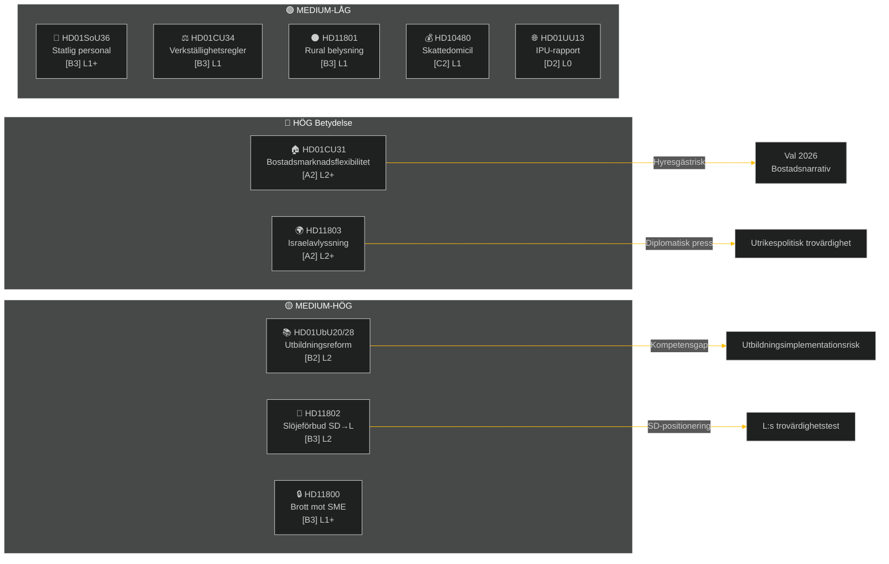

# Exekutiv sammanfattning — Veckogenomgång 2026-05-09

**Klassificering**: OFFENTLIG | **Konfidens**: MEDIUM-HÖG [B2] | **Horisont**: T+72h / T+7d
**Författare**: Riksdagsmonitor AI Intelligence System | **Riksmöte**: 2025/26

---

## Kortfattad slutsats (BLUF)

Veckan 2–9 maj 2026 gav upphov till ett kluster av inhemsk lagstiftning om bostäder, utbildning, socialvård och rättsstaten, medan utrikespolitiska frågor blottlade en skarp tvärpartiell klyfta om Israels avlyssning av ett Sverige-bemannat fartyg i internationellt vatten. Med riksdagsvalet 2026 ungefär 16 veckor bort bär varje stor debatt valröstningssignalering bortom sitt omedelbara lagstiftningssyfte.

**Ledande bedömning**: Tidö-koalitionen (M, SD, KD, L) inleder en lagstiftningsspurt utformad för att låsa in viktiga politiska segrar innan sommaruppehållet och valet i september 2026. Bostadsmarknadsflexibilitetspaketet (HD01CU31), utbildningslegitimationsreformen (HD01UbU28) och förbättringen av socialvårdsbemanningen (HD01SoU36) förstärker tillsammans regeringens narrativ om "reformleverans". Dock riskerar Israel/Gaza-flottiljincidenten (HD11803), lantliga belysningskontroversen (HD11801) och SD:s slöjebanfråga (HD11802) att fragmentera koalitionens offentliga budskap och energisera oppositionen.

---

## Topp-5 "Vad-innebär-det"-bedömningar

| # | Bedömning | Konfidens | Horisont |
|---|----------|-----------|---------|
| J1 | HD01CU31-bostadsflexibilitetsreformen **kommer att dominera veckans politiska media** eftersom den direkt påverkar miljontals svenska hyresgäster; oppositionen (S, V, MP) kommer att förstärka risker för hyreshöjningar | HIGH [A2] | T+72h |
| J2 | HD11803 (Israels avlyssning av svenska medborgare) **kommer att pressa utrikesministern** att avge ett offentligt uttalande bortom parlamentarisk procedur; tvärpartilig efterfrågan är bipartisk | HIGH [A2] | T+72h |
| J3 | HD11802 (slöjeförbud, SD→L) **avslöjar förvalsidentitetspolitisk positionering** av SD som riktar in sig på L:s integrationsrekord; L-minister Mohamsson möter ett trovärdighetstest kring tidigare uttalanden | MEDIUM [B3] | T+7d |
| J4 | HD01UbU28 (lärarlegitimationer i 10-årig skola) **kommer att möta implementationsfriktioner** — skoloperatörer saknar den personalpipeline som krävs för att uppfylla nya kompetenskrav | MEDIUM [B3] | T+7d |
| J5 | HD11801 (borttagning av rural belysning) **kommer att energisera landsbygdsvalkretsar** att pressa KD- och C-riksdagsmän; koalitionens landsbygdsstöd är en strukturell sårbarhet inför valet | MEDIUM [B3] | T+7d |

---

## Dokumentunderrättelsekarta

---

## Makroekonomisk kontext

**IMF WEO Apr-2026 (SWE)** — status: degraderad (WEO/FM Datamapper funktionell; SDMX 404):
- BNP-tillväxt 2026: **~1,2%** (återhämtning förblir dämpad)
- Arbetslöshet: **~8,1%** (strukturellt platå över förepandemisk nivå)
- Styrränta (Riksbanken): **2,25%** (juniskärcykel 2025 i stort sett avslutad)
- Budgetunderskottsmål: inom EU:s SGP-gränser

Det utdragna lågväxtmiljön förstärker den politiska relevansen hos bostadsöverkomlighet (CU31) och lantliga servicenedskärningar (HD11801) eftersom hushållens disponibla inkomst förblir under press. SD:s slöjebanfråga (HD11802) är tajmad för att skörda identitetspolitisk ångest som förstärks i lågväxtcykler.

---

## Underrättelseanalys: Läsarguide

Denna analys täcker **6 utskottsbetänkanden** (bet) och **5 parlamentsfrågor/interpellationer** (fråga/interpellation) från riksmötet 2025/26. Alla dokument hämtade från riksdag-regering MCP 2026-05-09; data från 2026-05-08 (1 dagars återblick). Inga voteringar registrerade för detta datum.

**Nyckelfel**: Veckans dokument är debattstadiebetkänkanden — slutliga kammarsröstningar ännu inte registrerade. Resultatkonfidens är beroende av koalitionsdisciplin och potentiella avvikelsemotioner.

---

*Källa: riksdag-regering MCP | IMF WEO-2026-04 | Riksdagsmonitor Veckogenomgång 2026-05-09*

<!-- source-sha: 3b789b190efe65d2af879b1da666d37f948938a3 -->
