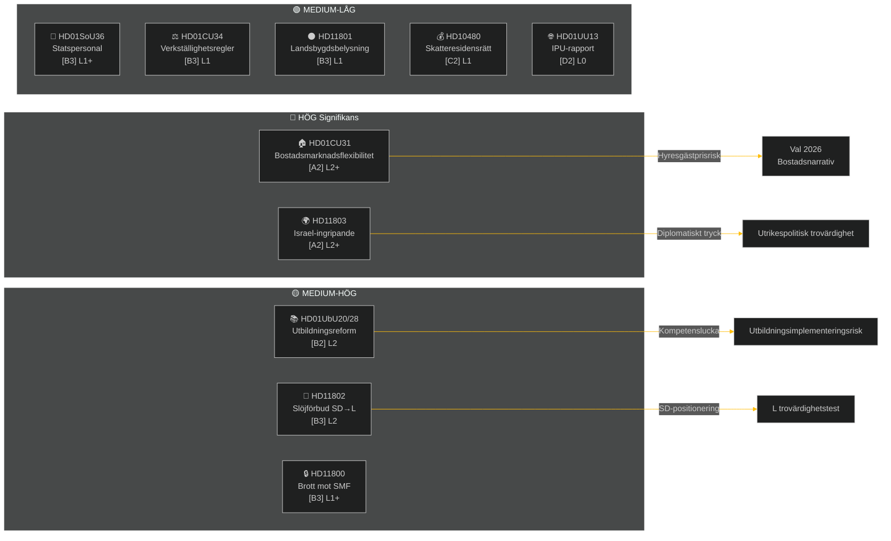

# Veckobrev — Veckoöversikt

**Klassificering**: PUBLIC | **Konfidensgrad**: MEDIUM-HIGH [B2] | **Horisont**: T+72h / T+7d
**Författare**: Riksdagsmonitor AI-underrättelsetjänst | **Riksmöte**: 2025/26

---

## Sammanfattning

Veckan 2–9 maj 2026 genererade en kluster av inrikeslagstiftning inom bostad, utbildning, socialt välfärd och rättsstatsprincipen, medan utrikespolitiska frågor exponerade en skarp partiovergripande klyfta kring Israels ingripande mot ett fartyg med svenska besättningsmedlemmar på internationellt vatten. Med det allmänna valet 2026 ungefär 16 veckor bort bär varje stor debatt ett valdelsignal bortom sitt omedelbara lagstiftningssyfte.

**Ledande bedömning**: Tidö-koalitionen (M, SD, KD, L) inleder ett lagstiftningsspurt för att befästa nyckelreformer inför sommaruppehållet och valet i september 2026. Bostadsmarknadsflexibilitetspaketet (HD01CU31), reformen av lärarutbildningsbehörighet (HD01UbU28) och förbättringen av socialtjänstpersonal (HD01SoU36) förstärker kollektivt regeringens berättelse om "reformleverans". Dock riskerar Israels/Gazas flottiljeincident (HD11803), landsbygdslysningskontroversin (HD11801) och den SD-drivna slöjbansfrågan (HD11802) att fragmentera koalitionens offentliga budskap och energisera oppositionen.

---

## Topp-5 Slutsatser

| # | Bedömning | Konfidensgrad | Horisont |
|---|-----------|---------------|---------|
| J1 | HD01CU31 bostadsflexibilitetsreform **kommer att dominera veckans politiska media** eftersom den direkt påverkar miljontals svenska hyresgäster; oppositionen (S, V, MP) kommer att förstärka riskerna för hyreshöjningar | HIGH [A2] | T+72h |
| J2 | HD11803 (Israel ingrep mot svenska medborgare) **kommer att sätta press på utrikesministern** att göra ett offentligt uttalande bortom parlamentarisk procedur; kravet från partierna är tvåpartistiskt | HIGH [A2] | T+72h |
| J3 | HD11802 (slöjförbud, SD→L) **avslöjar identitetspolitisk positionering** inför valet av SD som riktar sig mot L:s integrationsrekord; L-minister Mohamsson möter ett trovärdighetstest mot tidigare uttalanden | MEDIUM [B3] | T+7d |
| J4 | HD01UbU28 (lärarbehörighet i 10-årig skola) **möter implementationsfriktioner** — skolhuvudmän saknar personalpipeline för att möta nya kompetenskrav | MEDIUM [B3] | T+7d |
| J5 | HD11801 (borttagning av landsbygdsbelysning) **energiserar landsbygdskonstituenstrycket** på KD- och C-riksdagsledamöter; koalitionens landsbygdsstöd är en strukturell sårbarhet inför valet | MEDIUM [B3] | T+7d |

---

## Dokumentunderrättelsekarta

---

## Makroekonomisk Kontext

**IMF WEO apr-2026 (SWE)** — status: degraderat (WEO/FM Datamapper fungerar; SDMX 404):
- BNP-tillväxt 2026: **~1,2%** (återhämtningen förblir dämpad)
- Arbetslöshet: **~8,1%** (strukturellt platå ovan pre-pandemisk nivå)
- Styrränta (Riksbanken): **2,25%** (räntesänkningscykeln juni 2025 i princip slutförd)
- Budgetunderskottsmål: inom EU:s SGP-gränser

Den utdragna lågkonjunkturmiljön förstärker den politiska relevansen av bostadsöverkomlighet (CU31) och nedskärningar av landsbygdstjänster (HD11801) eftersom hushållens disponibla inkomster förblir under press. SD:s slöjbansfråga (HD11802) är planerad för att skörda identitetspolitiska ångesterierna som intensifieras i lågkonjunkturcykler.

---

## Underrättelsebedömning: Läsguide

Denna analys täcker **6 utskottsbetänkanden** (bet) och **5 parlamentariska frågor/interpellationer** (fråga/interpellation) från Riksmöte 2025/26. Alla dokument hämtade från riksdag-regering MCP den 2026-05-09; data från 2026-05-08 (1-dags lookback). Inga omröstningar (voteringar) registrerades för detta datum.

**Central osäkerhet**: Veckans dokument är debattstadiet utskottsbetänkanden — slutomröstningar i kammaren ännu ej registrerade. Utfallskonfidensen är betingad av koalitionsdisciplin och eventuella avvikelsemotioner.

---

*Källa: riksdag-regering MCP | IMF WEO-2026-04 | Riksdagsmonitor Veckoöversikt 2026-05-09*

<!-- source-sha: 3b789b190efe65d2af879b1da666d37f948938a3 -->
