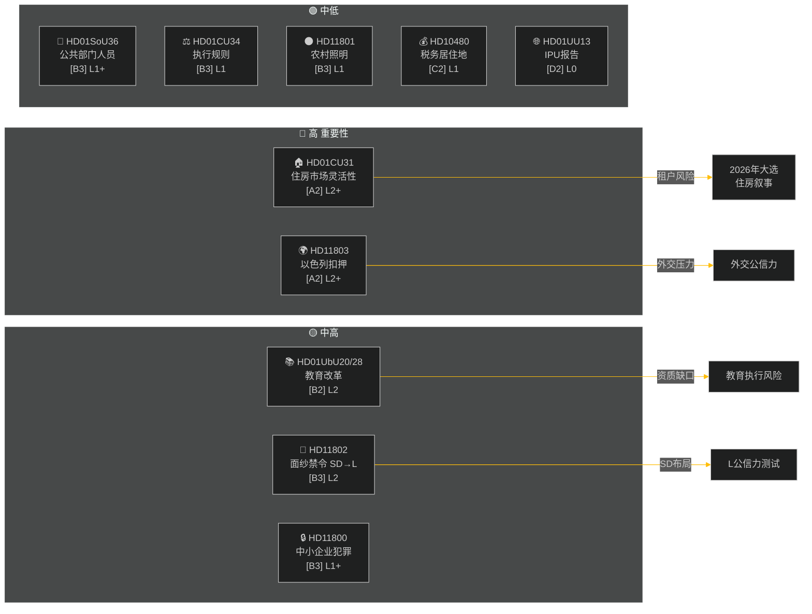

# 执行简报 — 每周回顾 2026-05-09

**分类**: 公开 | **可信度**: 中高 [B2] | **时间范围**: T+72h / T+7d
**作者**: Riksdagsmonitor AI情报系统 | **瑞典议会届次**: 2025/26

---

## BLUF（核心信息）

2026年5月2日至9日这一周，围绕住房、教育、社会保障和法治生成了一批国内立法，与此同时，外交质询揭示出各党派之间就以色列在国际水域扣押一艘悬挂瑞典国旗船只事件的尖锐分歧。距离2026年瑞典大选约16周，每场重大辩论在即时立法目的之外都带有选举信号意味。

**核心评估**：Tidö联合政府（M、SD、KD、L）正在进行一场立法冲刺，目标是在夏季休会和2026年9月大选前锁定重要政策成果。住房市场灵活性一揽子计划（HD01CU31）、教师资质改革（HD01UbU28）以及改善社会保障人员规划（HD01SoU36）共同强化了政府"改革生产力"的执政叙事。然而，以色列/加沙舰队事件（HD11803）、农村道路照明争议（HD11801）以及SD的面纱禁令质询（HD11802）有可能分裂联合政府的公开沟通，并激活反对派。

---

## 五大"意味着什么"评估

| # | 评估 | 置信度 | 时间范围 |
|---|----------|-----------|---------|
| J1 | HD01CU31住房灵活性改革**主导本周政治媒体**，直接影响数百万瑞典租户；反对党（S、V、MP）放大租金上涨风险 | 高 [A2] | T+72h |
| J2 | HD11803（以色列人拦截瑞典人）**向外交部长施压**，要求在议会程序之外公开表态；该要求具有跨党派性质 | 高 [A2] | T+72h |
| J3 | HD11802（面纱禁令，SD→L）**揭示SD针对L的融合记录在身份政治上的选前布局**；L部长Mohamsson面临早前表态的公信力考验 | 中 [B3] | T+7d |
| J4 | HD01UbU28（十年制学校教师资质）**遭遇执行阻力**——学校运营方缺乏满足新能力要求的人才管道 | 中 [B3] | T+7d |
| J5 | HD11801（拆除农村道路照明）**激活KD和C议员所在选区的农村选举压力**；农村联合政府支持率是大选前的结构性弱点 | 中 [B3] | T+7d |

---

## 文件情报地图

---

## 宏观经济背景

**IMF世界经济展望2026年4月 (SWE)** — 状态：恶化（WEO/FM Datamapper可用；SDMX 404）：
- 2026年GDP增速：**约1.2%**（复苏依然疲软）
- 失业率：**约8.1%**（高于疫情前目标的结构性高位）
- 基准利率（瑞典央行）：**2.25%**（2025年6月降息周期基本结束）
- 财政收支目标：在欧盟稳定与增长公约约束范围内

持续低增长环境凸显了住房可负担性（CU31）和农村服务削减（HD11801）的政治重要性，因为家庭可支配收入持续承压。SD的面纱质询（HD11802）旨在利用低增长周期中放大的身份政治焦虑。

---

## 情报分析：读者指南

本分析涵盖瑞典议会2025/26届次的**6份委员会报告**（bet）和**5份议会书面问题/质询**（fråga/interpellation）。所有文件于2026-05-09通过riksdag-regering MCP获取；数据来自2026-05-08（回溯1天）。该日期无投票（voteringar）记录。

**核心不确定性**：本周文件均为处于辩论阶段的委员会报告——最终全体会议表决尚未记录。结果可靠性取决于联合政府的纪律性和潜在的异议动议。

---

*来源：riksdag-regering MCP | IMF世界经济展望-2026-04 | Riksdagsmonitor 每周回顾 2026-05-09*

<!-- source-sha: 3b789b190efe65d2af879b1da666d37f948938a3 -->
