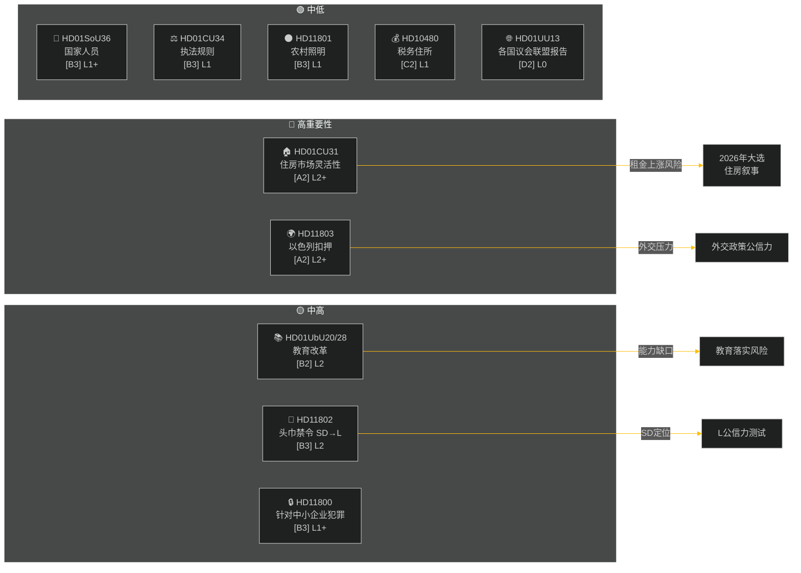

# 周报 — 每周审查 2026-05-09

**分类**: PUBLIC | **置信度**: MEDIUM-HIGH [B2] | **时间维度**: T+72h / T+7d
**作者**: Riksdagsmonitor AI情报系统 | **Riksmöte**: 2025/26

---

## 执行摘要

2026年5月2日至9日这一周产生了一批住房、教育、社会福利和法治领域的国内法律，与此同时，外交政策问题揭示了各党派之间的尖锐分歧——以色列在国际水域扣押了一艘载有瑞典船员的船只。随着2026年瑞典大选仅剩约16周，每一场重大辩论都承载着超越其直接立法目的的选举运动信号。

**主要评估**: Tidö联合政府(M, SD, KD, L)正在进入一场立法冲刺，旨在在暑假和2026年9月大选前锁定关键政策成果。住房市场灵活性方案(HD01CU31)、教育资格改革(HD01UbU28)和社会福利人员改善(HD01SoU36)共同强化了政府"落实改革"的叙事。然而，以色列/加沙舰队事件(HD11803)、农村照明撤除争议(HD11801)以及由SD推动的头巾禁令问题(HD11802)可能使联合政府的公开信息支离破碎，并激活反对派。

---

## 五大核心评估

| # | 评估 | 置信度 | 时间维度 |
|---|------|--------|---------|
| J1 | 住房灵活性改革HD01CU31将**主导本周政治媒体**，因为它直接影响数百万瑞典租客；反对党(S, V, MP)将放大租金上涨风险 | HIGH [A2] | T+72h |
| J2 | HD11803(以色列逮捕瑞典公民)将**向外交部长施压**要求发表超越议会程序的公开声明；跨党派要求 | HIGH [A2] | T+72h |
| J3 | HD11802(头巾禁令，SD→L)在选举前**揭示SD针对L整合记录的身份政治定位**；L部长莫哈姆森面临与此前声明相悖的信任测试 | MEDIUM [B3] | T+7d |
| J4 | HD01UbU28(10年制学校教师资格)将**面临实施阻力** — 学校校长缺乏满足新能力要求的人员储备 | MEDIUM [B3] | T+7d |
| J5 | HD11801(撤除农村照明)将**激活农村选区对KD和C议员的压力**；联合政府的农村支持是选举前的结构性弱点 | MEDIUM [B3] | T+7d |

---

## 文档情报地图

---

## 宏观经济背景

**IMF WEO 2026年4月 (SWE)** — 状态：降级 (WEO/FM Datamapper运行；SDMX 404)：
- GDP增长率2026年：**约1.2%**（复苏持续低迷）
- 失业率：**约8.1%**（结构性平台期，高于疫情前水平）
- 政策利率 (Riksbanken)：**2.25%**（2025年6月降息周期基本完成）
- 财政赤字目标：在欧盟稳定与增长公约限度内

长期低增长环境放大了住房可负担性(CU31)和农村服务削减(HD11801)的政治关联性，因为家庭可支配收入持续承压。SD的头巾问题(HD11802)的时机安排旨在收获在低增长周期中加剧的身份政治焦虑。

---

## 情报评估：阅读指南

本分析涵盖Riksmöte 2025/26的**6份委员会报告**(bet)和**5个议会问题/质询**(fråga/interpellation)。所有文件于2026-05-09从riksdag-regering MCP获取；数据为2026-05-08的(1天回溯)。该日期未记录投票(voteringar)。

**核心不确定性**：本周文件处于辩论阶段 — 最终全体投票尚未记录。结果置信度取决于联合政府纪律和潜在的偏离动议。

---

*来源：riksdag-regering MCP | IMF WEO-2026-04 | Riksdagsmonitor 每周审查 2026-05-09*

<!-- source-sha: 3b789b190efe65d2af879b1da666d37f948938a3 -->
