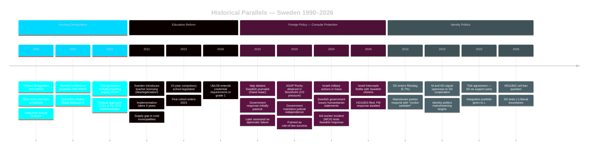

# Historical Parallels — Weekly Review 2026-05-09

**Classification**: PUBLIC | **Methodology**: electoral-domain-methodology.md §precedents
**Riksmöte**: 2025/26

---

## Historical Parallel Analysis

Key precedents for the week's major political events, drawn from Swedish and Nordic parliamentary history.

---

## Timeline of Precedents

---

## Parallel 1: Finnish Rent Deregulation (1995) — Closest Analogue to CU31

**What happened**: Finland removed rent regulation in 1995, transitioning from a regulated to a market-based system. The reform was part of a broader economic liberalisation following Finland's severe early-1990s depression.

**Outcomes (documented)**:
- Rental prices in Helsinki rose ~15–20% in the first 5 years
- New private rental construction increased significantly over 10 years
- Affordability for new market entrants worsened in the short term
- Long-term housing supply improved

**Relevance to CU31**:
- Sweden's CU31 is more limited (new construction initially), avoiding full deregulation
- Sweden's construction cost environment is different (higher material/labour costs)
- The opposition's "rents will rise" warning is validated by the Finnish precedent for the short-to-medium term
- The government's "more supply" argument is validated by the 10-year Finnish evidence

**Intelligence implication**: Both sides have empirical ammunition from the Finnish case. The framing contest will determine which part of the evidence the public absorbs.

---

## Parallel 2: Sweden Teacher Licensing Reform 2011–2015 — Closest Analogue to UbU28

**What happened**: Sweden introduced mandatory teacher licensing (*lärarlegitimation*) for all teachers from 2011, with full implementation required by 2015. Many teachers lacked the required documentation.

**Outcomes (documented)**:
- Initial implementation created significant shortages: 30–40% of teachers lacked full licensing
- Government extended deadlines multiple times
- Rural municipalities disproportionately affected — fewer qualified applicants
- By 2020, licensing compliance reached ~85%
- PISA results did not immediately improve (other factors dominant)

**Relevance to UbU28**:
- UbU28 extends the credential requirement to grade 1 in the 10-year school
- The same implementation challenges will arise: teacher shortages, rural gaps, timeline extensions
- The 2011–2015 reform took 4+ years to reach 85% compliance; UbU28's 2026–2027 timeline is optimistic

**Intelligence implication**: The government should expect a 3–5 year implementation horizon and should pre-announce a flexible compliance schedule to prevent the reform from becoming a "broken promise" story.

---

## Parallel 3: Dawit Isaac / Swedish Consular Failures — Historical Context for HD11803

**What happened**: Swedish-Eritrean journalist Dawit Isaac was imprisoned by the Eritrean government in 2001 and remains imprisoned. Swedish diplomatic efforts over 25 years have failed to secure his release.

**Outcomes (documented)**:
- Multiple Swedish foreign ministers expressed concern; diplomatic notes were filed
- No concrete result achieved
- The case became a symbol of the limits of Swedish diplomatic power relative to authoritarian states

**Relevance to HD11803**:
- The Israel case is materially different (a democracy intercepting in international waters, not a long-term detention)
- However, the Dawit Isaac precedent establishes that Swedish diplomatic protests alone rarely produce results against states with strong geopolitical leverage
- The government will likely issue a formal statement but cannot guarantee outcome for Swedish citizens

---

## Parallel 4: SD's Wedge-Question Strategy — Historical Pattern for HD11802

**What happened**: Since entering government cooperation in 2022, SD has consistently filed parliamentary questions targeting L and KD on identity issues (veils, immigration, blasphemy, etc.).

**Pattern**:
- Questions filed that quote L/KD ministers' own prior statements
- Questions designed to force a contradiction or capitulation
- No accompanying motion — the media cycle is the product
- Frequency: approximately 8–12 such questions per riksmöte

**Relevance to HD11802**:
- This is the established SD playbook, not a novel strategy
- L has survived previous versions; the key is the response quality
- Historical evidence: L has maintained its 4% floor despite repeated SD pressure (2022–2026)

---

## Summary of Historical Intelligence

| Issue | Best Precedent | Outcome Prediction | Confidence |
|-------|---------------|-------------------|-----------|
| CU31 Housing deregulation | Finnish 1995 | Short-term rent pressure; long-term supply gain | HIGH [A2] |
| UbU28 Teacher credentials | Sweden 2011 | 3–5 year implementation delay; rural gap | HIGH [A2] |
| HD11803 Israel/consular | Dawit Isaac; WCK aid workers 2024 | Formal protest likely; limited concrete outcome | MEDIUM [B2] |
| HD11802 Veil ban question | SD wedge-question pattern 2022–2025 | Media cycle; L maintains position; no legislation | HIGH [A2] |

---

*Source: riksdag-regering MCP | electoral-domain-methodology.md §precedents | Swedish parliamentary archive | 2026-05-09*
