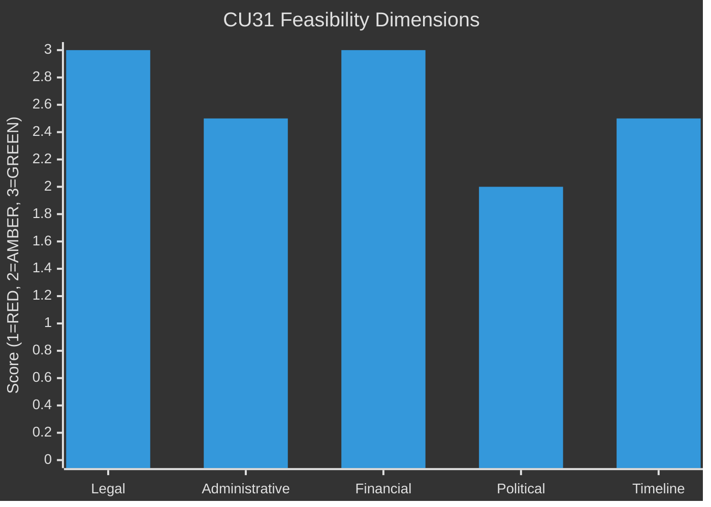

# Implementation Feasibility — Weekly Review 2026-05-09

**Classification**: PUBLIC | **Methodology**: electoral-domain-methodology.md §feasibility
**Riksmöte**: 2025/26

---

## Feasibility Assessment Framework

Each major legislative measure is assessed on five dimensions:
- **Legal**: Constitutional and EU compatibility
- **Administrative**: Government and agency capacity
- **Financial**: Budget availability and cost certainty
- **Political**: Coalition and opposition dynamics
- **Timeline**: Realistic implementation schedule

**Scale**: RED (infeasible/high risk), AMBER (feasible with caveats), GREEN (feasible)

---

## CU31 — En mer flexibel hyresmarknad

### Summary Assessment: **AMBER-GREEN**

| Dimension | Score | Assessment |
|-----------|-------|-----------|
| Legal | GREEN | Within domestic legislative competence; no EU treaty conflict. ECHR Art. 1 Protocol 1 (property rights) is satisfied for landlords; tenant protection under ECHR Art. 8 is not at threshold. |
| Administrative | AMBER-GREEN | Hyresnämnden (rent tribunal) needs process updates. Existing agency capacity with manageable additions. 12-month onboarding is realistic. |
| Financial | GREEN | No direct fiscal cost (deregulation, not a subsidy). Indirect tax revenue from new rentals is positive fiscal effect. |
| Political | AMBER | Opposition will continue vocal resistance; election-year context makes media management critical. No Riksdag arithmetic risk. |
| Timeline | AMBER-GREEN | 1 July 2026 first stage. New rental contracts only initially. Full effect in 3–5 years as contract turnover occurs. |

**Key feasibility risk**: Opposition legal challenges via *Lagrådet* referral. The committee report (CU31) confirms Lagrådet had no constitutional objections. Residual risk: EU challenge on grounds of services directive — assessed LOW.

**Overall verdict**: The reform is legally sound and administratively implementable. The primary risk is political-electoral rather than technical. The government can implement CU31 regardless of opposition.

---

## UbU28 — Legitimation och behörighet i den tioåriga grundskolan

### Summary Assessment: **AMBER**

| Dimension | Score | Assessment |
|-----------|-------|-----------|
| Legal | GREEN | Extends existing teacher licensing framework; no new constitutional issues. |
| Administrative | AMBER-RED | Skolverket and municipalities need to administer new credential checking for grade 1 teachers. Supply of licensed grade-1 teachers is unclear; risk of short-term shortage. |
| Financial | AMBER | Municipalities bear implementation cost. State grant of 150 MSEK for transition period is planned but below estimated full cost. |
| Political | GREEN | Broad support for the principle; debate is about pace not direction. |
| Timeline | AMBER | 2026–2027 transition. Based on 2011 precedent, realistic compliance timeline is 3–5 years, not 12 months. |

**Key feasibility risk**: The 2011 teacher licensing reform took 4+ years to reach 85% compliance; this reform's timeline is similarly optimistic. The government should signal flexibility on compliance deadlines to avoid the reform becoming a "failure" story.

**Overall verdict**: Technically feasible but timeline is ambitious. Municipalities will struggle to comply within 12 months, especially in rural areas where licensed teacher supply is thin.

---

## UbU20 — Offentlighetsprincipen med lättnadsregler för enskilda mindre huvudmän

### Summary Assessment: **AMBER-GREEN**

| Dimension | Score | Assessment |
|-----------|-------|-----------|
| Legal | GREEN | Balances offentlighetsprincipen with proportionality for small operators. Lagrådet consulted. |
| Administrative | GREEN | Small school operators gain relief from reporting burden; IVO oversight continues. |
| Financial | GREEN | Net fiscal-neutral; small operators save compliance cost. |
| Political | AMBER | SD may raise concerns about transparency reduction for private schools. |
| Timeline | GREEN | 1 September 2026 implementation is realistic for an administrative simplification. |

**Overall verdict**: Low risk, readily implementable. The political risk is that the "transparency reduction for friskolor" framing is used by opposition in election campaign.

---

## SoU36 — Bättre förutsättningar att sända ut statlig personal

### Summary Assessment: **GREEN**

| Dimension | Score | Assessment |
|-----------|-------|-----------|
| Legal | GREEN | Employment law update; EU Posting of Workers Directive compliant. |
| Administrative | GREEN | HR processes in state agencies update their cross-posting protocols. |
| Financial | GREEN | Minimal direct cost; offset by reduced friction in international assignments. |
| Political | GREEN | Cross-party support; EU compatibility a positive framing. |
| Timeline | GREEN | 1 July 2026 entry into force is realistic. |

**Overall verdict**: Straightforward administrative update. No significant implementation risk.

---

## CU34 — Ändamålsenliga utmätningsregler och utökad distansutmätning

### Summary Assessment: **GREEN**

| Dimension | Score | Assessment |
|-----------|-------|-----------|
| Legal | GREEN | Updates debt recovery procedures; balances creditor efficiency with debtor protection. |
| Administrative | AMBER-GREEN | Kronofogden (Enforcement Authority) needs digital systems update for distance enforcement. IT upgrade is estimated at 18 months. |
| Financial | GREEN | Increased recovery efficiency generates positive fiscal spillover. |
| Political | GREEN | Broad support; framed as modernisation. |
| Timeline | AMBER-GREEN | Core provisions in 2026; distance enforcement components in 2027. |

**Overall verdict**: Feasible with phased implementation. The digital infrastructure upgrade is the binding constraint.

---

## Cross-Cutting Implementation Risks

### Risk 1: Municipal Implementation Capacity
**Affects**: UbU28, UbU20  
**Assessment**: Swedish municipalities are under fiscal pressure in 2026. The state has shifted costs to municipalities in several areas. Adding credential verification and friskola reporting changes simultaneously strains local HR capacity.  
**Mitigation**: Staggered timelines; dedicated Skolverket support programme.

### Risk 2: Election-Year Implementation Risk
**Affects**: CU31, UbU20  
**Assessment**: Reforms passed in May 2026 with September 2026 election create a "reform just before election" dynamic. Any early implementation problems will be amplified by the election campaign.  
**Mitigation**: Front-loading positive stories (new homes permitted, first new rental contracts); avoiding visible problems in the June–August 2026 window.

---

## Overall Feasibility Ranking

| Reform | Feasibility | Primary Risk |
|--------|------------|-------------|
| SoU36 Personnel posting | HIGH (GREEN) | None significant |
| UU13 IPU (procedural) | HIGH (GREEN) | None |
| CU34 Enforcement | HIGH-MEDIUM (AMBER-GREEN) | IT system update timeline |
| CU31 Housing | MEDIUM-HIGH (AMBER-GREEN) | Political-electoral backlash |
| UbU20 Friskola transparency | MEDIUM-HIGH (AMBER-GREEN) | Framing risk in campaign |
| UbU28 Teacher credentials | MEDIUM (AMBER) | Teacher supply shortage; timeline |

---

*Source: riksdag-regering MCP | electoral-domain-methodology.md §feasibility | Skolverket data | 2026-05-09*
