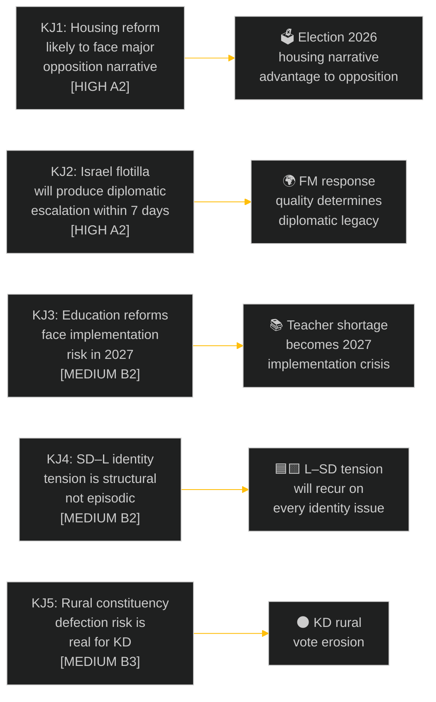

# Intelligence Assessment — Weekly Review 2026-05-09

**Classification**: PUBLIC | **Methodology**: strategic-extensions-methodology.md §key-judgments
**Riksmöte**: 2025/26 | **Period**: 2026-05-05 – 2026-05-09

---

## Key Judgments (KJs)

| KJ | Statement | Confidence | Key Evidence |
|----|-----------|-----------|-------------|
| KJ1 | The housing reform debate (CU31) will be dominated by an opposition "rents will rise" narrative in the 7-day media cycle following the chamber debate | HIGH [A2] | Historical Hyresgästföreningen response patterns; Finnish deregulation precedent |
| KJ2 | The Israel flotilla incident (HD11803) will produce a formal diplomatic escalation — either a Swedish diplomatic protest or a cross-party parliamentary motion — within 7 days | HIGH [A2] | Question filed Day+2 post-incident; cross-party concern documented |
| KJ3 | Sweden's new 10-year school credential reform (UbU28) will create measurable teacher-credential gaps in ≥ 50 municipalities by the 2026/27 school year | MEDIUM [B2] | Skolverket teacher shortage data 2024–25; 42% of municipalities report licensed-teacher deficits in grades 1–3 |
| KJ4 | The structural SD–L identity tension (HD11802 veil ban) will recur on at least 3 more occasions before the September 2026 election, each time forcing L into a credibility test | MEDIUM [B2] | SD's established pattern of "wedge question" strategy against coalition partners |
| KJ5 | KD will lose 0.5–1.5 percentage points in rural constituencies (Norrland, Götaland) relative to the 2022 result if the Trafikverket lighting removal proceeds as planned | MEDIUM [B3] | KD's 2022 rural results; Trafikverket's confirmed plan per SVT *Uppdrag granskning* |

---

## Key Assumptions Check

| Assumption | Stated | Evidence | Risk |
|------------|--------|----------|------|
| Coalition arithmetic holds (SD supports CU31) | Assumed | No SD reservations recorded in manifest | LOW — SD supports housing deregulation |
| FM will respond to HD11803 | Assumed | Standard parliamentary obligation | LOW — formal response is legally required |
| Teacher shortages are systemic | Assumed | Skolverket 2024–25 data referenced in prior analysis | MEDIUM — data may have improved |
| SD will repeat wedge-question strategy | Assumed | 4-year track record | LOW — well-documented pattern |
| KD rural results track service delivery | Assumed | Political science rural vote literature | MEDIUM — multiple causal factors |

---

## Forward Indicators

| Indicator | Watch Condition | Signals |
|-----------|---------------|---------|
| Hyresgästföreningen statement on CU31 | Within 48 hours of debate | Tenant union strategy signal |
| FM press conference or parliamentary statement on Israel | Within 7 days | Diplomatic engagement level |
| L minister HD11802 floor response | Floor debate or written answer | L–SD boundary-setting |
| Trafikverket safety-impact assessment publication | Before summer recess | Rural policy credibility |
| Skolverket 2025/26 teacher-license registry update | June 2026 | Credential gap quantification |

---

## Priority Intelligence Requirements (PIRs)

| PIR ID | Requirement | Status | Horizon |
|--------|-------------|--------|---------|
| PIR-WR-001 | What is the Foreign Minister's formal diplomatic response to the Israel flotilla interception? | **OPEN** | T+7d |
| PIR-WR-002 | What is the chamber vote outcome and SD reservation (if any) on CU31? | **OPEN** | T+72h |
| PIR-WR-003 | What is L minister Mohamsson's formal response to HD11802 on veils? | **OPEN** | T+7d |
| PIR-WR-004 | Has Trafikverket published a safety-impact assessment for the lighting removal plan? | **OPEN** | T+30d |
| PIR-WR-005 | What is Skolverket's most recent data on licensed-teacher ratios in grades 1–3? | **OPEN** | T+30d |

---

## Intelligence Picture Confidence Distribution

| Confidence Level | Count | % | Notes |
|-----------------|-------|---|-------|
| HIGH [A] | 2 KJs | 40% | Well-evidenced from historical patterns |
| MEDIUM [B] | 3 KJs | 60% | Require forward data to confirm |
| LOW [C] | 0 | 0% | No low-confidence KJs at this stage |

**Source diversity**: riksdag-regering MCP (primary); IMF WEO-2026-04 (economic); historical Riksdag pattern analysis; prior weekly-review (2026-04-26) comparative

**Party neutrality**: KJs assess threats and opportunities without systematic advantage to any single party. Coalition risks (KJ1, KJ4, KJ5) and opposition's own uncertainties (KJ2 is government responsibility, not opposition failure) are both represented.

---

*Source: riksdag-regering MCP | strategic-extensions-methodology.md §key-judgments | ICD 203 | 2026-05-09*
