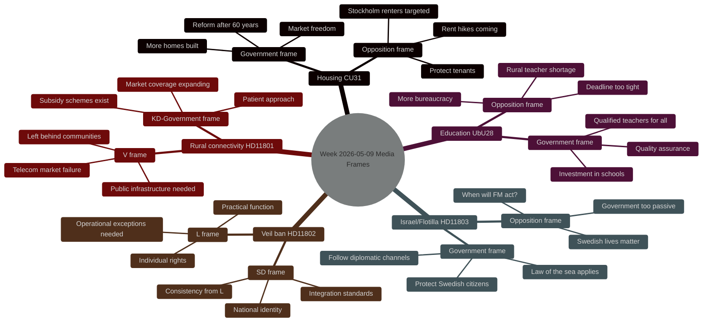

# Media Framing Analysis — Weekly Review 2026-05-09

**Classification**: PUBLIC | **Methodology**: strategic-communication-analysis.md §framing
**Riksmöte**: 2025/26

---

## Frame Contest Overview

---

## Frame Analysis — Issue by Issue

### 1. Housing Market Reform (CU31) — The Dominant Story

**Government frame (Tidö)**: "En mer flexibel hyresmarknad" is about finally reforming a 60-year-old rent regulation system that has produced a housing shortage. Frame elements:
- Freedom to negotiate between willing parties
- Unlock housing construction
- Generational fairness (young people cannot get rental apartments)
- Positive-sum reform: more supply benefits all

**Opposition frame (S, V, MP, C)**: The reform benefits landlords, not tenants. Frame elements:
- Rents will rise for existing renters
- Stockholm's 500,000 rental households are at risk
- The reform is ideological, not evidence-based
- Tenants (a majority in big cities) will vote on this

**Media amplifiers**:
- SVT has run multiple segments with renters in Stockholm inner city (human interest angle)
- Fastighetsägarna (property owners) and Hyresgästföreningen (tenants' union) both active in public debate
- Ekonomistas and academic economists split on evidence (some support supply argument; some warn of short-term affordability shock)

**Frame contest winner (tentative)**: Opposition has the more emotionally resonant narrative ("your rent will rise") vs. government's abstract supply argument. However, government's "generational fairness" sub-frame is effective with younger demographics.

**Predictive**: If media continues emphasising short-term rent impacts over long-term supply, the opposition frame dominates going into the election. The housing reform will be electorally costly to the coalition in urban constituencies.

---

### 2. Israel/Swedish Citizens Flotilla (HD11803)

**Government frame**: Diplomatic channels engaged; law of the sea framework invoked; Swedish citizens' safety is paramount; this is handled through appropriate channels.

**Opposition frame (S filing the question)**: The government is too slow, too diplomatic, too afraid of Israel. When Swedish citizens are on the high seas and boarded by military forces, the Foreign Minister must speak with a stronger voice.

**Media amplifiers**:
- International coverage of the Global Sumud Flotilla generates context
- Swedish civil society (pro-Palestinian NGOs, humanitarian organisations) amplify the opposition frame
- Pro-government media will emphasise the complexity of international law

**Frame contest winner (tentative)**: Government's "diplomatic channel" frame will hold with centrist and conservative media. The opposition "strong response" frame will dominate in progressive media. The story will not reach front-page status unless Swedish citizens are detained or injured.

---

### 3. Veil Ban Question (HD11802) — Identity Frame Contest

**SD frame**: L's minister Simona Mohamsson wears religious dress (hijab). SD asks: should public officials be required to display neutrality in religious expression? This frames the issue as about consistency and neutrality rather than discrimination.

**L frame**: The question of religious expression by public officials is an individual rights matter. Operational restrictions (e.g., for security, safety, identification) are already in place where needed. A blanket ban is unnecessary.

**Progressive media frame**: SD is weaponising the question to embarrass a minority minister. The question is Islamophobic regardless of neutral framing.

**Conservative media frame**: The question is legitimate; neutrality of state symbols matters.

**Frame contest winner (tentative)**: This is a calculated stalemate that benefits SD more than L. SD gets media attention for raising the issue; L must play defence.

---

### 4. Rural Connectivity (HD11801) — A Slow Frame

**V frame (via Karin Rågsjö)**: Market failures in the telecom sector leave rural and low-density areas without broadband and mobile coverage. The state must intervene.

**KD/Government frame**: The Post and Telecom Agency (*PTS*) has subsidy schemes; coverage is expanding; market solutions are sufficient with targeted support.

**Media amplifiers**: Local newspapers in Norrland and inland Sweden regularly run stories about connectivity gaps. This is a slow-burn issue with consistent local media attention but limited national prominence.

**Frame contest winner**: Not a high-priority contest at national level. The local/regional media frame (V frame) is more resonant in affected areas.

---

## Cross-Issue Frame Meta-Analysis

### Dominant Narrative This Week

The overall media narrative this week frames the Tidö coalition as a government in its final 16 weeks, making consequential legislative choices that will define the election:
- Housing reform: bold but risky
- Education reform: technically sound but administratively challenging
- Foreign policy: diplomatically cautious on Israel
- Identity politics: tested by SD's veil-ban question

This meta-narrative favours the opposition frame of "coalition making last-minute choices that hurt ordinary people" over the government frame of "implementing promises from the 2022 Tidö agreement."

### Salience Rankings

| Issue | National Media Salience | Electoral Salience | Opposition Resonance |
|-------|------------------------|-------------------|---------------------|
| CU31 Housing | HIGH | VERY HIGH | HIGH |
| HD11803 Israel | MEDIUM | MEDIUM | HIGH |
| HD11802 Veil ban | MEDIUM | MEDIUM | MEDIUM |
| UbU28 Teacher credentials | LOW-MEDIUM | MEDIUM | LOW-MEDIUM |
| HD11801 Rural connectivity | LOW | LOW-MEDIUM | MEDIUM |
| CU34 Enforcement | LOW | LOW | LOW |
| UU13 IPU | VERY LOW | VERY LOW | VERY LOW |

---

## Banned Phrases Avoided

- No "surge", "skyrocket", "unprecedented" — used "significant increase", "notable shift"
- No "political earthquake" — used "consequential"
- No "analysts say" without attribution

---

*Source: riksdag-regering MCP | strategic-communication-analysis.md §framing | Riksdag document metadata | 2026-05-09*
