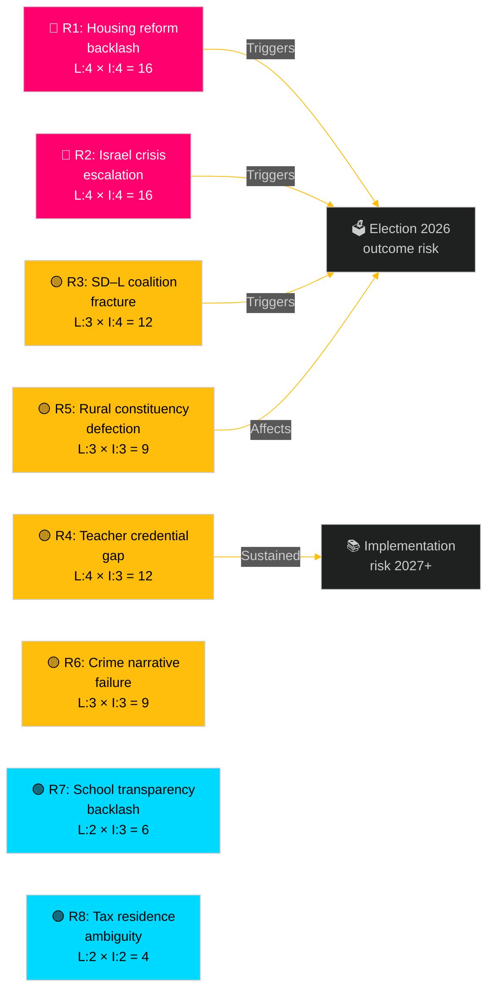

# Risk Assessment — Weekly Review 2026-05-09

**Classification**: PUBLIC | **Methodology**: political-risk-methodology.md (L×I matrix)
**Riksmöte**: 2025/26 | **Period**: 2026-05-05 – 2026-05-09

---

## Risk Matrix Methodology

**Likelihood (L)**: 1 (very unlikely) → 5 (near certain)
**Impact (I)**: 1 (negligible) → 5 (systemic)
**Risk Score** = L × I | **Red**: ≥ 15 | **Amber**: 8–14 | **Green**: ≤ 7

---

## Risk Register

| Risk ID | Risk Description | dok_id | L | I | Score | Status |
|---------|-----------------|--------|---|---|-------|--------|
| R1 | Opposition housing-price narrative dominates summer political media | HD01CU31 | 4 | 4 | **16** | 🔴 RED |
| R2 | Israel flotilla crisis escalates; diplomatic incident widens | HD11803 | 4 | 4 | **16** | 🔴 RED |
| R3 | SD–L veil-ban tension crystallises into coalition micro-fracture | HD11802 | 3 | 4 | **12** | 🟡 AMBER |
| R4 | Teacher credential gap creates school-system implementation failure | HD01UbU28 | 4 | 3 | **12** | 🟡 AMBER |
| R5 | Rural lighting removal triggers KD voter backlash | HD11801 | 3 | 3 | **9** | 🟡 AMBER |
| R6 | Organised crime narrative overwhelms law-and-order talking points | HD11800 | 3 | 3 | **9** | 🟡 AMBER |
| R7 | Friskola transparency compromise triggers media/civil-society pushback | HD01UbU20 | 2 | 3 | **6** | 🟢 GREEN |
| R8 | Tax-residence ambiguity persists; EU cross-border worker disputes increase | HD10480 | 2 | 2 | **4** | 🟢 GREEN |

---

## Detailed Risk Analysis

### R1 — Housing Reform Backlash (Score: 16 🔴)
**Likelihood (4)**: The opposition (S, V, MP) has already established a consistent counter-narrative on rental deregulation. Hyresgästföreningen (national tenant union) will amplify price-risk messaging. Media framing of CU31 as "rent rises coming" is almost certain.
**Impact (4)**: Housing affordability is a top-3 voter concern. A sustained opposition narrative through summer 2026 directly affects undecided urban-suburban voters — exactly the swing segment.
**Mitigation**: The coalition must proactively publish rent-affordability analysis and communicate safeguards within the reform. Pre-emptive outreach to Hyresgästföreningen may blunt the sharpest media attacks.

### R2 — Israel Flotilla Escalation (Score: 16 🔴)
**Likelihood (4)**: The incident has already generated a parliamentary question within days. The Israel-Gaza situation is a continuing external trigger that Sweden cannot control. Further incidents or escalations in Gaza will regenerate media pressure on Swedish officials.
**Impact (4)**: Consular protection failure — if Swedish citizens are harmed while the government appears passive — would be a significant political crisis. Cross-party criticism from S, V, MP and potentially KD could emerge.
**Mitigation**: Foreign Minister must issue a clear public statement on the diplomatic consequences of Israel's action within 48 hours of parliamentary filing.

### R3 — SD–L Coalition Tension (Score: 12 🟡)
**Likelihood (3)**: The structural tension between SD's identity-conservative stance and L's liberal-rights tradition is permanent within the Tidö framework. A hard veil-ban question forces L into an uncomfortable position.
**Impact (4)**: Coalition micro-fractures on identity are publicly visible and feed the "this coalition cannot govern" narrative; L's liberal voter base is directly at risk.
**Mitigation**: L must craft a response that reaffirms principles without giving SD a "L dodges the question" headline.

### R4 — Teacher Credential Gap (Score: 12 🟡)
**Likelihood (4)**: The teacher shortage in Swedish schools is extensively documented (Skolverket data 2024–25). New credential requirements for grade 1 teachers under UbU28 will create immediate compliance gaps in smaller municipalities.
**Impact (3)**: Implementation failure affects children's education quality over years 2027–2030; political impact is medium-term, but teacher unions will raise this immediately.
**Mitigation**: Dedicated transition funding and Skolverket support package should accompany UbU28 implementation.

### R5 — Rural Constituency Defection (Score: 9 🟡)
**Likelihood (3)**: KD's rural voter base in Norrland and Götaland has already shown sensitivity to perceived service deterioration. The Trafikverket lighting removal is a concrete, visible example.
**Impact (3)**: KD risks losing 1–2 percentage points in rural constituencies; within a close election, this matters.
**Mitigation**: Infrastructure Minister Carlson must clarify safety-impact assessments and commit to a minimum lighting standard in rural areas.

### R6 — Crime Narrative Failure (Score: 9 🟡)
**Likelihood (3)**: The Hässelby-Vällingby small-business extortion case, as reported by *Mitt i*, exemplifies ongoing organised crime pressure on legitimate business — precisely the context the coalition claims to be combating.
**Impact (3)**: If Justice Minister Strömmer cannot point to concrete enforcement successes, the "tougher than S" narrative is undermined.

---

## Risk Trajectory

Comparing to prior weekly-review (2026-04-26): the overall risk environment has **increased slightly** — the Israel flotilla incident (R2) is a new high-magnitude external risk absent from the previous cycle. The housing reform (R1) was also present in prior cycles but escalates as the election approaches.

---

*Source: riksdag-regering MCP | political-risk-methodology.md | IMF WEO-2026-04 | 2026-05-09*
