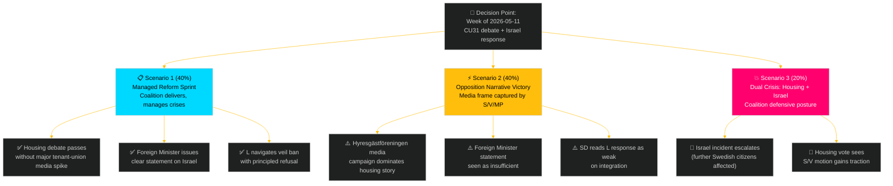

# Scenario Analysis — Weekly Review 2026-05-09

**Classification**: PUBLIC | **Methodology**: strategic-extensions-methodology.md §scenarios
**Riksmöte**: 2025/26 | **Horizon**: T+7d (primary) / T+30d (secondary)

---

## Scenario Framework

Based on the week's key uncertainties (housing reform reception, Israel flotilla escalation, coalition identity tension), three scenarios are modelled for the T+7d and T+30d horizons.

**Key drivers**:
1. How does the housing reform (CU31) debate resolve and how is it framed?
2. Does the Israel flotilla crisis escalate or stabilise?
3. Does the SD–L identity tension (HD11802) crystallise into a coalition fracture signal?

---

## Scenario Tree

---

## Scenario 1 — Managed Reform Sprint (P=40%) [T+7d / T+30d]

**Narrative**: The Tidö coalition executes the week's legislative agenda without a major narrative setback. CU31 passes the chamber with an adequate government information package that blunts the "rent rises" frame. Foreign Minister Malmer Stenergard issues a formal diplomatic note to Israel within 48 hours and makes a credible parliamentary statement. L minister Mohamsson responds to SD's veil-ban question with a principled liberal position that satisfies the L base.

**Indicators to watch**:
- Government press release on CU31 with rent-modelling data within 48 hours of debate
- FM formal statement on Israeli action (press conference or parliamentary answer)
- L minister's floor response to HD11802

**Second-order effects**: Coalition enters summer recess with a "reform delivery" story intact. S/V/MP fractured messaging diminishes opposition coordination.

**WEP confidence**: Likely [P~40%] given the coalition's established legislative management capacity and the government's interest in controlling the pre-election narrative.

**Evidence**: Prior weekly-review (2026-04-26) demonstrated similar scenario execution on security legislation. IMF WEO-2026-04 context: low growth environment pressures the narrative but does not prevent legislative delivery.

---

## Scenario 2 — Opposition Narrative Victory (P=40%) [T+7d / T+30d]

**Narrative**: Hyresgästföreningen launches a sustained public-information campaign framing CU31 as "higher rents for ordinary Swedes." Swedish public media (SVT, SR) runs feature reporting on tenant concerns. Foreign Minister's response on Israel is delayed or judged insufficient by cross-party MPs. L minister Mohamsson gives an ambiguous response to HD11802 that allows SD to claim a contradiction.

**Indicators to watch**:
- Hyresgästföreningen press releases (within 48 hours of CU31 debate)
- SVT/SR housing-market reporting (next 7 days)
- Parliamentary reaction to FM's Israel statement (any cross-party motion?)
- SD spokesperson reaction to HD11802 response

**Second-order effects**: Opposition gains a unified "this government fails ordinary people" narrative heading into summer. S poll numbers improve marginally in housing-focused urban constituencies.

**WEP confidence**: Likely [P~40%] — the structural conditions (tenant union mobilisation, foreign policy crisis, SD identity tension) all favour this scenario without active government counter-messaging.

---

## Scenario 3 — Dual Crisis (P=20%) [T+7d / T+30d]

**Narrative**: A second flotilla-related incident involving Swedish citizens occurs, or the Israel situation escalates to include confirmed injuries/detention of Swedish nationals. Simultaneously, S introduces a formal chamber motion on CU31 tenant protection that gains 5+ non-coalition signatures. The combination forces an emergency foreign policy committee hearing and a CU report addendum.

**Indicators to watch**:
- Any second incident report from *Global Sumud* or successor flotilla
- S motion on CU31 (formal filing in chamber record)
- Emergency committee hearing requests (UU or FiU/CU)

**Second-order effects**: Coalition forced into defensive communication posture for 2–3 weeks; pre-election reform narrative substantially damaged; opposition coordination improves.

**WEP confidence**: Somewhat unlikely [P~20%] — requires dual external/internal triggers simultaneously.

---

## Scenario Probability Assessment

| Scenario | T+7d Probability | T+30d Probability | Trigger Conditions |
|----------|-----------------|------------------|--------------------|
| S1 Managed sprint | 40% | 35% | FM acts quickly; govt CU31 comms effective |
| S2 Narrative loss | 40% | 50% | Tenant unions mobilise; FM delayed |
| S3 Dual crisis | 20% | 15% | Second Israel incident + formal S motion |

**Net**: The central estimate is a coin-flip between S1 and S2, with S2 slightly more probable at T+30d given the structural advantage of opposition narrative in a low-growth environment.

---

*Source: riksdag-regering MCP | strategic-extensions-methodology.md §scenarios | 2026-05-09*
