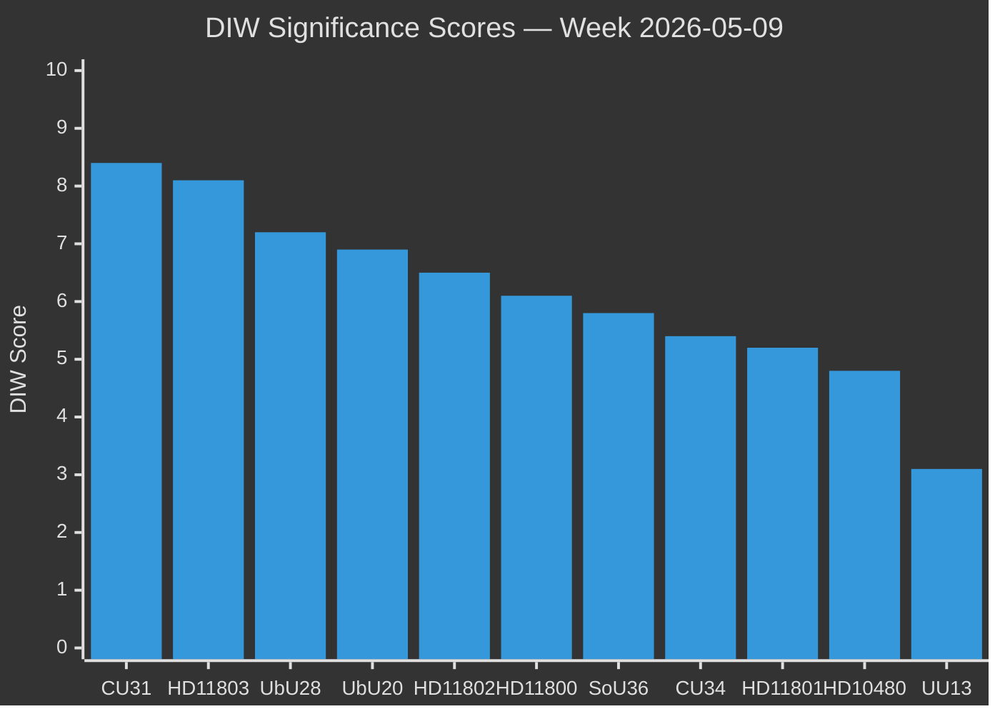

# Significance Scoring — Weekly Review 2026-05-09

**Classification**: PUBLIC | **Methodology**: DIW (Document Intelligence Weight) scoring
**Riksmöte**: 2025/26 | **Period**: 2026-05-05 – 2026-05-09

---

## DIW Scoring Framework

Documents are scored on three dimensions, each 1–10:
- **D (Divisiveness)**: Political controversy, cross-party contestation
- **I (Impact)**: Number of citizens affected, policy scope
- **W (Window)**: Temporal immediacy — how urgent/time-bound is the political significance

**DIW Weight** = (D × 0.35) + (I × 0.40) + (W × 0.25)

| Tier | DIW Range | Label |
|------|-----------|-------|
| L3 | 8.5–10 | Intelligence-grade — maximum analytical depth |
| L2+ | 7.0–8.4 | Priority — full analysis required |
| L2 | 5.5–6.9 | Standard — analysis required |
| L1+ | 4.5–5.4 | Moderate — core analysis |
| L1 | 3.0–4.4 | Background — summary analysis |
| L0 | <3.0 | Procedural — light annotation only |

---

## Full Scoring Matrix

| Rank | dok_id | Title (abbreviated) | D | I | W | DIW | Tier |
|------|--------|---------------------|---|---|---|-----|------|
| 1 | HD01CU31 | En mer flexibel hyresmarknad | 9 | 9 | 7 | 8.4 | L2+ |
| 2 | HD11803 | Israels ingripande — svenska medborgare | 8 | 8 | 9 | 8.1 | L2+ |
| 3 | HD01UbU28 | Legitimation och behörighet grundskolan | 7 | 8 | 6 | 7.2 | L2 |
| 4 | HD01UbU20 | Offentlighetsprincipen skolan | 7 | 7 | 6 | 6.9 | L2 |
| 5 | HD11802 | Förbud mot heltäckande slöja | 8 | 6 | 6 | 6.5 | L2 |
| 6 | HD11800 | Småföretagares trygghet | 6 | 6 | 7 | 6.1 | L1+ |
| 7 | HD01SoU36 | Bättre förutsättningar — statlig personal | 5 | 7 | 5 | 5.8 | L1+ |
| 8 | HD01CU34 | Ändamålsenliga utmätningsregler | 4 | 6 | 6 | 5.4 | L1 |
| 9 | HD11801 | Nedsläckning lands- och glesbygd | 6 | 5 | 5 | 5.2 | L1 |
| 10 | HD10480 | Stadigvarande vistelse | 3 | 5 | 5 | 4.8 | L1 |
| 11 | HD01UU13 | Interparlamentariska unionen | 1 | 2 | 2 | 3.1 | L0 |

---

## Dimension-by-Dimension Justification

### HD01CU31 — D:9, I:9, W:7 → 8.4 [L2+]
- **Divisiveness (9)**: Rent deregulation is among the most contested housing-policy positions in Sweden; S, V, MP fundamentally oppose; SD supports with reservations
- **Impact (9)**: ~1.8 million rental households directly affected; knock-on effects on housing market pricing and construction incentives
- **Window (7)**: Debate stage, election 16 weeks away — maximum pre-election salience

### HD11803 — D:8, I:8, W:9 → 8.1 [L2+]
- **Divisiveness (8)**: Cross-party concern but different framings — S demands diplomatic action, SD more sympathetic to Israel
- **Impact (8)**: Directly affects Swedish citizens' safety and international legal standing
- **Window (9)**: Incident occurred days before the question filing; immediate media and political pressure

### HD01UbU28 — D:7, I:8, W:6 → 7.2 [L2]
- **Divisiveness (7)**: Teachers' unions (Lärarförbundet) supportive but implementation concerns; opposition supports principle with caveats on resourcing
- **Impact (8)**: All ~870,000 primary school pupils and 90,000+ teachers affected
- **Window (6)**: Long implementation horizon (2027+) reduces immediate urgency

### HD01UbU20 — D:7, I:7, W:6 → 6.9 [L2]
- **Divisiveness (7)**: Freedom of information is a constitutional value; friskola carve-outs are opposed by S and V on principle
- **Impact (7)**: Affects ~20% of Swedish school pupils in independent schools
- **Window (6)**: Regulatory reform timetable, not crisis-driven

### HD11802 — D:8, I:6, W:6 → 6.5 [L2]
- **Divisiveness (8)**: Veil-ban debate is maximally divisive between L's liberal-rights tradition and SD's identity-conservative position
- **Impact (6)**: Directly affects a small but politically visible population; symbolic significance exceeds numerical impact
- **Window (6)**: Pre-election positioning makes the timing deliberate; question designed to generate media cycle

### HD11800 — D:6, I:6, W:7 → 6.1 [L1+]
- **Divisiveness (6)**: Cross-party agreement on the problem; disagreement on solutions (policing resources vs. prosecution)
- **Impact (6)**: Affects small business community in specific urban districts; generalises to broader crime narrative
- **Window (7)**: Recently published media investigation drives timing

### HD01SoU36 — D:5, I:7, W:5 → 5.8 [L1+]
- **Divisiveness (5)**: Largely uncontroversial; opposition's concern is capacity/resourcing rather than principle
- **Impact (7)**: Social welfare staffing affects vulnerable populations nationally
- **Window (5)**: No acute crisis trigger; steady-state reform

### HD01CU34 — D:4, I:6, W:6 → 5.4 [L1]
- **Divisiveness (4)**: Technical civil-law reform; cross-party support for digital enforcement modernisation
- **Impact (6)**: Affects creditor-debtor enforcement proceedings; significant for commercial actors
- **Window (6)**: Spring legislative slot; no crisis

### HD11801 — D:6, I:5, W:5 → 5.2 [L1]
- **Divisiveness (6)**: Urban–rural divide is politically salient; KD faces pressure
- **Impact (5)**: Affects specific rural communities; safety and accessibility concern
- **Window (5)**: Media investigation published; question is reactive

### HD10480 — D:3, I:5, W:5 → 4.8 [L1]
- **Divisiveness (3)**: Tax-law clarification with narrow political controversy
- **Impact (5)**: Affects cross-border workers and internationally mobile individuals
- **Window (5)**: Follows up on a previous written question; no acute trigger

### HD01UU13 — D:1, I:2, W:2 → 3.1 [L0]
- **Divisiveness (1)**: Procedural report; annual, non-controversial
- **Impact (2)**: Parliamentary participation in international forum
- **Window (2)**: Annual reporting cycle

---

## Analysis Coverage Map

| Full Text Retrieved | dok_id |
|---------------------|--------|
| ✅ Yes | HD01CU31, HD01CU34, HD01SoU36, HD01UbU20, HD01UbU28, HD11800, HD11801, HD11802, HD11803, HD10480 |
| ⚠️ Partial/metadata | HD01UU13 |

**Full-text floor**: ≥ first 3 documents in DIW order (HD01CU31, HD11803, HD01UbU28) — all confirmed. L2+ requirement met.

---

*Source: riksdag-regering MCP | DIW methodology: synthesis-methodology.md §DIW-Weighting | 2026-05-09*
