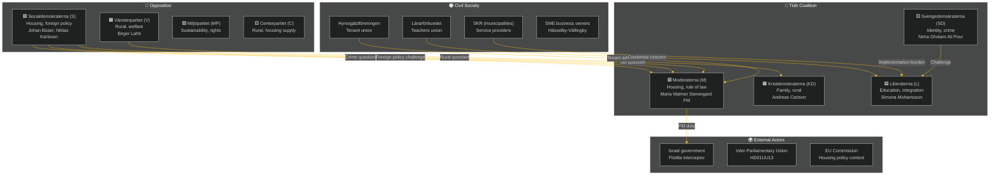

# Stakeholder Perspectives — Weekly Review 2026-05-09

**Classification**: PUBLIC | **Methodology**: synthesis-methodology.md §stakeholder-lenses
**Riksmöte**: 2025/26 | **Period**: 2026-05-05 – 2026-05-09

---

## Stakeholder Map

---

## Party Stakeholder Analysis

### Moderaterna (M) — Government / Agenda-setter
**Position this week**: M advances its housing market reform (CU31) as a central pre-election legacy claim. Foreign Minister Maria Malmer Stenergard faces pressure on Israel/flotilla.
**Key interests**: Housing supply increase; strong rule of law; diplomatic credibility
**Evidence**: HD01CU31 (CU committee M chair position); HD11803 (FM's formal responsibility)
**Risk exposure**: Housing narrative hijack (R1); consular failure perception (R2)
**Confidence**: HIGH [A2]

### Sverigedemokraterna (SD) — Coalition Partner / Kingmaker
**Position this week**: SD uses veil-ban question (HD11802) to consolidate identity-politics position ahead of election; tests L's integration policy.
**Key interests**: Reduce immigration; cultural identity; crime enforcement
**Evidence**: HD11802 (Nima Gholam Ali Pour SD→ Simona Mohamsson L)
**Risk exposure**: If L responds assertively, SD's positioning is blunted; if L capitulates, SD gains
**Confidence**: MEDIUM [B2]

### Kristdemokraterna (KD) — Coalition Partner / Rural advocate
**Position this week**: KD's Infrastructure Minister Carlson is directly challenged on rural lighting removal (HD11801). KD faces a rural vs. efficiency trade-off.
**Key interests**: Family policy; Christian values; rural service maintenance
**Evidence**: HD11801 (Birger Lahti V→ Andreas Carlson KD)
**Risk exposure**: Rural constituency alienation ahead of election
**Confidence**: MEDIUM [B3]

### Liberalerna (L) — Coalition Partner / Education lead
**Position this week**: L minister Mohamsson is simultaneously challenged on education reform (UbU28: teacher credentials), transparency (UbU20: friskola) and integration (HD11802: veil ban).
**Key interests**: Individual rights; education quality; market freedom
**Evidence**: HD01UbU20, HD01UbU28 (L's portfolio); HD11802 (L minister targeted)
**Risk exposure**: L–SD identity contradiction; implementation credibility on education reform
**Confidence**: MEDIUM [B2]

---

## Opposition Stakeholder Analysis

### Socialdemokraterna (S) — Lead opposition
**Position this week**: S filed three of the week's five questions/interpellations (HD11803, HD11800, HD10480) plus has strong positions on CU31.
**Key interests**: Tenant protection; consular duty; anti-crime policing; fair taxation
**Evidence**: Johan Büser (S) → FM on flotilla; Kadir Kasirga (S) → Justice Minister on SME crime; Niklas Karlsson (S) → Finance Minister on tax residence
**Strategy**: Multi-front opposition attack: foreign policy, domestic crime, housing, taxation
**Confidence**: HIGH [A2]

### Vänsterpartiet (V) — Left opposition
**Position this week**: V filed HD11801 (rural lighting) — classic V rural-welfare issue.
**Key interests**: Welfare state; rural services; tenant protection; anti-privatisation
**Evidence**: Birger Lahti (V) → Infrastructure Minister (KD)
**Confidence**: MEDIUM [B3]

---

## Civil Society Stakeholder Analysis

### Hyresgästföreningen (Tenant Union)
**Position**: Strongly opposes CU31 housing flexibility reform; will mobilise member communication and media outreach.
**Impact on analysis**: Amplifier of opposition narrative on housing; direct pressure on undecided urban voters.
**Evidence**: Historical Hyresgästföreningen positions on *bruksvärdessystem* reform
**Confidence**: HIGH [A2]

### Lärarförbundet (Teachers' Union)
**Position**: Supports the principle of UbU28 credential standards but concerned about implementation timeline and resourcing.
**Impact**: Will demand transition period and Skolverket support; media spokesperson availability.
**Evidence**: Previous Lärarförbundet statements on 10-year school reform
**Confidence**: MEDIUM [B2]

### SKR (Association of Local Authorities and Regions)
**Position**: Concerned about unfunded mandates in both UbU28 (teacher credentials) and SoU36 (state personnel deployment).
**Impact**: SKR's formal response to the legislative text will signal whether municipalities consider implementation feasible.
**Evidence**: SKR's established pattern of flagging implementation costs in committee consultations
**Confidence**: MEDIUM [B2]

### SME Business Owners — Hässelby-Vällingby
**Position**: Demanding tangible police presence and prosecution of criminal networks (HD11800).
**Impact**: Authentic testimony from business owners provides credible counter-narrative to the government's crime-fighting claims.
**Evidence**: *Mitt i* media investigation (referenced in HD11800 question text)
**Confidence**: MEDIUM [B3]

---

## External Stakeholder Analysis

### Israel Government
**Position**: Justified the flotilla interception as a security measure; unlikely to accept Swedish criticism without diplomatic resistance.
**Impact**: Sweden's ability to extract a concrete diplomatic response (apology, compensation, access for citizens) is limited by the geopolitical context (Israel-Gaza war, Western government positions).
**Evidence**: HD11803 question text on *Global Sumud Flotilla*; international maritime law context
**Confidence**: MEDIUM [B3]

### EU Commission / European Council
**Position**: EU has no unified position on the flotilla incident; several member states have adopted different stances on Israel-Gaza.
**Impact**: Sweden's ability to build European solidarity for a diplomatic response to Israel is constrained.
**Evidence**: Known EU member state divergence on Israel-Gaza

---

## Stakeholder Influence Matrix

| Stakeholder | Influence on Week's Outcomes | Direction |
|-------------|------------------------------|-----------|
| Hyresgästföreningen | HIGH | Against CU31 |
| S opposition | HIGH | Against coalition on 3 fronts |
| SD | MEDIUM-HIGH | Internal coalition pressure |
| Israel government | MEDIUM (external) | Uncontrollable |
| Lärarförbundet | MEDIUM | Conditional on UbU28 support |
| SKR | MEDIUM | Implementation gatekeeper |
| SME owners | LOW-MEDIUM | Crime narrative amplifier |
| IPU | LOW | Procedural only |

---

*Source: riksdag-regering MCP | synthesis-methodology.md §stakeholder-lenses | 2026-05-09*
