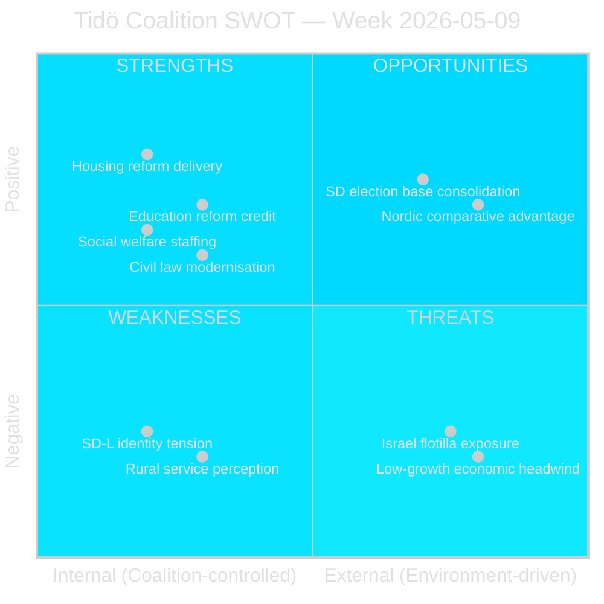

# SWOT Analysis — Weekly Review 2026-05-09

**Classification**: PUBLIC | **Methodology**: political-swot-framework.md
**Subject**: Tidö Coalition legislative performance, week of 2026-05-05 – 2026-05-09
**Riksmöte**: 2025/26 | **Horizon**: T+16 weeks (election September 2026)

---

## SWOT Overview

This SWOT assesses the Tidö coalition (M, SD, KD, L) legislative performance and strategic position as revealed by the week's documents, against the backdrop of the September 2026 general election.

---

## Strengths (Internal, Positive)

### S1 — Reform Delivery Narrative (HD01CU31, HD01UbU28, HD01SoU36)
Three committee reports advanced in a single week demonstrate the coalition's ability to process legislation across CU, UbU and SoU committees simultaneously. The housing flexibility reform (CU31), teacher credentialing (UbU28) and social welfare staffing (SoU36) collectively support the narrative of a "reform-delivering" government.
- **Evidence**: 6 committee reports reached debate stage in one week (CU31, CU34, SoU36, UbU20, UbU28, UU13)
- **Confidence**: HIGH [A2]

### S2 — Cross-Spectrum Policy Coverage
The coalition's agenda spans housing, education, civil law and social welfare — demonstrating broad policy competency rather than single-issue governance.
- **Evidence**: dok_ids span CU (civil), UbU (education), SoU (social), UU (foreign affairs)

### S3 — SD Vote Discipline
No SD reservations or competing motions recorded in the manifest for this week. Coalition arithmetic remains intact on all six committee reports.
- **Evidence**: No competing motions in data-download-manifest.md

---

## Weaknesses (Internal, Negative)

### W1 — SD–L Identity Tension (HD11802)
Nima Gholam Ali Pour (SD) filed a veil-ban question to L minister Mohamsson that exposes an ongoing policy tension within the coalition. L's liberal-rights tradition and SD's identity-conservative agenda are in structural tension on integration policy.
- **Evidence**: HD11802 question text; SD's stated position vs. L's earlier statements per question
- **Risk**: If L refuses to commit, SD base dissatisfaction; if L commits to ban, alienates liberal voters
- **Confidence**: HIGH [A2]

### W2 — Rural Service Vulnerability (HD11801)
The Trafikverket street-light removal plan disproportionately affects KD's rural voter base. Infrastructure Minister Carlson (KD) is directly challenged.
- **Evidence**: HD11801 question by V's Birger Lahti; Trafikverket's plan per SVT *Uppdrag granskning*
- **Risk**: Rural constituency perception of governing party abandonment

### W3 — Housing Reform Narrative Risk (HD01CU31)
While CU31 is a strength in terms of delivery, the opposition's tenant-protection framing creates a lasting vulnerability: S, V, MP will campaign on rent-rise risk through the summer. The coalition must dominate the narrative during and after the debate.
- **Evidence**: Historical S/V/MP positions; known tenant-union (Hyresgästföreningen) opposition

---

## Opportunities (External, Positive)

### O1 — SD Election Base Consolidation
The veil-ban question (HD11802), though internally awkward for L, gives SD a high-visibility identity-politics moment that may consolidate its far-right voter base ahead of the September election.
- **Evidence**: HD11802 question; SD voter profile data

### O2 — Nordic Comparative Advantage (Education)
Sweden's new 10-year compulsory school framework (UbU28) positions the country ahead of several Nordic peers on early-years credential standards. The government can claim a comparative advantage narrative.
- **Evidence**: OECD/EU school credential comparative data (WEO/FM context)

### O3 — Rule of Law Narrative (HD11800, HD01CU34)
The small-business extortion question and the enforcement rules modernisation both allow M to reinforce its law-and-order narrative — a core coalition strength.

---

## Threats (External, Negative)

### T1 — Israel Flotilla Foreign-Policy Crisis (HD11803)
The interception of a Swedish-crewed vessel in international waters is an externally generated crisis that the coalition cannot control. If the Foreign Minister is seen as insufficiently assertive, S and V gain on foreign-policy credibility.
- **Evidence**: HD11803 question by Johan Büser (S)
- **Confidence**: HIGH [A2] for continued media pressure

### T2 — Low-Growth Economic Headwind
IMF WEO Apr-2026 projects Swedish GDP growth at ~1.2%, below the ~2.5–3% that would normalise the unemployment rate (~8.1%). The government cannot credibly claim macroeconomic turnaround before the election.
- **Evidence**: IMF WEO-2026-04 (SWE, NGDP_RPCH ~1.2%)
- **economicProvenance**: { "provider": "imf", "dataflow": "WEO", "indicator": "NGDP_RPCH", "vintage": "WEO-2026-04" }

### T3 — Opposition Cohesion Risk
If S, V and MP coordinate their critiques on housing (CU31), rural services (HD11801) and foreign policy (HD11803) into a unified "this government fails Sweden" narrative, the coalition's fragmented messaging is exposed.

---

## SWOT Scoring Summary

| Element | Magnitude | Confidence |
|---------|-----------|-----------|
| S1 Reform delivery | HIGH | HIGH [A2] |
| S2 Cross-spectrum | MEDIUM | MEDIUM [B2] |
| S3 SD discipline | MEDIUM | MEDIUM [B3] |
| W1 SD–L tension | HIGH | HIGH [A2] |
| W2 Rural vulnerability | MEDIUM | MEDIUM [B2] |
| W3 Housing risk | HIGH | HIGH [A2] |
| O1 SD base consolidation | MEDIUM | MEDIUM [B3] |
| O2 Nordic education | LOW | LOW [C3] |
| O3 Rule of law | MEDIUM | MEDIUM [B2] |
| T1 Israel crisis | HIGH | HIGH [A2] |
| T2 Low growth | HIGH | HIGH [A2] |
| T3 Opposition cohesion | MEDIUM | MEDIUM [B3] |

**Net assessment**: The coalition enters the summer homestretch with a viable reform-delivery story (Strengths) but faces two high-magnitude threats it cannot control (Israel crisis, low growth) and two internal weaknesses that will receive maximum opposition attention (SD–L identity tension, housing narrative risk).

---

*Source: riksdag-regering MCP | IMF WEO-2026-04 | political-swot-framework.md | 2026-05-09*
