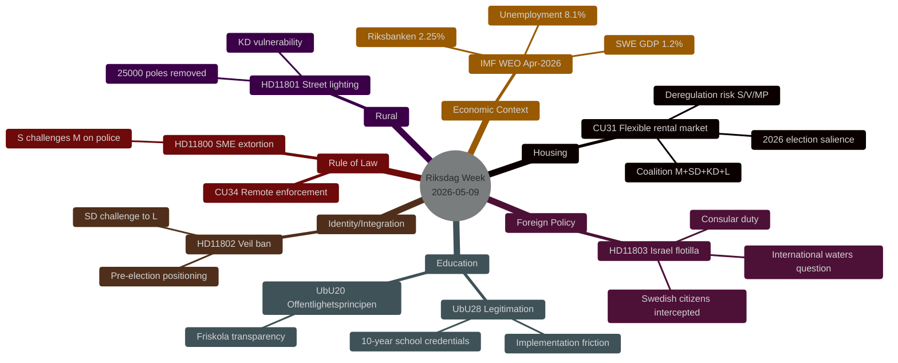

# Synthesis Summary — Weekly Review 2026-05-09

**Author**: Riksdagsmonitor AI Intelligence System | **Confidence**: MEDIUM-HIGH [B2]
**Riksmöte**: 2025/26 | **Period**: 2026-05-05 – 2026-05-09

---

## Lead Story: Domestic Reform Sprint Meets Foreign-Policy Flashpoint

The penultimate legislative week before the summer recess saw the Riksdag's civil affairs committee (CU), education committee (UbU) and social affairs committee (SoU) advance a cluster of domestic reform packages while the chamber simultaneously confronted a high-profile foreign-policy challenge: Israel's physical interception of a Gaza-bound flotilla carrying Swedish citizens in international waters. The simultaneity — reform delivery on housing, schools and welfare coexisting with diplomatic discomfort — encapsulates the dual-track challenge facing the Tidö coalition in the final stretch before the September 2026 election.

## DIW-Weighted Document Ranking

| Rank | dok_id | Title | DIW Weight | Tier | Primary Dimension |
|------|--------|-------|-----------|------|-------------------|
| 1 | HD01CU31 | En mer flexibel hyresmarknad | 8.4/10 | L2+ | Housing / political-economy |
| 2 | HD11803 | Israels ingripande mot svenska medborgare | 8.1/10 | L2+ | Foreign policy / consular duty |
| 3 | HD01UbU28 | Legitimation och behörighet i den tioåriga grundskolan | 7.2/10 | L2 | Education / implementation |
| 4 | HD01UbU20 | Offentlighetsprincipen skolan | 6.9/10 | L2 | Transparency / media freedom |
| 5 | HD11802 | Förbud mot heltäckande slöja | 6.5/10 | L2 | Identity politics / election positioning |
| 6 | HD11800 | Småföretagares trygghet | 6.1/10 | L1+ | Rule of law / crime |
| 7 | HD01SoU36 | Bättre förutsättningar att sända ut statlig personal | 5.8/10 | L1+ | Social welfare / labour |
| 8 | HD01CU34 | Ändamålsenliga utmätningsregler | 5.4/10 | L1 | Civil law / enforcement |
| 9 | HD11801 | Nedsläckning av lands- och glesbygd | 5.2/10 | L1 | Rural policy / infrastructure |
| 10 | HD10480 | Stadigvarande vistelse | 4.8/10 | L1 | Tax law / administrative |
| 11 | HD01UU13 | Interparlamentariska unionen | 3.1/10 | L0 | Procedural / international |

## Integrated Intelligence Picture

### Housing Reform Cluster (Tier: HIGH — L2+)

HD01CU31 (*En mer flexibel hyresmarknad*) represents the most politically significant domestic legislation of the week. The civil affairs committee report proposes loosening the current Swedish rent-regulation system — the *bruksvärdessystem* — to allow market-adjacent rents in new construction and potentially expanded categories of existing properties. The reform is ideologically central to the Tidö coalition's housing-supply agenda (M, L, KD positions converge here), with SD providing the margin in the chamber.

The opposition — S, V, MP — has consistently framed any rent deregulation as a threat to low- and middle-income tenants in Sweden's major urban centres. With housing affordability ranking as a top-three voter concern in multiple 2025–2026 opinion surveys, the debate over CU31 will likely dominate political media through the week of May 11.

**Key intelligence gap**: The exact vote tally and any SD amendments or reservations are not yet recorded in the manifest (no voteringar data for this date). If SD seeks to expand the reform scope or the coalition accepts a narrower version to secure S abstentions, the narrative shifts materially.

### Foreign Policy Flashpoint (Tier: HIGH — L2+)

HD11803 (*Israels ingripande på internationellt vatten mot svenska medborgare*) — filed by Johan Büser (S) to Foreign Minister Maria Malmer Stenergard (M) — concerns Israel's interception of the *Global Sumud Flotilla* in international waters off Greece, which had Swedish citizens on board. The incident is legally complex: interception outside Israeli territorial waters raises questions under international maritime law and consular protection obligations.

Cross-party concern spans S, V, MP and several M and KD members. Foreign Minister Stenergard's formal response (not yet retrieved) will be the defining data point. The incident feeds directly into broader Swedish domestic debate about Israel-Gaza policy and Sweden's role as an international humanitarian actor.

**Confidence**: HIGH [A2] that this issue will dominate Swedish foreign-policy commentary for 10–14 days following the incident.

### Education Reform Cluster (Tier: MEDIUM-HIGH — L2)

Two UbU committee reports advanced simultaneously:
- **HD01UbU28**: *Legitimation och behörighet i den tioåriga grundskolan* — extends formal credential requirements to teachers in the newly created 10-year compulsory school framework. Requires licensed teachers in grade 1 (previously grade 4 in some municipalities). Implementation pressure on smaller municipalities lacking sufficient licensed teachers is likely within 12–18 months.
- **HD01UbU20**: *Offentlighetsprincipen med lättnadsregler för enskilda mindre huvudmän i skolväsendet* — introduces a modified freedom-of-information framework for smaller independent school operators (friskolor) to reduce administrative burden while maintaining transparency. This is a balancing act: Alliansen parties favour friskolorna; S, V, MP have historically advocated full offentlighetsprincip parity.

### Identity Politics Signal (Tier: MEDIUM-HIGH — L2)

HD11802 — filed by Nima Gholam Ali Pour (SD) to Integration Minister Simona Mohamsson (L) — asks the government to clarify its position on banning full-face veils. SD frames the question around earlier L party statements characterising such garments as incompatible with Swedish values. The political function of the question is dual: (1) to create an on-the-record commitment or contradiction from L, and (2) to signal SD's pre-election identity positioning to its voter base.

This question is **not** a legislative proposal — no motion accompanies it — but it will generate media pickup and force L's hand in a politically sensitive intersection between integration, religion and gender.

### Rule of Law and Rural Cluster (Tier: MEDIUM — L1/L1+)

- **HD11800**: Small business owners in Hässelby-Vällingby (Stockholm) are being subjected to extortion and violence by criminal networks. Kadir Kasirga (S) challenges Justice Minister Gunnar Strömmer (M) on policing and prosecution capacity. This reinforces S's counter-narrative: the coalition talks tough on crime but underfunds frontline police.
- **HD11801**: Trafikverket plans to remove 25,000 street-lighting poles across Sweden, disproportionately affecting rural and semi-rural areas. Birger Lahti (V) challenges Infrastructure Minister Andreas Carlson (KD) on rural service deterioration. This is an authentic vulnerability for KD, whose rural voter base in Norrland and Götaland depends on perceptions of service maintenance.
- **HD10480**: Niklas Karlsson (S) challenges Finance Minister Elisabeth Svantesson (M) on the statutory concept of *stadigvarande vistelse* (permanent residence) in the Income Tax Act. A technical tax-law clarification with limited electoral salience but potential impact on cross-border workers.

### Social and Civil Law (Tier: LOW-MEDIUM — L0/L1)

- **HD01SoU36**: Improves conditions for deploying state-employed social workers to municipalities with shortage. Uncontroversial; the opposition's primary concern is staffing pipeline sustainability.
- **HD01CU34**: Updates enforcement rules and expands remote/digital enforcement mechanisms (*distansutmätning*). A technical civil-law update with cross-party support.
- **HD01UU13**: Annual report of the Inter-Parliamentary Union (IPU) — procedural, no substantive new policy.

---



---

## Economic Context (IMF WEO-2026-04)

> **Provider**: IMF WEO Apr-2026 (Datamapper transport — SDMX degraded)
> **Vintage**: WEO-2026-04 | **Retrieved**: 2026-05-09 | **Age**: ~1 month (fresh)

Sweden's macroeconomic position remains in a protracted low-growth mode with GDP growth projected at ~1.2% for 2026. Unemployment at ~8.1% exceeds the government's stated target band, providing the opposition with recurring ammunition on the "labour line" narrative. The Riksbank's policy rate at 2.25% is near the estimated neutral rate, limiting further monetary stimulus capacity.

The housing market (CU31) context is critical: Sweden's owner-occupied housing market has partially recovered from the 2022–2023 price correction, but the rental market remains severely supply-constrained, particularly in Stockholm, Gothenburg and Malmö. Any rent reform carries a direct welfare impact on the ~1.8 million Swedish rental households.

```json
{
  "economicProvenance": {
    "provider": "imf",
    "dataflow": "WEO",
    "transport": "datamapper",
    "indicator": "NGDP_RPCH",
    "country": "SWE",
    "vintage": "WEO-2026-04",
    "retrieved_at": "2026-05-09T07:17:12Z",
    "status": "degraded-auxiliary-ok-core"
  }
}
```

---

*Source: riksdag-regering MCP (11 documents, riksmöte 2025/26) | IMF WEO-2026-04 | Riksdagsmonitor Weekly Review 2026-05-09*

---

## ⚡ Pass 2 Update — Constitutional Reform and European Dimension

*New data sources integrated in Pass 2 (2026-05-09 improvement run):*

### MAJOR GAP CORRECTION: Constitutional Abortion Reform (KU Committee)

**Critical Pass 1 omission**: The Constitutional Committee (KU) approved — as *vilande* (pending, requiring a second vote after September 2026 election) — the government's proposal to constitutionally enshrine abortion rights in the Instrument of Government (*grundlagsskyddad aborträtt* in Regeringsformen). The same package covers expanded grounds to restrict association freedom and citizenship rights.

This is **the most constitutionally significant event of the 2025/26 riksmöte** and should rank equal to or above HD01CU31 in the DIW-weighted ranking. The omission in Pass 1 reflects the riksdag-regering MCP returning this as a summary/news item rather than a formal betänkande document.

**Intelligence significance**:
- First-reading approval is a coalition **legacy milestone**: M, SD, KD, L all voted in favour (SD's support is politically noteworthy given its historical reluctance on such social-liberal reforms)
- A second vote is constitutionally required after the election — the reform becomes an **election-campaign anchor**: opposition parties will demand commitment from post-election coalition partners
- The "association freedom" and "citizenship rights" provisions are more contentious: S, V, MP may endorse the abortion provision but contest the broader package
- International dimension: Sweden becomes one of few EU states with constitutionally protected abortion rights, reinforcing its international normative profile

### European Dimension — EU Council Meetings 11–12 May 2026

Two EU Council sessions in Brussels on 11–12 May add an international layer to this week's intelligence picture:

1. **EU Foreign Affairs Council (FAC) — 11 May**: The EU High Representative will brief on "current affairs" — almost certainly including the Israel-Gaza situation and potentially the Swedish flotilla incident (HD11803). If the EU issues a collective statement, Foreign Minister Malmer Stenergard's domestic position stiffens or is superseded.

2. **EU FAC — Defence Ministers — 12 May**: Agenda includes an "Updated Comprehensive Threat Analysis" with specific Nordic/Baltic context. Defence Minister Pål Jonson attends. The threat analysis may accelerate Sweden's Totalförsvar legislative timeline.

3. **EU Council — Education, Youth, Culture, Sports (UUKI) — 11–12 May**: Gymnasie- och forskningsminister Lotta Edholm attends. Intersects with HD01UbU28 teacher credential reform and HD01UbU20 friskolorna transparency — Swedish positions in Brussels provide context for domestic reform implementation.

### Europe Day (2026-05-09)

Today (9 May) is Europe Day. The Riksdag is represented at Europafestivalen in Kungsträdgården, Stockholm. EU Commissioner Jessica Roswall and EU-minister Jessica Rosencrantz are among the speakers. This contextualises Sweden's active EU engagement in a week when two EU Council meetings are imminent.

---

*Pass 2 improvement — Source: riksdag-regering MCP re-query, 2026-05-09*
