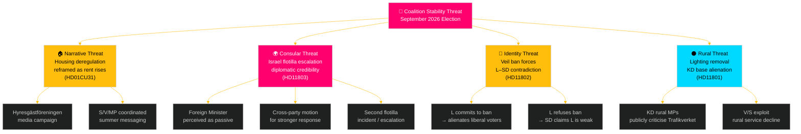

# Threat Analysis — Weekly Review 2026-05-09

**Classification**: PUBLIC | **Methodology**: political-threat-framework.md
**Riksmöte**: 2025/26 | **Horizon**: T+72h / T+7d / T+30d

---

## Political Threat Framework

This analysis applies a political STRIDE variant to identify threats to democratic governance, coalition stability and policy implementation arising from the week's documents.

| STRIDE Category | Political Equivalent |
|-----------------|---------------------|
| Spoofing | Identity manipulation / disinformation |
| Tampering | Policy narrative distortion |
| Repudiation | Political accountability denial |
| Information Disclosure | Forced transparency risks |
| Denial of Service | Agenda-blocking tactics |
| Elevation of Privilege | Power concentration / democratic overreach |

---

## Attack Tree Analysis

---

## Threat Catalogue

### Threat 1: Housing Narrative Hijack (Tampering) — MEDIUM-HIGH

**Source**: Opposition parties (S, V, MP) + Hyresgästföreningen
**Mechanism**: The committee report on flexible rental market (HD01CU31) gives the opposition a tangible legislative vehicle to advance a "rents will rise" narrative through the summer pre-election period.
**Political STRIDE**: Tampering — the policy substance is being redefined by opponents to emphasise negative second-order effects (rent increases) rather than primary effects (increased housing supply).
**Evidence**: HD01CU31 (debate stage CU); established opposition positions on *bruksvärdessystem* reform
**Likelihood**: HIGH [A2]
**Counter**: Government must proactively publish rent-modelling data and communicate supply-side benefits.

### Threat 2: Israel Flotilla Consular Failure (Repudiation) — HIGH

**Source**: External (Israel) + internal opposition (S, V, MP)
**Mechanism**: The interception of *Global Sumud Flotilla* with Swedish citizens aboard forces the government to demonstrate consular effectiveness. A passive or delayed response creates a "Repudiation" threat — the government appears to deny its duty of care.
**Political STRIDE**: Repudiation — failure to act clearly on Swedish citizens' rights
**Evidence**: HD11803 (Johan Büser S→ Maria Malmer Stenergard M); international maritime law context
**Likelihood**: HIGH [A2] that parliamentary debate intensifies; medium that diplomatic incident escalates
**Counter**: Foreign Minister formal diplomatic protest to Israel + clear parliamentary statement within 48 hours.

### Threat 3: Identity Contradiction Exposure (Spoofing) — MEDIUM

**Source**: SD (internally) attacking L's stated liberal position
**Mechanism**: HD11802 is designed to force L minister Mohamsson into either agreeing with SD's veil-ban position (spoofing L's liberal identity) or refusing and appearing to contradict earlier statements.
**Political STRIDE**: Spoofing — SD attempts to assert that L's "real" position is closer to SD's identity agenda than to liberal values
**Evidence**: HD11802 question text references earlier L statements; SD's consistent strategy of exposing coalition partners' compromises
**Likelihood**: MEDIUM [B2]
**Counter**: L must draft a principled response that clearly distinguishes L's position (values-based, non-coercive) from SD's (coercive legislative ban).

### Threat 4: Rural Service Decline Narrative (Denial of Service) — MEDIUM

**Source**: V, S, potentially C rural MPs
**Mechanism**: Trafikverket's plan to remove 25,000 rural street lights is a concrete, visible service reduction that rural constituencies will experience directly. V's question (HD11801) is the opening shot.
**Political STRIDE**: Denial of Service — service removal in rural areas is framed as the government "shutting off" rural communities
**Evidence**: HD11801 (Birger Lahti V→ Andreas Carlson KD); SVT *Uppdrag granskning* investigation
**Likelihood**: MEDIUM [B3] that it becomes a sustained campaign; HIGH [A2] that it remains a media story

### Threat 5: Organised Crime Governance Gap (Information Disclosure) — MEDIUM-LOW

**Source**: S opposition; investigative media
**Mechanism**: Media investigation of criminal extortion in Hässelby-Vällingby (HD11800) discloses a governance gap — the government's anti-crime narrative is contradicted by concrete business-owner testimony.
**Political STRIDE**: Information Disclosure — forcing disclosure of enforcement failures
**Likelihood**: LOW-MEDIUM [C2]

### Threat 6: Teacher Credential Gap (Elevation of Privilege) — LOW-MEDIUM

**Source**: Skolverket, teacher unions (Lärarförbundet, Lärarnas Riksförbund)
**Mechanism**: UbU28 elevates credential standards for grade 1 teachers without guaranteed resourcing — creating an unfunded mandate on municipalities.
**Political STRIDE**: Elevation of Privilege — central government mandates without resourcing is a form of regulatory overreach that the implementation system cannot absorb.
**Likelihood**: HIGH [A2] that credential gaps emerge in 2027; LOW-MEDIUM [C2] that it generates political crisis before the September 2026 election.

---

## Threat Severity Summary

| Threat | Category | Severity | Horizon |
|--------|----------|----------|---------|
| T1 Housing narrative | Tampering | MEDIUM-HIGH | T+7d – T+30d |
| T2 Israel flotilla | Repudiation | HIGH | T+72h |
| T3 Identity contradiction | Spoofing | MEDIUM | T+7d |
| T4 Rural decline | Denial of Service | MEDIUM | T+7d – T+30d |
| T5 Crime disclosure | Information Disclosure | MEDIUM-LOW | T+7d |
| T6 Credential gap | Elevation | LOW-MEDIUM | T+12 months |

---

*Source: riksdag-regering MCP | political-threat-framework.md | 2026-05-09*
