# Voter Segmentation — Weekly Review 2026-05-09

**Classification**: PUBLIC | **Methodology**: electoral-domain-methodology.md §segmentation
**Riksmöte**: 2025/26 | **Election horizon**: September 2026

---

## Voter Segment Map

```mermaid
%%{init: {'theme': 'dark', 'themeVariables': {'primaryColor': '#00d9ff', 'primaryTextColor': '#e0e0e0', 'lineColor': '#ffbe0b'}}}%%
graph TB
    subgraph URBAN["🏙️ Urban Segments"]
        U1["Urban Renters<br/>25–45 yrs, Stockholm/GBG/Malmö<br/>~650k eligible voters<br/>HIGH relevance: CU31"]
        U2["Urban Professionals<br/>35–55 yrs, educated<br/>~400k eligible voters<br/>MEDIUM: HD11803, HD11802"]
        U3["Urban New Citizens<br/>Integration background<br/>~200k eligible voters<br/>HIGH: HD11802"]
    end
    subgraph RURAL["🌾 Rural Segments"]
        R1["Rural Traditional<br/>KD/C voter base<br/>Norrland/Götaland<br/>~300k eligible voters<br/>HIGH: HD11801"]
        R2["Rural SME owners<br/>Small business<br/>~100k eligible voters<br/>MEDIUM: HD11800"]
    end
    subgraph PARENTS["👨‍👩‍👧 Family Segments"]
        F1["Parents of primary<br/>school children<br/>~800k eligible voters<br/>MEDIUM: UbU28, UbU20"]
    end
    subgraph CROSS["🌐 Cross-Cutting"]
        X1["Foreign policy<br/>concerned voters<br/>~500k eligible voters<br/>HIGH: HD11803"]
        X2["Law & order<br/>priority voters<br/>~700k eligible voters<br/>MEDIUM: HD11800, CU34"]
    end
    CU31["CU31 Housing"] --> U1
    HD11803["HD11803 Israel"] --> U2 & X1
    HD11802["HD11802 Veil"] --> U3 & U2
    UbU28["UbU28 Credentials"] --> F1
    HD11801["HD11801 Rural lights"] --> R1
    HD11800["HD11800 SME crime"] --> R2 & X2
```

---

## Segment-by-Segment Analysis

### Segment 1 — Urban Renters (25–45) — CRITICAL
**Size**: ~650,000 eligible voters in major urban areas
**Key issue this week**: CU31 (housing flexibility reform)
**Political alignment**: Historically leaning S and L; increasingly contested
**Impact**: CU31 directly affects this segment's housing costs. Opposition "rents will rise" narrative targets this segment specifically.
**Pre-election trajectory**: This segment could shift 3–5 percentage points toward opposition if the housing narrative lands as "rents will rise." It is the single most electorally consequential segment for this week's legislation.
**Confidence**: HIGH [A2]

### Segment 2 — Urban Educated Professionals (35–55) — IMPORTANT
**Size**: ~400,000 eligible voters
**Key issue this week**: HD11803 (Israel/consular), HD11802 (veil/identity)
**Political alignment**: M, L; internationally engaged; liberal values
**Impact**: FM's response to Israel flotilla matters to this segment — they prioritise diplomatic competence and international rule-of-law. The veil-ban question activates their liberal values identity.
**Pre-election trajectory**: If FM response is seen as assertive and principled (not captured by SD's Israel position), this segment remains with M/L. If FM appears passive, some shift to S/C on foreign-policy grounds.
**Confidence**: MEDIUM [B2]

### Segment 3 — Urban New Citizens (Integration background) — IMPORTANT
**Size**: ~200,000 eligible voters
**Key issue this week**: HD11802 (veil ban), UbU20/28 (education)
**Political alignment**: Historically S-leaning; increasingly contested; some SD-adjacent immigrant communities
**Impact**: HD11802's veil-ban framing directly affects Muslim women in Sweden and broader Muslim community perception of integration policy direction. UbU20's school transparency creates both opportunities (scrutiny of bad actors in friskolor) and concerns (additional administrative burden on community schools).
**Pre-election trajectory**: SD's question may alienate this segment from the coalition further; L's response is the key variable.
**Confidence**: MEDIUM [B3]

### Segment 4 — Rural Traditional (KD/C voter base) — IMPORTANT
**Size**: ~300,000 eligible voters in Norrland and Götaland rural constituencies
**Key issue this week**: HD11801 (rural lighting removal)
**Political alignment**: KD, C, sometimes M; rural service-dependent; declining population areas
**Impact**: Trafikverket's plan to remove 25,000 street-lighting poles is a concrete, visible reduction in rural infrastructure. This segment's trust in KD is built on protection of rural services.
**Pre-election trajectory**: If KD minister Carlson cannot reverse or mitigate the lighting plan, KD risks losing 0.5–1.0 percentage points in rural constituencies.
**Confidence**: MEDIUM [B3]

### Segment 5 — Parents of Primary School Children — MEDIUM
**Size**: ~800,000 eligible voters
**Key issue this week**: UbU28 (teacher credentials), UbU20 (school transparency)
**Political alignment**: Mixed; tend to prioritise education quality over ideology
**Impact**: UbU28 raises education quality in principle; implementation friction (teacher gaps) creates short-term concern. UbU20 provides transparency safeguards for friskola users.
**Pre-election trajectory**: Neutral to slightly positive for coalition if reform framed as quality improvement; negative if teacher-gap narrative dominates.
**Confidence**: MEDIUM [B2]

### Segment 6 — Foreign Policy Concerned Voters — MEDIUM
**Size**: ~500,000 eligible voters (cross-cutting)
**Key issue this week**: HD11803 (Israel/flotilla), HD01UU13 (IPU)
**Political alignment**: Mixed; includes both Israel-sympathetic (SD adjacent) and humanitarian-internationalist (S/MP adjacent) voters
**Impact**: FM response quality is the critical variable. A weak response alienates humanitarian internationalists; a strong response (Sweden demands Israeli accountability) alienates SD's more Israel-sympathetic voter base.
**Pre-election trajectory**: FM faces an almost impossible balance; the most likely outcome is measured language that satisfies neither extreme.
**Confidence**: MEDIUM [B3]

### Segment 7 — Law & Order Priority Voters — MEDIUM
**Size**: ~700,000 eligible voters
**Key issue this week**: HD11800 (SME crime), HD01CU34 (enforcement rules)
**Political alignment**: SD, M core; also crosses into independent/floating voter territory
**Impact**: Hässelby-Vällingby SME extortion cases undermine the "we're tough on crime" narrative if no prosecution successes are cited.
**Pre-election trajectory**: Neutral if Justice Minister can point to concrete enforcement actions; slightly negative if perceived as rhetoric only.
**Confidence**: LOW-MEDIUM [C2]

---

## Segment Priority Matrix for Election 2026

| Segment | Size | Electoral Impact | Coalition Risk | Priority |
|---------|------|-----------------|----------------|---------|
| Urban Renters | 650k | CRITICAL | HIGH | 🔴 Priority 1 |
| Rural Traditional | 300k | HIGH | MEDIUM | 🟡 Priority 2 |
| Urban Educated Professionals | 400k | HIGH | MEDIUM | 🟡 Priority 2 |
| Parents Primary School | 800k | MEDIUM | LOW-MEDIUM | 🟢 Priority 3 |
| Foreign Policy Concerned | 500k | MEDIUM | MEDIUM | 🟡 Priority 2 |
| Urban New Citizens | 200k | MEDIUM | LOW | 🟢 Priority 3 |
| Law & Order | 700k | MEDIUM | LOW | 🟢 Priority 3 |

---

*Source: riksdag-regering MCP | electoral-domain-methodology.md §segmentation | SCB demographics | 2026-05-09*
