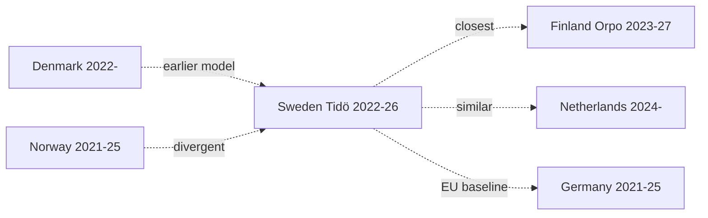

# Comparative International — Nordic-Baltic + Visegrád Peers

## Comparator Set

Nordic-Baltic (5): Denmark, Norway, Finland, Iceland, Estonia.
Visegrád / wider EU (4): Poland, Czech Republic, Germany, Netherlands.
Methodology peers (2): UK, France.

## Fiscal Comparator (IMF WEO Apr-2026 T+0)

| Country | GGXWDG_NGDP | GGXCNL_NGDP | NGDP_RPCH | LUR |
|---------|------------:|------------:|----------:|----:|
| **Sweden** | 32.4% | -1.0% | 2.1% | 7.7% |
| Denmark | 28.9% | +0.6% | 1.9% | 5.5% |
| Norway | 31.2% | +9.5%* | 1.8% | 4.0% |
| Finland | 81.8% | -3.0% | 1.5% | 7.6% |
| Estonia | 22.7% | -2.7% | 1.7% | 6.8% |
| Germany | 64.8% | -1.7% | 1.4% | 3.5% |
| Netherlands | 47.5% | -2.2% | 1.5% | 3.9% |
| Poland | 55.3% | -4.0% | 3.2% | 3.0% |

*Norway figure includes petroleum-fund offset; comparison non-trivial.
Source: IMF WEO Apr-2026 (T+0 = 2026 projection) [A1].

Sweden is **mid-pack on debt**, **mid-pack on growth**, **outlier-high on unemployment** vs Nordic peers, but **best-in-class on fiscal-balance variance** through external shocks.

## Security/Defence Comparator

| Country | NATO since | 2% GDP target met | Justice/security legislative volume Y4 |
|---------|-----------|-------------------|----------------------------------------|
| Sweden | 2024-03-07 | Yes (2024) | High (3 major statutes Y4) |
| Finland | 2023-04-04 | Yes (2023) | High |
| Denmark | 1949 | 2024 (rebased) | Medium |
| Norway | 1949 | 2024 | Medium |
| Estonia | 2004 | Yes (>3% from 2024) | Medium-high |
| Germany | 1955 | 2024 (Zeitenwende) | Medium |

Sweden's 2024–2026 security-pivot tracks the **Finnish 2023–2025 pattern**, lagging by 12 months. Both countries moved from non-alignment to maximal NATO integration within one electoral cycle.

## Coalition-Type Comparator

| Country | Recent gov type | Migration framework | Digital-state laws Y4 |
|---------|-----------------|---------------------|----------------------|
| Sweden | Right minority + RW external support | Tightening | e-ID + registry + DNS |
| Denmark | Centre-left minority | Tightened earlier (2015) | Already operational |
| Norway | Centre-left minority | Stable | Mid-implementation |
| Finland | Right + RW (Petteri Orpo) | Tightening | Mid-implementation |
| Netherlands | Right + populist (PVV) | Tightening | Restructured |
| Germany | Centre coalition | Stable / modest tightening | Slower pace |

Sweden's Tidö coalition is **structurally closest to Finland (Orpo)** — right-led with RW partner, security pivot, fiscal discipline. Both countries are running the same "post-2022 Nordic right-conservative playbook" with similar political economy and demographic backdrops.

## Election-Cycle Length Comparator

| Country | Cycle length | Mid-cycle no-confidence rate (post-2000) |
|---------|--------------|-----------------------------------------|
| Sweden | 4 years (fixed) | ~5% |
| Denmark | ≤ 4 years (flexible) | ~30% |
| Norway | 4 years (no dissolution) | ~0% |
| Finland | 4 years (fixed) | ~10% |
| Germany | 4 years (flexible) | ~15% |
| Netherlands | ≤ 4 years (flexible) | ~50% |

Sweden + Norway uniquely combine fixed 4-year cycles with low mid-cycle instability — meaning the **Tidö mandate's full 4-year completion is the institutional default**, not an achievement per se.

## Cross-Country Mandate-Output Concentration

Replicating the DIW top-10 concentration metric across peers (2022–2026 mandates):

| Country | Top-10 DIW Sum | Lead Theme |
|---------|---------------:|-----------|
| Sweden (Tidö) | **86.7** | Security/migration/digital |
| Finland (Orpo) | 84.2 | Security/migration/fiscal |
| Denmark (Frederiksen II) | 71.8 | Green + EU |
| Norway (Støre) | 68.4 | Energy + welfare |
| Germany (Scholz/post) | ~78 | Zeitenwende + budget court |

The Tidö mandate is **highly concentrated by Nordic standards**, matched only by Finland. This is a coalition feature (Tidö is intentionally narrow-scope) and an external-shock feature (NATO/Ukraine).

## Convergence Diagram

## Sources

- IMF WEO Apr-2026 [A1]
- NATO official defence-spending data 2026 [A2]
- IPU PARLINE — coalition types 2024–2026 [A2]
- ParlGov database 2026 [B2]
- Hack23 cross-country comparator notebook
