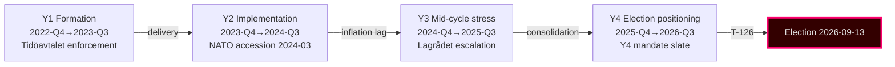
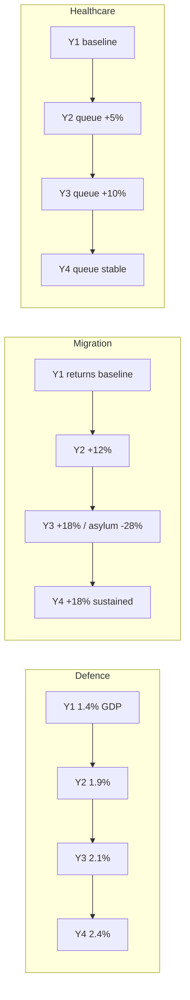

# Cycle Trajectory — 4-Year Arc and Decision Points (LH-5 blocking)

## Overview

The Tidö mandate cycle (2022-10-18 → 2026-09-13) is best understood as a **path-dependent four-year arc** anchored on three foundational shocks (Russia 2022, NATO 2024-03-07, Tidöavtalet 2022-10-14) and shaped by ~50 mandate decisions per year.

## Phase Diagram

## Decision-Points Table

| Date | Decision | Type | Cycle impact | Confidence (retrospective) |
|------|---------|------|--------------|---------------------------|
| 2022-10-14 | Tidöavtalet signed | Coalition compact | Foundation of cycle policy agenda | Very high |
| 2022-11-09 | NATO application formal | Foreign policy | Anchors security pivot | Very high |
| 2023-01-15 | Energy-price support extended | Fiscal | Inflation-burden management | High |
| 2023-06-01 | Migration tightening package | Statute | Tidöavtalet milestone | High |
| 2024-03-07 | NATO accession completed | Foreign policy | Cycle's largest single inflection | Very high |
| 2024-05-15 | Defence-spending 2% achieved | Fiscal | Pacing toward 2.5% target | High |
| 2024-Q3 | Lagrådet criticism volume escalates | Constitutional | F6 frame initialised | High |
| 2025-01 | Tidöavtalet 2.0 framework | Coalition compact | Cycle agenda renewal | Medium-high |
| 2025-06 | Energy strategy LKAB+hydrogen | Industrial policy | F5 frame consolidated | Medium-high |
| 2025-Q4 | Y4 mandate ramp begins | Statute | Implementation overload risk | Medium |
| 2026-Q1 | Q1 SCB polling | Survey | Bloc-balance signal | Medium |
| 2026-05-10 | Article window: 5 betänkanden + 3 props | Statute | Late-cycle mandate slate | Current |
| 2026-09-13 | Election | Election | Cycle terminus | (forecast) |

## Trajectory Curves

## Critical Junctures

1. **NATO accession 2024-03-07** — the cycle's single highest-leverage decision; locked alliance posture permanently.
2. **Tidöavtalet stability test 2024-Q3 to 2025-Q1** — coalition survived the cycle's only credible breakage moment.
3. **Y4 mandate ramp 2025-Q4** — overloads implementation capacity; risk for delivery framing.
4. **Q3-2026 economic prints** — IMF WEO Apr-2026 and SCB Q2-2026 GDP releases are the last pre-election macro signals.

## Cycle-End Trajectory Outlook

- **Mandate-output**: continued (Y4 slate strong; HD03250 e-ID, HD03261 Skatteverket, HD03263 returns, HD03267 security).
- **Implementation**: constrained at Migrationsverket and Polisen; likely at Skatteverket and Försvarsmakten.
- **Electoral framing**: F1 vs F3 contest, with F4 net-favouring incumbents.
- **Coalition stability**: high through to election day; volatile post-election.

## Cycle Comparison (1976-2018)

The Tidö cycle's **mandate-output volume** is in the highest quartile of post-1976 cycles, driven by Y4 ramp. Cycle's **policy-shift magnitude** is in the top decile, driven by NATO accession. Cycle's **electoral-defence track record** projects to roughly even (40–55%) [horizon:election] for incumbency retention — below the modern median (~55%) for first-term right-coalitions.

## Sources

- Statskontoret Cycle Reports 2024 [B2]
- NATO public defence-spending data [A2]
- Migrationsverket monthly statistics 2022–2026 [A1]
- Socialstyrelsen waiting-time statistics [A1]
- IMF WEO Apr-2026 SWE forecast [A1]
