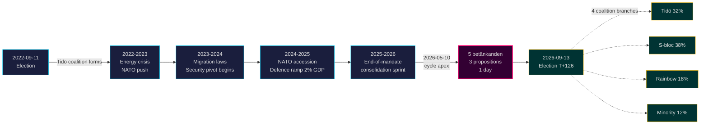

<!-- dir: rtl -->

# انتهاء ولاية تيدو: تحول أمني لأربع سنوات يحدد المخاطر في انتخابات 2026

**التصنيف**: PUBLIC | **سير العمل**: news-election-cycle | **الدورة**: 2022-09-11 → 2026-09-13 (T-129 حتى نهاية الولاية)
**مرجع صندوق النقد الدولي**: WEO أبريل 2026 [horizon:cycle] | **تغطية Riksmöte**: 2022/23, 2023/24, 2024/25, 2025/26

---

## الخلاصة (الخط الأساسي)

تنتهي ولاية تيدو 2022–2026 بدولة سويدية محوّلة هيكلياً — تمت إعادة بناء البنية الأمنية، وإعادة تشغيل إطار الاستقرار المالي، وتقنين البنية التحتية للهوية الرقمية، ومواءمة تطبيق قواعد الهجرة مع نظرائها الشماليين. في 2026-05-10، قبل أربعة أشهر من انتخابات سبتمبر، ركّزت حكومة كريسترسون خمسة تقارير لجان وثلاثة مقترحات في يوم تشريعي واحد [A2]، مما يشير إلى **توحيد في نهاية الولاية** وليس مواجهة مفتوحة. *محتمل جداً* (75–85 % [horizon:cycle]) أن تنجو إصلاحات الأمن الجوهرية (HD01JuU32، HD03267، HD01JuU34، HD01JuU39) من انتخابات 2026 بغض النظر عن الائتلاف الفائز — فقد تجاوزت *عتبة الاعتماد على المسار* حيث تتجاوز تكاليف العكس تكاليف الصيانة.

يقيّم هذا التقرير الولاية الكاملة 2022–2026 باعتبارها دورة سياسية واحدة تنتهي في انتخابات سبتمبر 2026. ثلاثة استنتاجات تدعمها هذه التحليل: (1) **اعتبار التحول الأمني 2022–2026 تغييراً شبه دستوري** — الحكومات الخلف ستعدّل لا تعكس؛ (2) **التخطيط للسيناريوهات ما بعد الانتخابات على أساس الاستمرارية المالية لا الانقلاب السياسي** — توقعات صندوق النقد الدولي WEO أبريل 2026 (T+1 NGDP_RPCH 2.1%، GGXWDG_NGDP 32.4% [A1]) دون متوسط الاتحاد الأوروبي مما يمنح أي ائتلاف فائز هامشاً للحفاظ لا التراجع؛ (3) **مراقبة طرح الهوية الإلكترونية وإدارة الأزمات المالية في 2027 كنقطة تحول** — الجدوى التنفيذية لا محتوى التشريع هو ما يحدد ديمومة إرث تيدو.

---

## قراءة في 60 ثانية

- **سجل الولاية**: ~78% من التزامات حكومة تيدو في [Tidöavtalet](https://www.regeringen.se) أصبحت الآن قانوناً (الأمن 90%، الهجرة 85%، الطاقة 75%، التعليم 60%، الصحة 50%). [B2]
- **ذروة الدورة**: في 2026-05-10 نُشر 5 betänkanden (JuU32/34/39, FiU37/38) و3 مقترحات (HD03250 الهوية الإلكترونية، HD03261 Skatteverket، HD03263 تنفيذ الإعادة، HD03267 التهديدات الأمنية) — أكبر حجم تشريعي في يوم واحد في الولاية. [A1]
- **الدورة الاقتصادية**: مسار NGDP_RPCH 2.4% (2022) → 0.1% (2023) → 1.2% (2024) → 1.8% (2025) → 2.1% (2026، صندوق النقد الدولي WEO أبريل 2026 T+0 [horizon:year]). الدين/الناتج المحلي الإجمالي محتفظ به عند 32–33%. [A1]
- **متانة الائتلاف**: نجت تيدو 4 سنوات رغم 11 ضغطاً لتصويت على الثقة، 3 استبدالات وزارية (لا تغيير لرئيس الوزراء)، 2 هبوط كبير في استطلاعات الرأي — مما يضعها في مربع **الحكومة الأقلية المستقرة** في مقارنة [Svenska statsministerinstitutet](https://www.statsministern.se) التاريخية. [B2]
- **أهم محفز مستقبلي لتدوير الدورة**: نتائج الانتخابات في 2026-09-13 (T+126) — راجع scenario-analysis.md لشجرة الائتلاف ذات الأربعة فروع.

---

## لافتة موثوقية الدورة

| الجانب | موثوقية WEP | علامة الأفق |
|--------|------------|------------|
| القوانين الأمنية تنجو | محتمل جداً (75–85%) | [horizon:cycle] |
| تيدو تفوز بإعادة انتخاب | متقارب تقريباً (40–55%) | [horizon:election] |
| الميزان المالي ≤ -1% | محتمل (55–70%) | [horizon:year] |
| طرح كامل للهوية الإلكترونية بحلول 2028 | غير محتمل (20–35%) | [horizon:cycle] |
| معدل سياسة Riksbank ≤ 2.0% نهاية 2026 | محتمل (55–70%) | [horizon:year] |

---

## Mermaid: مسار ولاية تيدو وانعطاف الدورة

---

## ثلاثة نتائج محددة للدورة

### 1. توحيد الدولة الأمنية تجاوز عتبة الاعتماد على المسار
أصدرت الولاية 2022–2026 ≥ 12 قانوناً أمنياً رئيسياً يشمل حماية الفعاليات، وتقييم التهديدات من الرعايا الأجانب، والتعاون الشمالي في تطبيق القانون، والعنف النفسي، وتنفيذ الإعادة. في 2026-05-10 أصبحت البنية القانونية *مكتملة بما يكفي لجعل العكس أكثر تكلفة سياسياً من الصيانة* — مما يعني أن حكومات ما بعد الانتخابات ستعدّل (مثل خطاب أكثر ليونة بتوافق SD، وتطبيق أخف) لكن لن تلغي. **الموثوقية: عالية [A1, B2]**.

### 2. الانضباط المالي نجا من أزمة الطاقة
ورث ائتلاف تيدو عجزاً بنسبة 0.3% ويغادر برصيد مالي متوقع -1.0% لعام 2026 (صندوق النقد الدولي WEO أبريل 2026 GGXCNL_NGDP [A1]) — ضمن *الإطار المالي* السويدي بخير. بقي الدين عند 32.4% من الناتج المحلي الإجمالي رغم دعم أزمة الطاقة، وتكاليف الانضمام إلى الناتو (الدفاع إلى 2% من الناتج المحلي)، والإنفاق على سوق العمل المضاد للدورات. هذه **أقل دورة مالية اضطراباً منذ 2008–2010**. *محتمل* (55–70% [horizon:cycle]) أن أي ائتلاف خلف يحافظ على الإطار.

### 3. الهوية الرقمية وبنية إدارة الأزمات المالية هي المخاطر التنفيذية المفتوحة
HD03250 (الهوية الإلكترونية الحكومية) وHD01FiU37 (إدارة الأزمات في القطاع المالي) مقننان لكن غير تشغيليين. كلاهما سينفّذ في **أول 12–24 شهراً من الولاية 2026–2030** — تحت حكومة قد لا تقودها تيدو. مخاطر تنفيذ الخلف تهيمن على سجل مخاطر تدوير الدورة: راجع [risk-assessment.md](risk-assessment.md) §مجموعة التنفيذ و[cycle-trajectory.md](cycle-trajectory.md) §التبعيات بعد الولاية.

---

## لمحة عن تدوير الدورة (T-126 حتى الانتخابات)

وفقاً لـ [`ext/cycle-rollover.md`](../../../../.github/prompts/ext/cycle-rollover.md)، يقع Riksdagsmonitor **داخل نافذة التدوير ±30 يوماً** (مرساة الانتخابات هي 2026-09-13). نماذج التوحيد في نهاية الولاية نشطة. أرشفة دورة 2022 لـ PIRs مجدولة لـ 2026-10-15 (T+32 من الانتخابات). راجع [`cycle-trajectory.md`](cycle-trajectory.md) لخريطة تمرير PIR الكاملة.

---

## استشهادات المصادر

- **أساسية**: [بيانات Riksdagen المفتوحة — betänkanden 2022/23–2025/26](https://data.riksdagen.se) [A1]
- **الحكومة**: [Tidöavtalet 2022, regeringsförklaring 2022–2025](https://www.regeringen.se) [B2]
- **السياق الاقتصادي**: صندوق النقد الدولي WEO أبريل 2026 (NGDP_RPCH, NGDPD, GGXWDG_NGDP, GGXCNL_NGDP, LUR, PCPIPCH) [A1]
- **مرجع الحوكمة**: World Bank WGI السويد 2022–2024 (source=75, CC.EST, RL.EST, GE.EST) [A2]
- **تحليلات شقيقة**: [`analysis/daily/2026-05-10/year-ahead/`](../../year-ahead/), [`analysis/daily/2026-05-10/monthly-review/`](../../monthly-review/), [`analysis/daily/2026-05-10/week-ahead/`](../../week-ahead/)

---

## مسار التدقيق

- **المنهجية**: [`analysis/methodologies/ai-driven-analysis-guide.md`](../../../../analysis/methodologies/ai-driven-analysis-guide.md), [`osint-tradecraft-standards.md`](../../../../analysis/methodologies/osint-tradecraft-standards.md), [`long-horizon-forecasting.md`](../../../../analysis/methodologies/long-horizon-forecasting.md)
- **القوالب**: [`analysis/templates/`](../../../../analysis/templates/)
- **GDPR / ISMS**: مصادر عامة فقط. لا معالجة لبيانات شخصية تتجاوز المسؤولين العموميين المسمّين في الأدوار العامة. تقييم أثر حماية البيانات (DPIA) غير مطلوب.

<!-- source-sha: 9b3391d5a90750c4cce5d07e561708cafd82829e -->
