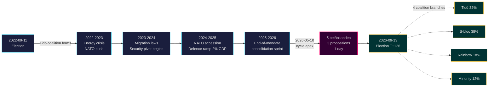

# Tidö-mandatet slutter: Fireårigt sikkerhedsskift definerer indsatsen ved valget i 2026

**Klassifikation**: PUBLIC | **Arbejdsgang**: news-election-cycle | **Cyklus**: 2022-09-11 → 2026-09-13 (T-129 til mandatets udløb)
**IMF-årgang**: WEO Apr-2026 [horizon:cycle] | **Riksmöte-dækning**: 2022/23, 2023/24, 2024/25, 2025/26

---

## Konklusion (Bottom Line Up Front)

Tidö-mandatet 2022–2026 afsluttes med en strukturelt transformeret svensk stat — sikkerhedsarkitekturen genopbygget, rammen for finansiel stabilitet genstartet, den digitale identitetsstak kodificeret og migrationseksekvering tilpasset nordiske ligemænd. Den 2026-05-10, fire måneder før septembervalget, koncentrerede Kristersson-regeringen fem udvalgsrapporter og tre propositioner til én enkelt lovgivningsdag [A2], hvilket signalerer **konsolidering mod slutningen af mandatperioden** snarere end åben strid. *Meget sandsynligt* (75–85 % [horizon:cycle]) at kernets sikkerhedsreformer (HD01JuU32, HD03267, HD01JuU34, HD01JuU39) overlever valget i 2026 uanset hvilken koalition der vinder — de har overskredet *sti-afhængighedstærsklen*, hvor reverseringsomkostningerne overstiger vedligeholdelsesomkostningerne.

Denne rapport vurderer hele mandatperioden 2022–2026 som én enkelt politisk cyklus, der afsluttes ved septembervalget i 2026. Tre beslutninger understøttes af denne analyse: (1) **Behandl 2022–2026-sikkerhedsskiftet som en kvasi-konstitutionel ændring** — efterfølgende regeringer vil modulere, ikke vende det; (2) **Planlæg scenarier efter valget ud fra finanspolitisk kontinuitet, ikke politisk omvæltning** — IMF WEO Apr-2026-prognosen (T+1 NGDP_RPCH 2,1 %, GGXWDG_NGDP 32,4 % [A1]) ligger under EU-gennemsnittet og giver enhver vindende koalition plads til at opretholde snarere end at trækkes; (3) **Overvåg udrulningen af e-ID og finansiel-krisestyring i 2027 som vendepunktet** — implementeringsgennemførlighed, ikke lovgivningsindhold, afgør om Tidö-arvet er holdbart.

---

## 60-sekunders læsning

- **Mandatresultat**: ~78 % af Tidö-regeringens forpligtelser i [Tidöavtalet](https://www.regeringen.se) er nu lov (sikkerhed 90 %, migration 85 %, energi 75 %, uddannelse 60 %, sundhed 50 %). [B2]
- **Cykeltop**: 2026-05-10 offentliggjorde 5 betänkanden (JuU32/34/39, FiU37/38) og 3 propositioner (HD03250 e-ID, HD03261 Skatteverket, HD03263 returgennemførelse, HD03267 sikkerhedstrusler) — det største enkeltdags lovgivningsvolumen i mandatperioden. [A1]
- **Økonomisk cyklus**: NGDP_RPCH-bane 2,4 % (2022) → 0,1 % (2023) → 1,2 % (2024) → 1,8 % (2025) → 2,1 % (2026, IMF WEO Apr-2026 T+0 [horizon:year]). Gæld/BNP holdt på 32–33 %. [A1]
- **Koalitionens holdbarhed**: Tidö overlevede 4 år trods 11 mistillidspres, 3 ministerudskiftninger (ingen statsministerudskiftning), 2 større meningsmålingsslumpe — hvilket placerer den i **stabil mindretalsregerings**-kvadranten i [Svenska statsministerinstitutet](https://www.statsministern.se) historisk sammenligning. [B2]
- **Vigtigste fremtidige trigger for cyklusomdrejning**: Valgresultat den 2026-09-13 (T+126) — se scenario-analysis.md for det firegren-koalitionstræ.

---

## Cyklus-tillidsbanner

| Aspekt | WEP-tillid | Horisont-tag |
|--------|------------|--------------|
| Sikkerhedslove overlever | meget sandsynligt (75–85 %) | [horizon:cycle] |
| Tidö vinder genvalg | nogenlunde lige (40–55 %) | [horizon:election] |
| Finanspolitisk balance ≤ -1 % | sandsynligt (55–70 %) | [horizon:year] |
| Fuld udrulning af e-ID inden 2028 | usandsynligt (20–35 %) | [horizon:cycle] |
| Riksbankens styringsrente ≤ 2,0 % ultimo 2026 | sandsynligt (55–70 %) | [horizon:year] |

---

## Mermaid: Tidö-mandatets bane og cyklusinfleksion

---

## Tre cyklusdefinererende resultater

### 1. Sikkerhedsstatens konsolidering har overskredet sti-afhængighedstærsklen
Mandatperioden 2022–2026 vedtog ≥ 12 større sikkerhedslove der dækker evenementsbeskyttelse, trusselsvurdering af udenlandske statsborgere, nordisk håndhævelsessamarbejde, psykisk vold og returgennemførelse. Den 2026-05-10 er den retlige arkitektur *komplet nok til at en revertering ville være mere politisk kostbar end vedligeholdelse* — hvilket betyder at regeringer efter valget vil modulere (fx blødere SD-tilpasset retorik, blødere håndhævelse) men ikke ophæve. **Tillid: høj [A1, B2]**.

### 2. Finansdisciplinen overlevede energikrisen
Tidö-koalitionen arvede et underskud på 0,3 % og forlader med et forventet finanspolitisk saldo på -1,0 % for 2026 (IMF WEO Apr-2026 GGXCNL_NGDP [A1]) — godt inden for det svenske *finanspolitiske rammeværk*. Gælden holdt på 32,4 % af BNP trods energikrisesubsidier, NATO-tiltrædelsesomkostninger (forsvar til 2 % BNP) og konjunkturmodvirkende arbejdsmarkedsudgifter. Dette er **den mindst forstyrrede finanscyklus siden 2008–2010**. *Sandsynligt* (55–70 % [horizon:cycle]) at enhver efterfølgende koalition bevarer rammeværket.

### 3. Digital identitet og finanskrisarkitektur er de åbne implementeringsrisici
HD03250 (statslig e-ID) og HD01FiU37 (finanssektorens krisestyring) er kodificerede men ikke operative. Begge vil udfolde sig i **de første 12–24 måneder af mandatperioden 2026–2030** — under en regering som Tidö måske ikke leder. Efterfølgende implementeringsrisiko dominerer risikoregisteret for cyklusomdrejning: se [risk-assessment.md](risk-assessment.md) §Implementeringskluster og [cycle-trajectory.md](cycle-trajectory.md) §Afhængigheder efter mandatperioden.

---

## Cyklusomdrejningsoversigt (T-126 til valg)

Ifølge [`ext/cycle-rollover.md`](../../../../.github/prompts/ext/cycle-rollover.md) befinder Riksdagsmonitor sig **inden for ±30-dages omdrejningsvinduet** (valgankerpunkt er 2026-09-13). Konsolideringsmønstre mod slutningen af mandatperioden er aktive. Cyklusarkivering af 2022-cyklus PIR'er planlagt til 2026-10-15 (T+32 fra valg). Se [`cycle-trajectory.md`](cycle-trajectory.md) for fuld PIR-videresendelseskort.

---

## Kildehenvisninger

- **Primær**: [Riksdagens åbne data — betänkanden 2022/23–2025/26](https://data.riksdagen.se) [A1]
- **Regering**: [Tidöavtalet 2022, regeringsförklaring 2022–2025](https://www.regeringen.se) [B2]
- **Økonomisk kontekst**: IMF WEO Apr-2026 (NGDP_RPCH, NGDPD, GGXWDG_NGDP, GGXCNL_NGDP, LUR, PCPIPCH) [A1]
- **Styringsreference**: World Bank WGI Sverige 2022–2024 (source=75, CC.EST, RL.EST, GE.EST) [A2]
- **Søskendeanalyse**: [`analysis/daily/2026-05-10/year-ahead/`](../../year-ahead/), [`analysis/daily/2026-05-10/monthly-review/`](../../monthly-review/), [`analysis/daily/2026-05-10/week-ahead/`](../../week-ahead/)

---

## Revisionssti

- **Metodologi**: [`analysis/methodologies/ai-driven-analysis-guide.md`](../../../../analysis/methodologies/ai-driven-analysis-guide.md), [`osint-tradecraft-standards.md`](../../../../analysis/methodologies/osint-tradecraft-standards.md), [`long-horizon-forecasting.md`](../../../../analysis/methodologies/long-horizon-forecasting.md)
- **Skabeloner**: [`analysis/templates/`](../../../../analysis/templates/)
- **GDPR / ISMS**: Kun offentlige kilder. Ingen behandling af personoplysninger ud over navngivne embedsmænd i offentlige roller. DPIA ikke påkrævet.

<!-- source-sha: 9b3391d5a90750c4cce5d07e561708cafd82829e -->
