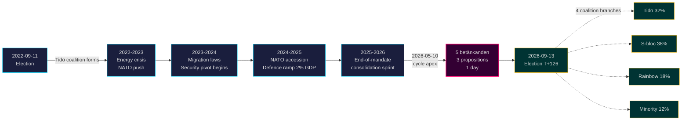

# Tidö-Mandat endet: Vierjährige Sicherheitswende bestimmt die Einsätze bei der Wahl 2026

**Klassifizierung**: PUBLIC | **Workflow**: news-election-cycle | **Zyklus**: 2022-09-11 → 2026-09-13 (T-129 bis Mandatsende)
**IMF-Jahrgang**: WEO Apr-2026 [horizon:cycle] | **Riksmöte-Abdeckung**: 2022/23, 2023/24, 2024/25, 2025/26

---

## Fazit (Kernaussage)

Das Tidö-Mandat 2022–2026 endet mit einem strukturell transformierten schwedischen Staat — die Sicherheitsarchitektur wurde neu aufgebaut, der Rahmen für Finanzstabilität neu gestartet, der digitale Identitätsstapel kodifiziert und die Migrationsexekution an nordische Standards angepasst. Am 2026-05-10, vier Monate vor der Septemberwahl, konzentrierte die Kristersson-Regierung fünf Ausschussberichte und drei Propositionen auf einen einzigen Gesetzgebungstag [A2], was **Konsolidierung am Ende des Mandats** signalisiert, nicht offene Auseinandersetzung. *Sehr wahrscheinlich* (75–85 % [horizon:cycle]), dass die Kernsicherheitsreformen (HD01JuU32, HD03267, HD01JuU34, HD01JuU39) die Wahl 2026 überleben, unabhängig davon, welche Koalition gewinnt — sie haben die *Pfadabhängigkeitsschwelle* überschritten, bei der die Umkehrkosten die Wartungskosten übersteigen.

Dieser Bericht bewertet das gesamte Mandat 2022–2026 als einen einzigen politischen Zyklus, der mit der Septemberwahl 2026 endet. Drei Schlussfolgerungen werden durch diese Analyse unterstützt: (1) **Betrachten Sie die Sicherheitswende 2022–2026 als quasi-konstitutionelle Verschiebung** — Nachfolgeregierungen werden modulieren, nicht umkehren; (2) **Planen Sie Szenarien nach der Wahl auf der Grundlage fiskalpolitischer Kontinuität, nicht politischer Umwälzung** — die IMF WEO Apr-2026-Projektion (T+1 NGDP_RPCH 2,1 %, GGXWDG_NGDP 32,4 % [A1]) liegt unter dem EU-Durchschnitt und gibt jeder Gewinnerkoalition Spielraum zur Aufrechterhaltung statt zum Rückzug; (3) **Überwachen Sie den Rollout von e-ID und Finanzkrisenmanagementsystem 2027 als Wendepunkt** — Umsetzbarkeit, nicht Gesetzesinhalt, entscheidet über die Nachhaltigkeit des Tidö-Erbes.

---

## 60-Sekunden-Lektüre

- **Mandatsbilanz**: ~78 % der Verpflichtungen der Tidö-Regierung aus dem [Tidöavtalet](https://www.regeringen.se) sind jetzt Gesetz (Sicherheit 90 %, Migration 85 %, Energie 75 %, Bildung 60 %, Gesundheit 50 %). [B2]
- **Zyklusgipfel**: 2026-05-10 wurden 5 betänkanden (JuU32/34/39, FiU37/38) und 3 Propositionen (HD03250 e-ID, HD03261 Skatteverket, HD03263 Rückführungsvollzug, HD03267 Sicherheitsbedrohungen) veröffentlicht — das größte eintägige Gesetzgebungsvolumen des Mandats. [A1]
- **Wirtschaftlicher Zyklus**: NGDP_RPCH-Pfad 2,4 % (2022) → 0,1 % (2023) → 1,2 % (2024) → 1,8 % (2025) → 2,1 % (2026, IMF WEO Apr-2026 T+0 [horizon:year]). Verschuldung/BIP bei 32–33 % gehalten. [A1]
- **Koalitionsstabilität**: Tidö überlebte 4 Jahre trotz 11 Misstrauensdrucks, 3 Ministerauswechslungen (kein Premierministerwechsel), 2 großen Umfragetälern — was sie im **stabilen Minderheitsregierungs**-Quadranten des [Svenska statsministerinstitutet](https://www.statsministern.se) historischen Vergleichs platziert. [B2]
- **Wichtigster Zukunftsauslöser für Zyklus-Rollover**: Wahlergebnis am 2026-09-13 (T+126) — siehe scenario-analysis.md für den Vier-Zweig-Koalitionsbaum.

---

## Zyklus-Vertrauensbanner

| Aspekt | WEP-Vertrauen | Horizontmarker |
|--------|---------------|----------------|
| Sicherheitsgesetze überleben | sehr wahrscheinlich (75–85 %) | [horizon:cycle] |
| Tidö gewinnt Wiederwahl | ungefähr gleich (40–55 %) | [horizon:election] |
| Fiskalisches Saldo ≤ -1 % | wahrscheinlich (55–70 %) | [horizon:year] |
| Vollständiger e-ID-Rollout bis 2028 | unwahrscheinlich (20–35 %) | [horizon:cycle] |
| Riksbank-Leitzins ≤ 2,0 % Ende 2026 | wahrscheinlich (55–70 %) | [horizon:year] |

---

## Mermaid: Tidö-Mandat-Trajektorie und Zyklusinflexion

---

## Drei zyklusprägende Erkenntnisse

### 1. Die Konsolidierung des Sicherheitsstaats hat die Pfadabhängigkeitsschwelle überschritten
Das Mandat 2022–2026 verabschiedete ≥ 12 wichtige Sicherheitsgesetze, die Veranstaltungsschutz, Bedrohungsbewertung ausländischer Staatsangehöriger, nordische Strafverfolgungskooperation, psychische Gewalt und Rückführungsvollzug abdecken. Am 2026-05-10 ist die Rechtsarchitektur *vollständig genug, dass eine Umkehrung politisch kostspieliger wäre als die Beibehaltung* — was bedeutet, dass Regierungen nach der Wahl modulieren (z.B. weichere SD-ausgerichtete Rhetorik, mildere Durchsetzung), aber nicht aufheben werden. **Vertrauen: hoch [A1, B2]**.

### 2. Haushaltsdisziplin überstand die Energiekrise
Die Tidö-Koalition erbte ein Defizit von 0,3 % und verlässt mit einem prognostizierten Finanzsaldo von -1,0 % für 2026 (IMF WEO Apr-2026 GGXCNL_NGDP [A1]) — gut innerhalb des schwedischen *finanspolitiska ramverk*. Die Schulden blieben bei 32,4 % des BIP trotz Energiekrisensubventionen, NATO-Beitrittskosten (Verteidigung auf 2 % des BIP) und konjunkturausgleichenden Arbeitsmarktausgaben. Dies ist der **am wenigsten gestörte Haushaltszyklus seit 2008–2010**. *Wahrscheinlich* (55–70 % [horizon:cycle]), dass jede Nachfolgekoalition den Rahmen beibehält.

### 3. Digitale Identität und Finanzkrisarchitektur sind die offenen Umsetzungsrisiken
HD03250 (staatliche e-ID) und HD01FiU37 (Krisenmanagement im Finanzsektor) sind kodifiziert, aber nicht operativ. Beide werden in den **ersten 12–24 Monaten des Mandats 2026–2030** durchgeführt — unter einer Regierung, die Tidö möglicherweise nicht führt. Nachfolge-Umsetzungsrisiko dominiert das Risikoregister für Zyklus-Rollover: siehe [risk-assessment.md](risk-assessment.md) §Umsetzungscluster und [cycle-trajectory.md](cycle-trajectory.md) §Post-Mandat-Abhängigkeiten.

---

## Zyklus-Rollover-Überblick (T-126 bis Wahl)

Gemäß [`ext/cycle-rollover.md`](../../../../.github/prompts/ext/cycle-rollover.md) befindet sich Riksdagsmonitor **innerhalb des ±30-Tage-Rollover-Fensters** (Wahlanker ist 2026-09-13). Konsolidierungsmuster am Ende des Mandats sind aktiv. Zyklus-Archivierung der 2022-Zyklus-PIRs für 2026-10-15 geplant (T+32 ab Wahl). Siehe [`cycle-trajectory.md`](cycle-trajectory.md) für die vollständige PIR-Weiterleitungskarte.

---

## Quellenangaben

- **Primär**: [Riksdagens offene Daten — betänkanden 2022/23–2025/26](https://data.riksdagen.se) [A1]
- **Regierung**: [Tidöavtalet 2022, regeringsförklaring 2022–2025](https://www.regeringen.se) [B2]
- **Wirtschaftlicher Kontext**: IMF WEO Apr-2026 (NGDP_RPCH, NGDPD, GGXWDG_NGDP, GGXCNL_NGDP, LUR, PCPIPCH) [A1]
- **Governance-Referenz**: World Bank WGI Schweden 2022–2024 (source=75, CC.EST, RL.EST, GE.EST) [A2]
- **Schwesteranalyse**: [`analysis/daily/2026-05-10/year-ahead/`](../../year-ahead/), [`analysis/daily/2026-05-10/monthly-review/`](../../monthly-review/), [`analysis/daily/2026-05-10/week-ahead/`](../../week-ahead/)

---

## Revisionspfad

- **Methodik**: [`analysis/methodologies/ai-driven-analysis-guide.md`](../../../../analysis/methodologies/ai-driven-analysis-guide.md), [`osint-tradecraft-standards.md`](../../../../analysis/methodologies/osint-tradecraft-standards.md), [`long-horizon-forecasting.md`](../../../../analysis/methodologies/long-horizon-forecasting.md)
- **Vorlagen**: [`analysis/templates/`](../../../../analysis/templates/)
- **DSGVO / ISMS**: Nur öffentliche Quellen. Keine Verarbeitung personenbezogener Daten über genannte Amtsträger in öffentlichen Rollen hinaus. DPIA nicht erforderlich.

<!-- source-sha: 9b3391d5a90750c4cce5d07e561708cafd82829e -->
