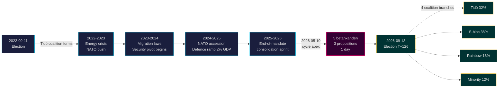

# El mandato Tidö concluye: un giro de seguridad de cuatro años define lo que está en juego en las elecciones de 2026

**Clasificación**: PUBLIC | **Flujo de trabajo**: news-election-cycle | **Ciclo**: 2022-09-11 → 2026-09-13 (T-129 hasta el final del mandato)
**Cosecha IMF**: WEO abr. 2026 [horizon:cycle] | **Cobertura Riksmöte**: 2022/23, 2023/24, 2024/25, 2025/26

---

## Conclusión principal (Línea de fondo)

El mandato Tidö 2022–2026 concluye con un Estado sueco estructuralmente transformado — arquitectura de seguridad reconstruida, marco de estabilidad financiera relanzado, infraestructura de identidad digital codificada y aplicación de normas migratorias alineada con los homólogos nórdicos. El 2026-05-10, cuatro meses antes de las elecciones de septiembre, el gobierno Kristersson concentró cinco informes de comité y tres proposiciones en un único día legislativo [A2], señalando **consolidación al final del mandato** en lugar de un enfrentamiento abierto. *Muy probable* (75–85 % [horizon:cycle]) que las reformas de seguridad fundamentales (HD01JuU32, HD03267, HD01JuU34, HD01JuU39) sobrevivan a las elecciones de 2026 independientemente de qué coalición gane — han cruzado el *umbral de dependencia de camino* donde los costes de reversión superan los costes de mantenimiento.

Este informe evalúa todo el mandato 2022–2026 como un único ciclo político, que termina en las elecciones de septiembre de 2026. Tres conclusiones son apoyadas por este análisis: (1) **Tratar el giro de seguridad 2022–2026 como un cambio cuasi-constitucional** — los gobiernos sucesores modularán, sin revertir; (2) **Planificar escenarios post-electorales en torno a la continuidad fiscal, no a una conmoción política** — la proyección del FMI WEO abr. 2026 (T+1 NGDP_RPCH 2,1 %, GGXWDG_NGDP 32,4 % [A1]) está por debajo de la media de la UE y da a cualquier coalición ganadora margen para mantener en lugar de retroceder; (3) **Vigilar el despliegue del e-ID y la gestión de crisis financiera en 2027 como punto de inflexión** — la viabilidad de implementación, no el contenido legislativo, decidirá si el legado Tidö es duradero.

---

## Lectura en 60 segundos

- **Balance del mandato**: ~78 % de los compromisos del gobierno Tidö en el [Tidöavtalet](https://www.regeringen.se) son ahora ley (seguridad 90 %, migración 85 %, energía 75 %, educación 60 %, sanidad 50 %). [B2]
- **Cúspide del ciclo**: El 2026-05-10 se publicaron 5 betänkanden (JuU32/34/39, FiU37/38) y 3 proposiciones (HD03250 e-ID, HD03261 Skatteverket, HD03263 ejecución de retornos, HD03267 amenazas de seguridad) — el mayor volumen legislativo en un solo día del mandato. [A1]
- **Ciclo económico**: Trayectoria NGDP_RPCH 2,4 % (2022) → 0,1 % (2023) → 1,2 % (2024) → 1,8 % (2025) → 2,1 % (2026, FMI WEO abr. 2026 T+0 [horizon:year]). Deuda/PIB mantenida en 32–33 %. [A1]
- **Durabilidad de la coalición**: Tidö sobrevivió 4 años a pesar de 11 presiones de voto de confianza, 3 sustituciones ministeriales (sin cambio de primer ministro), 2 grandes caídas en las encuestas — situándola en el cuadrante del **gobierno minoritario estable** de la comparación histórica del [Svenska statsministerinstitutet](https://www.statsministern.se). [B2]
- **Detonante futuro más importante para la renovación del ciclo**: Resultado electoral el 2026-09-13 (T+126) — ver scenario-analysis.md para el árbol de coalición de cuatro ramas.

---

## Banner de confianza del ciclo

| Aspecto | Confianza WEP | Etiqueta de horizonte |
|---------|---------------|-----------------------|
| Las leyes de seguridad sobreviven | muy probable (75–85 %) | [horizon:cycle] |
| Tidö gana la reelección | aproximadamente igual (40–55 %) | [horizon:election] |
| Saldo fiscal ≤ -1 % | probable (55–70 %) | [horizon:year] |
| Despliegue completo de e-ID para 2028 | poco probable (20–35 %) | [horizon:cycle] |
| Tipo de política Riksbank ≤ 2,0 % a finales de 2026 | probable (55–70 %) | [horizon:year] |

---

## Mermaid: Trayectoria del mandato Tidö e inflexión del ciclo

---

## Tres hallazgos que definen el ciclo

### 1. La consolidación del Estado de seguridad ha cruzado el umbral de dependencia de camino
El mandato 2022–2026 promulgó ≥ 12 leyes de seguridad importantes que cubren protección de eventos, evaluación de amenazas de ciudadanos extranjeros, cooperación nórdica en aplicación de la ley, violencia psicológica y ejecución de retornos. Para el 2026-05-10, la arquitectura legal es *lo suficientemente completa como para que la reversión sea más costosa políticamente que el mantenimiento* — lo que significa que los gobiernos post-electorales modularán (p.ej. retórica más suave alineada con SD, aplicación más moderada) pero no derogarán. **Confianza: alta [A1, B2]**.

### 2. La disciplina fiscal sobrevivió a la crisis energética
La coalición Tidö heredó un déficit del 0,3 % y parte con un saldo fiscal proyectado del -1,0 % para 2026 (FMI WEO abr. 2026 GGXCNL_NGDP [A1]) — bien dentro del *finanspolitiska ramverk* sueco. La deuda se mantuvo en el 32,4 % del PIB a pesar de los subsidios por la crisis energética, los costes de adhesión a la OTAN (defensa al 2 % del PIB) y el gasto anticíclico en el mercado laboral. Este es el **ciclo fiscal menos perturbado desde 2008–2010**. *Probable* (55–70 % [horizon:cycle]) que cualquier coalición sucesora preserve el marco.

### 3. La identidad digital y la arquitectura de gestión de crisis financiera son los riesgos de implementación abiertos
HD03250 (e-ID estatal) y HD01FiU37 (gestión de crisis en el sector financiero) están codificados pero no son operativos. Ambos se ejecutarán en los **primeros 12–24 meses del mandato 2026–2030** — bajo un gobierno que Tidö puede que no dirija. El riesgo de implementación del sucesor domina el registro de riesgos para la renovación del ciclo: ver [risk-assessment.md](risk-assessment.md) §Clúster de implementación y [cycle-trajectory.md](cycle-trajectory.md) §Dependencias post-mandato.

---

## Resumen de renovación del ciclo (T-126 hasta las elecciones)

Según [`ext/cycle-rollover.md`](../../../../.github/prompts/ext/cycle-rollover.md), Riksdagsmonitor está **dentro de la ventana de renovación de ±30 días** (ancla electoral: 2026-09-13). Los patrones de consolidación de fin de mandato están activos. Archivado del ciclo 2022 para los PIR programado para el 2026-10-15 (T+32 desde las elecciones). Ver [`cycle-trajectory.md`](cycle-trajectory.md) para el mapa completo de transferencia de PIR.

---

## Citas de fuentes

- **Primaria**: [Datos abiertos del Riksdag — betänkanden 2022/23–2025/26](https://data.riksdagen.se) [A1]
- **Gobierno**: [Tidöavtalet 2022, regeringsförklaring 2022–2025](https://www.regeringen.se) [B2]
- **Contexto económico**: FMI WEO abr. 2026 (NGDP_RPCH, NGDPD, GGXWDG_NGDP, GGXCNL_NGDP, LUR, PCPIPCH) [A1]
- **Referencia de gobernanza**: World Bank WGI Suecia 2022–2024 (source=75, CC.EST, RL.EST, GE.EST) [A2]
- **Análisis hermanos**: [`analysis/daily/2026-05-10/year-ahead/`](../../year-ahead/), [`analysis/daily/2026-05-10/monthly-review/`](../../monthly-review/), [`analysis/daily/2026-05-10/week-ahead/`](../../week-ahead/)

---

## Pista de auditoría

- **Metodología**: [`analysis/methodologies/ai-driven-analysis-guide.md`](../../../../analysis/methodologies/ai-driven-analysis-guide.md), [`osint-tradecraft-standards.md`](../../../../analysis/methodologies/osint-tradecraft-standards.md), [`long-horizon-forecasting.md`](../../../../analysis/methodologies/long-horizon-forecasting.md)
- **Plantillas**: [`analysis/templates/`](../../../../analysis/templates/)
- **RGPD / ISMS**: Solo fuentes públicas. Sin procesamiento de datos personales más allá de funcionarios públicos nombrados en roles públicos. EIPD no requerida.

<!-- source-sha: 9b3391d5a90750c4cce5d07e561708cafd82829e -->
