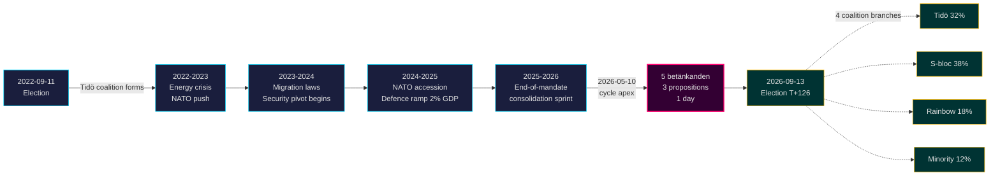

# Tidö-toimikausi päättyy: Nelivuotinen turvallisuuskäänne määrittää panokset vuoden 2026 vaaleissa

**Luokitus**: PUBLIC | **Työnkulku**: news-election-cycle | **Sykli**: 2022-09-11 → 2026-09-13 (T-129 toimikauden loppuun)
**IMF-vuosikerta**: WEO Apr-2026 [horizon:cycle] | **Riksmöte-kattavuus**: 2022/23, 2023/24, 2024/25, 2025/26

---

## Johtopäätös (Bottom Line Up Front)

Tidö-toimikausi 2022–2026 päättyy rakenteellisesti muuttuneeseen Ruotsiin — turvallisuusarkkitehtuuri on uusittu, rahoitusvakausrakenne käynnistetty uudelleen, digitaalinen henkilöllisyyspino kodifioitu ja maahanmuuton täytäntöönpano yhdenmukainen Pohjoismaisten vertaisten kanssa. Kristersson-hallitus tiivisti 2026-05-10, neljä kuukautta ennen syyskuun vaaleja, viisi valiokuntamietintöä ja kolme esitystä yhteen lainsäädäntöpäivään [A2], mikä viestii **toimikauden loppukonsolidaatiosta** eikä avoimesta kilpailusta. *Hyvin todennäköistä* (75–85 % [horizon:cycle]), että ydinturvallisuusuudistukset (HD01JuU32, HD03267, HD01JuU34, HD01JuU39) selviävät vuoden 2026 vaaleista riippumatta siitä, mikä koalitio voittaa — ne ovat ylittäneet *polkuriippuvuuden kynnysarvon*, jossa kumoamiskustannukset ylittävät ylläpitokustannukset.

Tässä raportissa arvioidaan koko toimikausi 2022–2026 yhtenä poliittisena syklinä, joka päättyy syyskuun 2026 vaaleissa. Kolme päätöstä tukee tätä analyysia: (1) **Pidä 2022–2026 turvallisuuskäännettä kvasikonstitutionaalisena muutoksena** — seuraavat hallitukset moduloivat, eivät palauta sitä; (2) **Suunnittele vaalien jälkeiset skenaariot finanssipoliittisen jatkuvuuden, ei politiikan mullistuksen pohjalta** — IMF WEO Apr-2026 ennuste (T+1 NGDP_RPCH 2,1 %, GGXWDG_NGDP 32,4 % [A1]) on alle EU:n keskiarvon ja antaa voittavalle koalitiolle tilaa ylläpitää pikemminkin kuin vetäytyä; (3) **Seuraa sähköisen tunnistautumisen ja finanssikriisinhallintajärjestelmän käyttöönottoa vuonna 2027 käännekohtana** — toteutettavuus, ei lainsäädännön sisältö, ratkaisee Tidö-perinnön kestävyyden.

---

## 60 sekunnin lukeminen

- **Toimikauden tulos**: ~78 % Tidö-hallituksen sitoumuksista [Tidöavtalet](https://www.regeringen.se) on nyt laissa (turvallisuus 90 %, maahanmuutto 85 %, energia 75 %, koulutus 60 %, terveydenhuolto 50 %). [B2]
- **Syklihuippu**: 2026-05-10 julkaistiin 5 betänkandea (JuU32/34/39, FiU37/38) ja 3 esitystä (HD03250 sähköinen tunnistautuminen, HD03261 Skatteverket, HD03263 palautuksen täytäntöönpano, HD03267 turvallisuusuhkat) — toimikauden suurin yksipäiväinen lainsäädäntövolyymi. [A1]
- **Taloudellinen sykli**: NGDP_RPCH-polku 2,4 % (2022) → 0,1 % (2023) → 1,2 % (2024) → 1,8 % (2025) → 2,1 % (2026, IMF WEO Apr-2026 T+0 [horizon:year]). Velka/BKT pysyi 32–33 %. [A1]
- **Koalition kestävyys**: Tidö selvisi 4 vuotta huolimatta 11 epäluottamuspaineesta, 3 ministerivaihdosta (ei pääministerin vaihtoa), 2 suuresta mielipidemittauslaaksosta — sijoittaen sen **vakaan vähemmistöhallituksen** kvadranttiin [Svenska statsministerinstitutet](https://www.statsministern.se) historiallisessa vertailussa. [B2]
- **Tärkein tulevaisuuden käynnistin syklikierrolle**: Vaalitulos 2026-09-13 (T+126) — katso scenario-analysis.md nelihaaraisen koalitiopuun osalta.

---

## Sykliluotettavuusbanneri

| Näkökohta | WEP-luotettavuus | Horisonttitunniste |
|-----------|------------------|--------------------|
| Turvallisuuslait selviävät | hyvin todennäköistä (75–85 %) | [horizon:cycle] |
| Tidö voittaa uusintavaalit | suunnilleen tasainen (40–55 %) | [horizon:election] |
| Finanssipoliittinen tasapaino ≤ -1 % | todennäköistä (55–70 %) | [horizon:year] |
| Sähköisen tunnistautumisen täysi käyttöönotto vuoteen 2028 mennessä | epätodennäköistä (20–35 %) | [horizon:cycle] |
| Riksbankenin ohjauskorko ≤ 2,0 % vuoden 2026 lopussa | todennäköistä (55–70 %) | [horizon:year] |

---

## Mermaid: Tidö-toimikauden polku ja sykli-inflektiokohta

---

## Kolme sykliä määrittelevää löydöstä

### 1. Turvallisuusvaltion konsolidaatio on ylittänyt polkuriippuvuuden kynnysarvon
Toimikausi 2022–2026 sääti ≥ 12 merkittävää turvallisuuslakia, jotka kattavat tapahtumaturvallisuuden, ulkomaalaisten uhka-arvioinnin, pohjoismaisen täytäntöönpanoyhteistyön, psykologisen väkivallan ja palautusten täytäntöönpanon. Vuoteen 2026-05-10 mennessä oikeudellinen arkkitehtuuri on *riittävän valmis siten, että peruuttaminen olisi poliittisesti kalliimpaa kuin ylläpito* — mikä tarkoittaa, että vaalienjälkeiset hallitukset moduloivat (esim. pehmeämpi SD-suuntautunut retoriikka, lempeämpi täytäntöönpano) mutta eivät kumoa. **Luotettavuus: korkea [A1, B2]**.

### 2. Finanssikuri selvisi energiakriisistä
Tidö-koalitio peri 0,3 %:n alijäämän ja poistuu ennustetulla 2026 -1,0 %:n finanssipoliittisella saldolla (IMF WEO Apr-2026 GGXCNL_NGDP [A1]) — hyvin Ruotsin *finanssipoliittisen kehyksen* sisällä. Velka pysyi 32,4 %:ssa BKT:sta huolimatta energiakiriistukista, NATO-liittymiskustannuksista (puolustus 2 %:iin BKT:sta) ja suhdannetta tasaavista työmarkkinamenoista. Tämä on **vähiten häiriintynyt finanssisykli vuosien 2008–2010 jälkeen**. *Todennäköistä* (55–70 % [horizon:cycle]), että seuraava koalitio säilyttää kehyksen.

### 3. Digitaalinen identiteetti ja finanssikriisiarkkitehtuuri ovat avoimet toteutusriskit
HD03250 (valtion sähköinen tunnistautuminen) ja HD01FiU37 (finanssialan kriisinhallinta) on kodifioitu mutta ei operatiivinen. Molemmat toteutetaan **toimikauden 2026–2030 ensimmäisten 12–24 kuukauden aikana** — hallituksen johdolla, jota Tidö ei ehkä johda. Seuraajan toteutusriski hallitsee syklikierron riskikirjaa: katso [risk-assessment.md](risk-assessment.md) §Toteutusklusteri ja [cycle-trajectory.md](cycle-trajectory.md) §Toimikauden jälkeiset riippuvuudet.

---

## Syklikiertoyhteenveto (T-126 vaaleihin)

[`ext/cycle-rollover.md`](../../../../.github/prompts/ext/cycle-rollover.md) mukaan Riksdagsmonitor on **±30 päivän kiertoikkunan sisällä** (vaaliankkuri on 2026-09-13). Toimikauden lopun konsolidaatiomallit ovat aktiiviset. 2022-syklin PIR-arkistointi aikataulutettu 2026-10-15:lle (T+32 vaaleista). Katso [`cycle-trajectory.md`](cycle-trajectory.md) täydellisestä PIR-siirtokartasta.

---

## Lähdeviittaukset

- **Ensisijainen**: [Riksdagenin avoin data — betänkanden 2022/23–2025/26](https://data.riksdagen.se) [A1]
- **Hallitus**: [Tidöavtalet 2022, regeringsförklaring 2022–2025](https://www.regeringen.se) [B2]
- **Taloudellinen konteksti**: IMF WEO Apr-2026 (NGDP_RPCH, NGDPD, GGXWDG_NGDP, GGXCNL_NGDP, LUR, PCPIPCH) [A1]
- **Hallintareferenssi**: World Bank WGI Ruotsi 2022–2024 (source=75, CC.EST, RL.EST, GE.EST) [A2]
- **Sisaranalyysi**: [`analysis/daily/2026-05-10/year-ahead/`](../../year-ahead/), [`analysis/daily/2026-05-10/monthly-review/`](../../monthly-review/), [`analysis/daily/2026-05-10/week-ahead/`](../../week-ahead/)

---

## Tarkastusketju

- **Metodologia**: [`analysis/methodologies/ai-driven-analysis-guide.md`](../../../../analysis/methodologies/ai-driven-analysis-guide.md), [`osint-tradecraft-standards.md`](../../../../analysis/methodologies/osint-tradecraft-standards.md), [`long-horizon-forecasting.md`](../../../../analysis/methodologies/long-horizon-forecasting.md)
- **Mallit**: [`analysis/templates/`](../../../../analysis/templates/)
- **GDPR / ISMS**: Vain julkiset lähteet. Ei henkilötietojen käsittelyä lukuun ottamatta nimettyjä julkisia virkamiehiä julkisissa rooleissa. DPIA ei tarvita.

<!-- source-sha: 9b3391d5a90750c4cce5d07e561708cafd82829e -->
