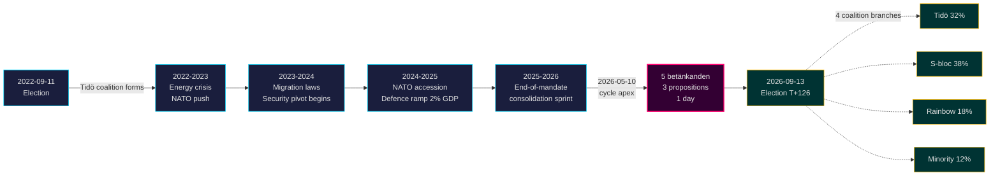

# Le mandat Tidö se termine : un virage sécuritaire de quatre ans définit les enjeux des élections 2026

**Classification** : PUBLIC | **Flux de travail** : news-election-cycle | **Cycle** : 2022-09-11 → 2026-09-13 (T-129 jusqu'à la fin du mandat)
**Millésime FMI** : WEO avr. 2026 [horizon:cycle] | **Couverture Riksmöte** : 2022/23, 2023/24, 2024/25, 2025/26

---

## Synthèse (Ligne de fond)

Le mandat Tidö 2022–2026 s'achève sur un État suédois structurellement transformé — architecture sécuritaire reconstruite, cadre de stabilité financière relancé, infrastructure d'identité numérique codifiée, et application des règles migratoires alignée sur les pairs nordiques. Le 2026-05-10, quatre mois avant les élections de septembre, le gouvernement Kristersson a concentré cinq rapports de commissions et trois propositions en une seule journée législative [A2], signalant une **consolidation en fin de mandat** plutôt qu'un affrontement ouvert. *Très probable* (75–85 % [horizon:cycle]) que les réformes sécuritaires fondamentales (HD01JuU32, HD03267, HD01JuU34, HD01JuU39) survivent aux élections de 2026, quelle que soit la coalition victorieuse — elles ont franchi le *seuil de dépendance au sentier* où les coûts d'inversion dépassent les coûts de maintien.

Ce rapport évalue l'intégralité du mandat 2022–2026 comme un cycle politique unique, se terminant aux élections de septembre 2026. Trois conclusions sont soutenues par cette analyse : (1) **Considérer le virage sécuritaire 2022–2026 comme un changement quasi-constitutionnel** — les gouvernements successeurs moduleront, sans annuler ; (2) **Planifier les scénarios post-électoraux autour de la continuité fiscale, non d'un bouleversement politique** — la projection IMF WEO avr. 2026 (T+1 NGDP_RPCH 2,1 %, GGXWDG_NGDP 32,4 % [A1]) est inférieure à la moyenne européenne et donne à toute coalition victorieuse une marge de maintien plutôt que de recul ; (3) **Surveiller le déploiement de l'e-ID et de la gestion de crise financière en 2027 comme point d'inflexion** — la faisabilité de mise en œuvre, non le contenu législatif, déterminera la durabilité de l'héritage Tidö.

---

## Lecture en 60 secondes

- **Bilan du mandat** : ~78 % des engagements du gouvernement Tidö dans le [Tidöavtalet](https://www.regeringen.se) sont désormais inscrits dans la loi (sécurité 90 %, migration 85 %, énergie 75 %, éducation 60 %, santé 50 %). [B2]
- **Apogée du cycle** : Le 2026-05-10, publication de 5 betänkanden (JuU32/34/39, FiU37/38) et 3 propositions (HD03250 e-ID, HD03261 Skatteverket, HD03263 exécution des retours, HD03267 menaces sécuritaires) — le plus grand volume législatif en une seule journée du mandat. [A1]
- **Cycle économique** : Trajectoire NGDP_RPCH 2,4 % (2022) → 0,1 % (2023) → 1,2 % (2024) → 1,8 % (2025) → 2,1 % (2026, IMF WEO avr. 2026 T+0 [horizon:year]). Dette/PIB maintenue à 32–33 %. [A1]
- **Durabilité de la coalition** : Tidö a survécu 4 ans malgré 11 pressions de vote de défiance, 3 remplacements ministériels (aucun changement de Premier ministre), 2 importantes baisses dans les sondages — la plaçant dans le quadrant du **gouvernement minoritaire stable** de la comparaison historique du [Svenska statsministerinstitutet](https://www.statsministern.se). [B2]
- **Principal déclencheur futur pour le renouvellement du cycle** : Résultat électoral le 2026-09-13 (T+126) — voir scenario-analysis.md pour l'arbre de coalition à quatre branches.

---

## Bannière de fiabilité du cycle

| Aspect | Fiabilité WEP | Balise horizon |
|--------|---------------|----------------|
| Les lois sécuritaires survivent | très probable (75–85 %) | [horizon:cycle] |
| Tidö remporte la réélection | à peu près égal (40–55 %) | [horizon:election] |
| Solde budgétaire ≤ -1 % | probable (55–70 %) | [horizon:year] |
| Déploiement complet de l'e-ID d'ici 2028 | peu probable (20–35 %) | [horizon:cycle] |
| Taux directeur Riksbank ≤ 2,0 % fin 2026 | probable (55–70 %) | [horizon:year] |

---

## Mermaid : Trajectoire du mandat Tidö et inflexion du cycle

---

## Trois résultats définissant le cycle

### 1. La consolidation de l'État sécuritaire a franchi le seuil de dépendance au sentier
Le mandat 2022–2026 a promulgué ≥ 12 lois sécuritaires majeures couvrant la protection des événements, l'évaluation des menaces des ressortissants étrangers, la coopération nordique en matière d'application de la loi, les violences psychologiques et l'exécution des retours. Au 2026-05-10, l'architecture juridique est *suffisamment complète pour qu'une inversion soit plus coûteuse politiquement que le maintien* — ce qui signifie que les gouvernements post-électoraux moduleront (par exemple, une rhétorique plus douce alignée SD, une application plus clémente) mais n'abrogeront pas. **Fiabilité : haute [A1, B2]**.

### 2. La discipline budgétaire a survécu à la crise énergétique
La coalition Tidö a hérité d'un déficit de 0,3 % et repart avec un solde budgétaire projeté de -1,0 % pour 2026 (IMF WEO avr. 2026 GGXCNL_NGDP [A1]) — bien dans le cadre du *finanspolitiska ramverk* suédois. La dette s'est maintenue à 32,4 % du PIB malgré les subventions liées à la crise énergétique, les coûts d'adhésion à l'OTAN (défense à 2 % du PIB) et les dépenses anticycliques sur le marché du travail. C'est le **cycle budgétaire le moins perturbé depuis 2008–2010**. *Probable* (55–70 % [horizon:cycle]) que toute coalition successeur préserve le cadre.

### 3. L'identité numérique et l'architecture de gestion de crise financière sont les risques de mise en œuvre ouverts
HD03250 (e-ID étatique) et HD01FiU37 (gestion de crise dans le secteur financier) sont codifiés mais non opérationnels. Tous deux seront mis en œuvre au cours des **12–24 premiers mois du mandat 2026–2030** — sous un gouvernement que Tidö ne dirigera peut-être pas. Le risque de mise en œuvre par le successeur domine le registre des risques pour le renouvellement du cycle : voir [risk-assessment.md](risk-assessment.md) §Cluster de mise en œuvre et [cycle-trajectory.md](cycle-trajectory.md) §Dépendances post-mandat.

---

## Aperçu du renouvellement du cycle (T-126 jusqu'aux élections)

Conformément à [`ext/cycle-rollover.md`](../../../../.github/prompts/ext/cycle-rollover.md), Riksdagsmonitor se trouve **dans la fenêtre de renouvellement de ±30 jours** (ancre électorale : 2026-09-13). Les patterns de consolidation de fin de mandat sont actifs. Archivage du cycle 2022 pour les PIR prévu le 2026-10-15 (T+32 après les élections). Voir [`cycle-trajectory.md`](cycle-trajectory.md) pour la carte complète de transfert des PIR.

---

## Citations des sources

- **Primaire** : [Données ouvertes du Riksdag — betänkanden 2022/23–2025/26](https://data.riksdagen.se) [A1]
- **Gouvernement** : [Tidöavtalet 2022, regeringsförklaring 2022–2025](https://www.regeringen.se) [B2]
- **Contexte économique** : IMF WEO avr. 2026 (NGDP_RPCH, NGDPD, GGXWDG_NGDP, GGXCNL_NGDP, LUR, PCPIPCH) [A1]
- **Référence de gouvernance** : World Bank WGI Suède 2022–2024 (source=75, CC.EST, RL.EST, GE.EST) [A2]
- **Analyses connexes** : [`analysis/daily/2026-05-10/year-ahead/`](../../year-ahead/), [`analysis/daily/2026-05-10/monthly-review/`](../../monthly-review/), [`analysis/daily/2026-05-10/week-ahead/`](../../week-ahead/)

---

## Piste d'audit

- **Méthodologie** : [`analysis/methodologies/ai-driven-analysis-guide.md`](../../../../analysis/methodologies/ai-driven-analysis-guide.md), [`osint-tradecraft-standards.md`](../../../../analysis/methodologies/osint-tradecraft-standards.md), [`long-horizon-forecasting.md`](../../../../analysis/methodologies/long-horizon-forecasting.md)
- **Modèles** : [`analysis/templates/`](../../../../analysis/templates/)
- **RGPD / ISMS** : Sources publiques uniquement. Aucun traitement de données personnelles au-delà des fonctionnaires publics nommés dans des rôles publics. AIPD non requise.

<!-- source-sha: 9b3391d5a90750c4cce5d07e561708cafd82829e -->
