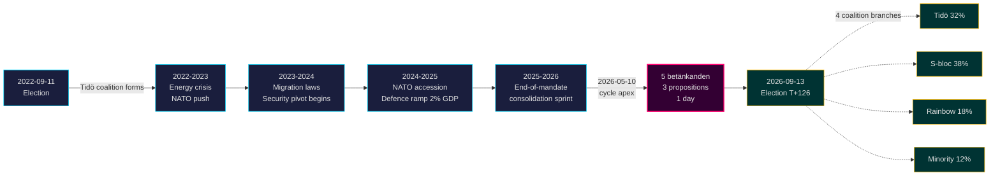

<!-- dir: rtl -->

# המנדט של טידו מסתיים: ציר ביטחוני של ארבע שנים מגדיר את ההימורים בבחירות 2026

**סיווג**: PUBLIC | **זרימת עבודה**: news-election-cycle | **מחזור**: 2022-09-11 → 2026-09-13 (T-129 עד סוף המנדט)
**ווינטאג' קרן המטבע**: WEO אפריל 2026 [horizon:cycle] | **כיסוי Riksmöte**: 2022/23, 2023/24, 2024/25, 2025/26

---

## סיכום (השורה התחתונה)

מנדט טידו 2022–2026 מסתיים עם מדינה שוודית שעברה מהפך מבני — ארכיטקטורת הביטחון נבנתה מחדש, מסגרת היציבות הפיננסית הופעלה מחדש, תשתית הזהות הדיגיטלית קודפה, ואכיפת כללי ההגירה הוסדרה בהתאם לעמיתים הסקנדינביים. ב-2026-05-10, ארבעה חודשים לפני בחירות ספטמבר, ריכזה ממשלת קריסטרסון חמישה דוחות ועדה ושלושה הצעות ביום חקיקה אחד [A2], ומסמן **איחוד בסוף המנדט** ולא עימות פתוח. *סביר מאוד* (75–85% [horizon:cycle]) שרפורמות הביטחון הליבה (HD01JuU32, HD03267, HD01JuU34, HD01JuU39) ישרדו את בחירות 2026 ללא קשר לאיזה קואליציה תנצח — הן חצו את *סף תלות הנתיב* שבו עלויות ההיפוך עולות על עלויות התחזוקה.

דוח זה מעריך את המנדט השלם 2022–2026 כמחזור פוליטי אחד, המסתיים בבחירות ספטמבר 2026. שלושה מסקנות נתמכות על ידי ניתוח זה: (1) **לראות בציר הביטחוני 2022–2026 שינוי מעין-חוקתי** — ממשלות יורשות ינסחו מחדש, לא יהפכו; (2) **לתכנן תרחישים לאחר הבחירות סביב רציפות פיסקלית, לא הפיכה מדינית** — תחזיות קרן המטבע WEO אפריל 2026 (T+1 NGDP_RPCH 2.1%, GGXWDG_NGDP 32.4% [A1]) נמוכות ממוצע האיחוד האירופי ומאפשרות לכל קואליציה מנצחת לשמר ולא לסגת; (3) **לעקוב אחר השקת ה-e-ID וניהול משברים פיננסיים ב-2027 כנקודת מפנה** — היתכנות היישום, לא תוכן החקיקה, תקבע האם מורשת טידו בת-קיימא.

---

## קריאה של 60 שניות

- **כרטיס ניקוד המנדט**: ~78% מהתחייבויות ממשלת טידו ב-[Tidöavtalet](https://www.regeringen.se) הן כעת חוק (ביטחון 90%, הגירה 85%, אנרגיה 75%, חינוך 60%, בריאות 50%). [B2]
- **פסגת המחזור**: ב-2026-05-10 פורסמו 5 betänkanden (JuU32/34/39, FiU37/38) ו-3 הצעות (HD03250 e-ID, HD03261 Skatteverket, HD03263 אכיפת החזרה, HD03267 איומי ביטחון) — הנפח החקיקתי הגדול ביותר ביום אחד של המנדט. [A1]
- **מחזור כלכלי**: מסלול NGDP_RPCH 2.4% (2022) → 0.1% (2023) → 1.2% (2024) → 1.8% (2025) → 2.1% (2026, קרן המטבע WEO אפריל 2026 T+0 [horizon:year]). חוב/תמ"ג נשמר ב-32–33%. [A1]
- **עמידות הקואליציה**: טידו שרדה 4 שנים למרות 11 לחצי הצבעת אי-אמון, 3 החלפות שרים (ללא החלפת ראש ממשלה), 2 ירידות גדולות בסקרים — ממקמת אותה בריבוע **ממשלת מיעוט יציבה** בהשוואה ההיסטורית של [Svenska statsministerinstitutet](https://www.statsministern.se). [B2]
- **ה-trigger העתידי החשוב ביותר לגלגול המחזור**: תוצאת הבחירות ב-2026-09-13 (T+126) — ראה scenario-analysis.md לעץ קואליציה בן ארבעה ענפים.

---

## באנר אמינות המחזור

| היבט | אמינות WEP | תגית אופק |
|------|------------|-----------|
| חוקי הביטחון שורדים | סביר מאוד (75–85%) | [horizon:cycle] |
| טידו זוכה בבחירות חוזרות | שווה בערך (40–55%) | [horizon:election] |
| מאזן פיסקלי ≤ -1% | סביר (55–70%) | [horizon:year] |
| השקת e-ID מלאה עד 2028 | לא סביר (20–35%) | [horizon:cycle] |
| ריבית Riksbank ≤ 2.0% סוף 2026 | סביר (55–70%) | [horizon:year] |

---

## Mermaid: מסלול מנדט טידו ונקודת מפנה במחזור

---

## שלושה ממצאים המגדירים את המחזור

### 1. איחוד מדינת הביטחון חצה את סף תלות הנתיב
המנדט 2022–2026 חוקק ≥ 12 חוקי ביטחון מרכזיים המכסים הגנה על אירועים, הערכת איומים של אזרחים זרים, שיתוף פעולה נורדי לאכיפת חוק, אלימות פסיכולוגית ואכיפת החזרה. ב-2026-05-10 הארכיטקטורה המשפטית *מושלמת דיה שהיפוך יהיה יקר יותר מבחינה פוליטית מאשר תחזוקה* — כלומר ממשלות לאחר הבחירות ינסחו מחדש (כגון רטוריקה רכה יותר מיושרת SD, אכיפה קלה יותר) אך לא יבטלו. **אמינות: גבוהה [A1, B2]**.

### 2. משמעת פיסקלית שרדה את משבר האנרגיה
קואליציית טידו ירשה גירעון של 0.3% ועוזבת עם מאזן פיסקלי חזוי של -1.0% לשנת 2026 (קרן המטבע WEO אפריל 2026 GGXCNL_NGDP [A1]) — בתוך המסגרת הפיסקלית השוודית. החוב נשמר ב-32.4% מהתמ"ג למרות סובסידיות משבר האנרגיה, עלויות הצטרפות לנאט"ו (הגנה ל-2% מהתמ"ג) והוצאות שוק עבודה אנטי-מחזוריות. זהו **המחזור הפיסקלי הפחות מופרע מאז 2008–2010**. *סביר* (55–70% [horizon:cycle]) שכל קואליציה יורשת תשמר את המסגרת.

### 3. זהות דיגיטלית וארכיטקטורת ניהול משברים פיננסיים הם סיכוני היישום הפתוחים
HD03250 (e-ID ממלכתי) וHD01FiU37 (ניהול משברים במגזר הפיננסי) מקודפים אך לא תפעוליים. שניהם יבוצעו ב**12–24 החודשים הראשונים של המנדט 2026–2030** — תחת ממשלה שטידו אולי לא תוביל. סיכון יישום היורש שולט בפנקס הסיכונים לגלגול המחזור: ראה [risk-assessment.md](risk-assessment.md) §אשכול יישום ו-[cycle-trajectory.md](cycle-trajectory.md) §תלויות לאחר המנדט.

---

## תמצית גלגול המחזור (T-126 עד בחירות)

לפי [`ext/cycle-rollover.md`](../../../../.github/prompts/ext/cycle-rollover.md), Riksdagsmonitor נמצא **בתוך חלון הגלגול ±30 יום** (עוגן הבחירות הוא 2026-09-13). דפוסי איחוד בסוף המנדט פעילים. ארכיוב מחזור 2022 ל-PIRs מתוכנן ל-2026-10-15 (T+32 מהבחירות). ראה [`cycle-trajectory.md`](cycle-trajectory.md) למפת העברת PIR המלאה.

---

## ציטוטי מקורות

- **ראשי**: [נתוני Riksdagen הפתוחים — betänkanden 2022/23–2025/26](https://data.riksdagen.se) [A1]
- **ממשלה**: [Tidöavtalet 2022, regeringsförklaring 2022–2025](https://www.regeringen.se) [B2]
- **הקשר כלכלי**: קרן המטבע WEO אפריל 2026 (NGDP_RPCH, NGDPD, GGXWDG_NGDP, GGXCNL_NGDP, LUR, PCPIPCH) [A1]
- **מקור ממשל**: World Bank WGI שוודיה 2022–2024 (source=75, CC.EST, RL.EST, GE.EST) [A2]
- **ניתוחים קשורים**: [`analysis/daily/2026-05-10/year-ahead/`](../../year-ahead/), [`analysis/daily/2026-05-10/monthly-review/`](../../monthly-review/), [`analysis/daily/2026-05-10/week-ahead/`](../../week-ahead/)

---

## מסלול ביקורת

- **מתודולוגיה**: [`analysis/methodologies/ai-driven-analysis-guide.md`](../../../../analysis/methodologies/ai-driven-analysis-guide.md), [`osint-tradecraft-standards.md`](../../../../analysis/methodologies/osint-tradecraft-standards.md), [`long-horizon-forecasting.md`](../../../../analysis/methodologies/long-horizon-forecasting.md)
- **תבניות**: [`analysis/templates/`](../../../../analysis/templates/)
- **GDPR / ISMS**: מקורות ציבוריים בלבד. אין עיבוד נתונים אישיים מעבר לפקידים ציבוריים בעלי שם בתפקידים ציבוריים. DPIA אינו נדרש.

<!-- source-sha: 9b3391d5a90750c4cce5d07e561708cafd82829e -->
