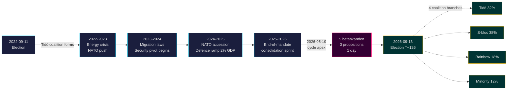

# ティードー任期終了：4年間の安全保障転換が2026年選挙の行方を左右する

**分類**: PUBLIC | **ワークフロー**: news-election-cycle | **サイクル**: 2022-09-11 → 2026-09-13 (T-129 任期終了まで)
**IMFヴィンテージ**: WEO 2026年4月 [horizon:cycle] | **リクスメーテ対象期間**: 2022/23, 2023/24, 2024/25, 2025/26

---

## 要旨（結論先行型）

ティードー任期2022–2026は、構造的に変容したスウェーデン国家で幕を閉じる——安全保障アーキテクチャが再建され、金融安定の枠組みが再起動し、デジタルアイデンティティスタックが法制化され、移民執行が北欧諸国の水準に合わせられた。2026-05-10、9月の選挙の4ヶ月前に、クリステション政権は5つの委員会報告と3つの法案提案を1日の立法日に集中させ[A2]、**任期末の統合**を示した（開かれた対立ではなく）。コア安全保障改革（HD01JuU32、HD03267、HD01JuU34、HD01JuU39）が、どの連立政権が勝利しようとも2026年選挙を生き延びる可能性は*非常に高い*（75–85% [horizon:cycle]）——それらは撤廃コストが維持コストを上回る*経路依存の閾値*を越えた。

本報告は2022–2026年の任期全体を一つの政治サイクルとして評価し、2026年9月の選挙で締め括られる。この分析が支持する3つの判断：(1) **2022–2026安全保障転換を準憲法的変化として扱う**——後継政権は修正するが、覆さない；(2) **選挙後のシナリオを政策の激変ではなく財政の継続性を軸に計画する**——IMF WEO 2026年4月の予測（T+1 NGDP_RPCH 2.1%、GGXWDG_NGDP 32.4% [A1]）はEU平均を下回り、勝利した連立政権が撤退ではなく維持の余地を与えている；(3) **2027年のe-IDと金融危機管理の展開を転換点として監視する**——実施可能性こそが、法律の内容ではなく、ティードーの遺産の耐久性を決める。

---

## 60秒の概要

- **任期スコアカード**: ティードー政権の[Tidöavtalet](https://www.regeringen.se)上のコミットメントの約78%が現在法律となっている（安全保障90%、移民85%、エネルギー75%、教育60%、医療50%）。[B2]
- **サイクルの頂点**: 2026-05-10に5つのbetänkanden（JuU32/34/39、FiU37/38）と3つの提案（HD03250 e-ID、HD03261 Skatteverket、HD03263 送還執行、HD03267 安全保障の脅威）が公表された——任期中最大の1日あたり立法量。[A1]
- **経済サイクル**: NGDP_RPCH軌跡 2.4%（2022）→ 0.1%（2023）→ 1.2%（2024）→ 1.8%（2025）→ 2.1%（2026、IMF WEO 2026年4月 T+0 [horizon:year]）。債務/GDP比32–33%に維持。[A1]
- **連立の耐久性**: ティードーは11回の不信任投票圧力、3回の閣僚交代（首相交代なし）、2回の大きな支持率低下にもかかわらず4年間生き残り——[Svenska statsministerinstitutet](https://www.statsministern.se)の歴史的比較において**安定した少数政権**の象限に位置する。[B2]
- **サイクルロールオーバーの最重要トリガー**: 2026-09-13の選挙結果（T+126）——4つの枝を持つ連立ツリーはscenario-analysis.mdを参照。

---

## サイクル信頼性バナー

| 側面 | WEP信頼性 | 地平線タグ |
|------|-----------|-----------|
| 安全保障法が存続 | 非常に高い（75–85%） | [horizon:cycle] |
| ティードーが再選 | ほぼ互角（40–55%） | [horizon:election] |
| 財政収支 ≤ -1% | 高い（55–70%） | [horizon:year] |
| 2028年までのe-ID完全展開 | 低い（20–35%） | [horizon:cycle] |
| リクスバンク政策金利 ≤ 2.0% 2026年末 | 高い（55–70%） | [horizon:year] |

---

## Mermaid: ティードー任期の軌跡とサイクルの転換点

---

## サイクルを定義する3つの発見

### 1. 安全保障国家の統合が経路依存の閾値を越えた
2022–2026年の任期は、イベント保護、外国人に対する脅威評価、北欧執行協力、心理的暴力、送還執行をカバーする12以上の主要な安全保障法を制定した。2026-05-10の時点で、法的アーキテクチャは*撤廃が維持よりも政治的にコストがかかるほど完成している*——つまり選挙後の政権は修正する（たとえばよりソフトなSD調整のレトリック、より緩やかな執行）が、廃止はしない。**信頼度：高 [A1, B2]**。

### 2. 財政規律がエネルギー危機を乗り越えた
ティードー連立は0.3%の赤字を引き継ぎ、2026年の財政収支予測 -1.0%（IMF WEO 2026年4月 GGXCNL_NGDP [A1]）で退く——スウェーデンの*finanspolitiska ramverk*の範囲内で十分。エネルギー危機補助金、NATO加盟コスト（防衛費GDP比2%へ）、反景気循環的な労働市場支出にもかかわらず、債務はGDP比32.4%に維持された。これは**2008–2010年以来最も乱れのない財政サイクル**である。後継連立がフレームワークを維持する*確率は高い*（55–70% [horizon:cycle]）。

### 3. デジタルアイデンティティと金融危機アーキテクチャが未解決の実装リスク
HD03250（国家e-ID）とHD01FiU37（金融セクターの危機管理）は法制化されているが稼働していない。両者は**2026–2030年の任期の最初の12–24ヶ月**に展開される——ティードーが率いないかもしれない政権の下で。後継者の実装リスクがサイクルロールオーバーのリスクレジスターを支配する：[risk-assessment.md](risk-assessment.md) §実装クラスターと[cycle-trajectory.md](cycle-trajectory.md) §任期後の依存関係を参照。

---

## サイクルロールオーバー概要（T-126 選挙まで）

[`ext/cycle-rollover.md`](../../../../.github/prompts/ext/cycle-rollover.md)によると、Riksdagsmonitorは**±30日のロールオーバーウィンドウ内**にある（選挙アンカーは2026-09-13）。任期末の統合パターンが活性化している。2022サイクルのPIRのサイクルアーカイブは2026-10-15（選挙後T+32）に予定。PIR引き継ぎマップの全体は[`cycle-trajectory.md`](cycle-trajectory.md)を参照。

---

## 出典引用

- **一次資料**: [リクスダーゲン公開データ — betänkanden 2022/23–2025/26](https://data.riksdagen.se) [A1]
- **政府**: [Tidöavtalet 2022, regeringsförklaring 2022–2025](https://www.regeringen.se) [B2]
- **経済的背景**: IMF WEO 2026年4月（NGDP_RPCH, NGDPD, GGXWDG_NGDP, GGXCNL_NGDP, LUR, PCPIPCH）[A1]
- **ガバナンス参照**: World Bank WGI スウェーデン 2022–2024（source=75, CC.EST, RL.EST, GE.EST）[A2]
- **関連分析**: [`analysis/daily/2026-05-10/year-ahead/`](../../year-ahead/), [`analysis/daily/2026-05-10/monthly-review/`](../../monthly-review/), [`analysis/daily/2026-05-10/week-ahead/`](../../week-ahead/)

---

## 監査証跡

- **方法論**: [`analysis/methodologies/ai-driven-analysis-guide.md`](../../../../analysis/methodologies/ai-driven-analysis-guide.md), [`osint-tradecraft-standards.md`](../../../../analysis/methodologies/osint-tradecraft-standards.md), [`long-horizon-forecasting.md`](../../../../analysis/methodologies/long-horizon-forecasting.md)
- **テンプレート**: [`analysis/templates/`](../../../../analysis/templates/)
- **GDPR / ISMS**: 公開情報のみ。公的役職の名前の挙がった公務員以外の個人データは処理しない。DPIAは不要。

<!-- source-sha: 9b3391d5a90750c4cce5d07e561708cafd82829e -->
