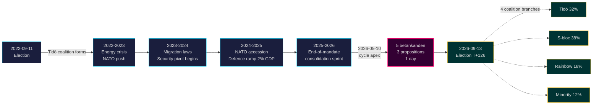

# 티도 임기 종료: 4년간의 안보 전환이 2026년 선거의 판세를 좌우하다

**분류**: PUBLIC | **워크플로우**: news-election-cycle | **사이클**: 2022-09-11 → 2026-09-13 (T-129 임기 종료까지)
**IMF 빈티지**: WEO 2026년 4월 [horizon:cycle] | **릭스메테 적용 기간**: 2022/23, 2023/24, 2024/25, 2025/26

---

## 핵심 결론 (결론 우선)

티도 임기 2022–2026은 구조적으로 변모한 스웨덴 국가와 함께 막을 내린다 — 안보 아키텍처가 재건되고, 금융 안정 체계가 재가동되고, 디지털 신원 스택이 법제화되고, 이민 집행이 북유럽 기준에 맞추어졌다. 2026-05-10, 9월 선거 4개월 전에 크리스테르손 정부는 다섯 개의 위원회 보고서와 세 개의 법안을 단 하루의 입법일에 집중시켜[A2], **임기 말 통합**을 보여주었다(개방적 대결이 아닌). 어느 연립이 승리하더라도 핵심 안보 개혁(HD01JuU32, HD03267, HD01JuU34, HD01JuU39)이 2026년 선거를 생존할 가능성은 *매우 높다*(75–85% [horizon:cycle]) — 이들은 철회 비용이 유지 비용을 초과하는 *경로 의존 임계치*를 넘었다.

이 보고서는 2022–2026년 전체 임기를 2026년 9월 선거로 마감되는 단일 정치 사이클로 평가한다. 이 분석이 지지하는 세 가지 판단: (1) **2022–2026 안보 전환을 준헌법적 변화로 취급하라** — 후계 정부는 수정하되, 뒤집지는 않는다; (2) **선거 후 시나리오를 정책 격변이 아닌 재정 연속성을 기반으로 계획하라** — IMF WEO 2026년 4월 예측(T+1 NGDP_RPCH 2.1%, GGXWDG_NGDP 32.4% [A1])은 EU 평균 이하로, 어느 승리 연립에게도 철수가 아닌 유지의 여지를 준다; (3) **2027년 e-ID와 금융 위기 관리 배포를 전환점으로 모니터링하라** — 입법 내용이 아닌 실현 가능성이 티도 유산의 지속성을 결정한다.

---

## 60초 요약

- **임기 성과**: 티도 정부의 [Tidöavtalet](https://www.regeringen.se) 공약 중 약 78%가 현재 법률이 됐다(안보 90%, 이민 85%, 에너지 75%, 교육 60%, 의료 50%). [B2]
- **사이클 정점**: 2026-05-10에 5개의 betänkanden(JuU32/34/39, FiU37/38)과 3개의 법안(HD03250 e-ID, HD03261 Skatteverket, HD03263 송환 집행, HD03267 안보 위협)이 발표됐다 — 임기 중 최대 단일 입법일 분량. [A1]
- **경제 사이클**: NGDP_RPCH 궤적 2.4%(2022) → 0.1%(2023) → 1.2%(2024) → 1.8%(2025) → 2.1%(2026, IMF WEO 2026년 4월 T+0 [horizon:year]). 부채/GDP 32–33% 유지. [A1]
- **연립 내구성**: 티도는 11번의 불신임 압박, 3번의 장관 교체(총리 교체 없음), 2번의 큰 지지율 하락에도 4년간 생존 — [Svenska statsministerinstitutet](https://www.statsministern.se) 역사적 비교에서 **안정적 소수정부** 사분면에 위치. [B2]
- **사이클 롤오버의 가장 중요한 미래 촉발 요인**: 2026-09-13 선거 결과(T+126) — 네 개의 가지를 가진 연립 트리는 scenario-analysis.md 참조.

---

## 사이클 신뢰도 배너

| 측면 | WEP 신뢰도 | 지평선 태그 |
|------|-----------|-----------|
| 안보법 생존 | 매우 높음 (75–85%) | [horizon:cycle] |
| 티도 재선 | 거의 동등 (40–55%) | [horizon:election] |
| 재정 수지 ≤ -1% | 높음 (55–70%) | [horizon:year] |
| 2028년까지 e-ID 완전 배포 | 낮음 (20–35%) | [horizon:cycle] |
| 릭스방크 정책 금리 ≤ 2.0% 2026년 말 | 높음 (55–70%) | [horizon:year] |

---

## Mermaid: 티도 임기 궤적과 사이클 전환점

---

## 사이클을 정의하는 세 가지 발견

### 1. 안보 국가 통합이 경로 의존 임계치를 넘었다
2022–2026 임기는 행사 보호, 외국인에 대한 위협 평가, 북유럽 법 집행 협력, 심리적 폭력, 송환 집행을 포괄하는 12개 이상의 주요 안보법을 제정했다. 2026-05-10 현재 법적 아키텍처는 *철회가 유지보다 정치적으로 더 비용이 드는 수준으로 완성됐다* — 즉 선거 후 정부는 수정할 것이지만(예: 더 부드러운 SD 조율 레토릭, 더 온화한 집행) 폐지하지는 않을 것이다. **신뢰도: 높음 [A1, B2]**.

### 2. 재정 규율이 에너지 위기를 견뎌냈다
티도 연립은 0.3% 적자를 물려받고 2026년 재정 수지 예측 -1.0%(IMF WEO 2026년 4월 GGXCNL_NGDP [A1])로 퇴임한다 — 스웨덴의 *finanspolitiska ramverk* 내에서 충분히 유지됐다. 에너지 위기 보조금, NATO 가입 비용(방위비 GDP 2%), 경기 대응적 노동시장 지출에도 불구하고 부채는 GDP 대비 32.4%에 유지됐다. 이는 **2008–2010년 이후 가장 안정적인 재정 사이클**이다. 후계 연립이 프레임워크를 유지할 가능성은 *높다*(55–70% [horizon:cycle]).

### 3. 디지털 신원과 금융 위기 아키텍처가 미해결 실현 리스크다
HD03250(국가 e-ID)과 HD01FiU37(금융 부문 위기 관리)은 법제화됐지만 운용 중이 아니다. 양자 모두 **2026–2030 임기의 첫 12–24개월** 내에 집행될 것이다 — 티도가 이끌지 않을 수도 있는 정부 하에서. 후계자 실현 리스크가 사이클 롤오버 리스크 레지스터를 지배한다: [risk-assessment.md](risk-assessment.md) §실현 클러스터와 [cycle-trajectory.md](cycle-trajectory.md) §임기 후 의존성 참조.

---

## 사이클 롤오버 개요 (T-126 선거까지)

[`ext/cycle-rollover.md`](../../../../.github/prompts/ext/cycle-rollover.md)에 따르면 Riksdagsmonitor는 **±30일 롤오버 창 내**에 있다(선거 앵커는 2026-09-13). 임기 말 통합 패턴이 활성화됐다. 2022 사이클 PIR의 사이클 아카이브는 2026-10-15(선거 후 T+32)에 예정. PIR 이관 맵 전체는 [`cycle-trajectory.md`](cycle-trajectory.md) 참조.

---

## 출처 인용

- **1차 자료**: [릭스다겐 공개 데이터 — betänkanden 2022/23–2025/26](https://data.riksdagen.se) [A1]
- **정부**: [Tidöavtalet 2022, regeringsförklaring 2022–2025](https://www.regeringen.se) [B2]
- **경제적 맥락**: IMF WEO 2026년 4월(NGDP_RPCH, NGDPD, GGXWDG_NGDP, GGXCNL_NGDP, LUR, PCPIPCH) [A1]
- **거버넌스 참조**: World Bank WGI 스웨덴 2022–2024(source=75, CC.EST, RL.EST, GE.EST) [A2]
- **연관 분석**: [`analysis/daily/2026-05-10/year-ahead/`](../../year-ahead/), [`analysis/daily/2026-05-10/monthly-review/`](../../monthly-review/), [`analysis/daily/2026-05-10/week-ahead/`](../../week-ahead/)

---

## 감사 추적

- **방법론**: [`analysis/methodologies/ai-driven-analysis-guide.md`](../../../../analysis/methodologies/ai-driven-analysis-guide.md), [`osint-tradecraft-standards.md`](../../../../analysis/methodologies/osint-tradecraft-standards.md), [`long-horizon-forecasting.md`](../../../../analysis/methodologies/long-horizon-forecasting.md)
- **템플릿**: [`analysis/templates/`](../../../../analysis/templates/)
- **GDPR / ISMS**: 공개 자료만 사용. 공개 역할의 명명된 공무원 이외의 개인 데이터는 처리하지 않음. DPIA 불필요.

<!-- source-sha: 9b3391d5a90750c4cce5d07e561708cafd82829e -->
