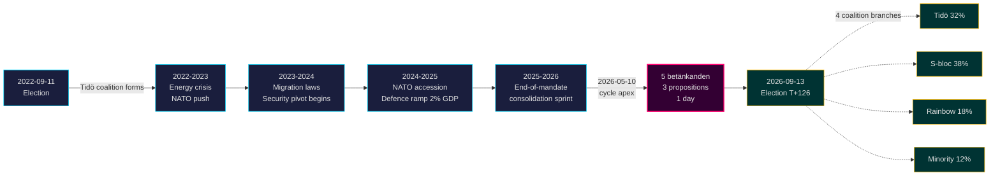

# Tidö-mandaat eindigt: vierjarige veiligheidspivot bepaalt de inzet bij de verkiezingen van 2026

**Classificatie**: PUBLIC | **Workflow**: news-election-cycle | **Cyclus**: 2022-09-11 → 2026-09-13 (T-129 tot einde mandaat)
**IMF-jaargang**: WEO apr. 2026 [horizon:cycle] | **Riksmöte-dekking**: 2022/23, 2023/24, 2024/25, 2025/26

---

## Samenvatting (Kernboodschap)

Het Tidö-mandaat 2022–2026 eindigt met een structureel getransformeerde Zweedse staat — veiligheidsarchitectuur herbouwd, kader voor financiële stabiliteit opnieuw gestart, digitale identiteitsinfrastructuur gecodificeerd en migratiehandhaving afgestemd op Scandinavische normen. Op 2026-05-10, vier maanden voor de verkiezingen van september, concentreerde de Kristersson-regering vijf commissierapporten en drie voorstellen in één enkele wetgevingsdag [A2], wat **consolidatie aan het einde van het mandaat** signaleert in plaats van openlijke confrontatie. *Zeer waarschijnlijk* (75–85 % [horizon:cycle]) dat de kernsecurityhervormingen (HD01JuU32, HD03267, HD01JuU34, HD01JuU39) de verkiezingen van 2026 overleven, ongeacht welke coalitie wint — ze hebben de *padafhankelijkheidsdrempel* overschreden waar de kosten van terugdraaien hoger zijn dan de onderhoudskosten.

Dit rapport beoordeelt het volledige mandaat 2022–2026 als één enkele politieke cyclus, die eindigt bij de verkiezingen van september 2026. Drie conclusies worden onderbouwd door deze analyse: (1) **Beschouw de veiligheidspivot van 2022–2026 als een quasi-constitutionele verschuiving** — opvolgende regeringen zullen moduleren, niet terugdraaien; (2) **Plan post-verkiezingsscenario's rond fiscale continuïteit, niet beleidsomwenteling** — de IMF WEO apr. 2026-projectie (T+1 NGDP_RPCH 2,1 %, GGXWDG_NGDP 32,4 % [A1]) ligt onder het EU-gemiddelde en geeft elke winnende coalitie ruimte om te handhaven in plaats van terug te trekken; (3) **Bewaak de uitrol van e-ID en financieel crisismanagement in 2027 als kantelpunt** — uitvoerbaarheid, niet wettelijke inhoud, bepaalt of het Tidö-erfgoed duurzaam is.

---

## 60-seconden-lezing

- **Mandaatscorekaart**: ~78 % van de verplichtingen van de Tidö-regering in het [Tidöavtalet](https://www.regeringen.se) zijn nu wet (veiligheid 90 %, migratie 85 %, energie 75 %, onderwijs 60 %, gezondheidszorg 50 %). [B2]
- **Cyclustop**: Op 2026-05-10 werden 5 betänkanden (JuU32/34/39, FiU37/38) en 3 voorstellen (HD03250 e-ID, HD03261 Skatteverket, HD03263 terugkeerhandhaving, HD03267 veiligheidsdreigementen) gepubliceerd — het grootste wetsvolume op één dag van het mandaat. [A1]
- **Economische cyclus**: NGDP_RPCH-trajectorie 2,4 % (2022) → 0,1 % (2023) → 1,2 % (2024) → 1,8 % (2025) → 2,1 % (2026, IMF WEO apr. 2026 T+0 [horizon:year]). Schuld/BBP gehouden op 32–33 %. [A1]
- **Coalitieduurzaamheid**: Tidö overleefde 4 jaar ondanks 11 drukpunten van moties van wantrouwen, 3 ministerwissel (geen premier-wissel), 2 grote dalingen in peilingen — waarmee het in het **stabiele minderheidskabinet**-kwadrant van de historische vergelijking van [Svenska statsministerinstitutet](https://www.statsministern.se) valt. [B2]
- **Belangrijkste toekomstige trigger voor cyclus-rollover**: Verkiezingsuitslag op 2026-09-13 (T+126) — zie scenario-analysis.md voor de viertak-coalitiestructuur.

---

## Cyclus-vertrouwensbanner

| Aspect | WEP-vertrouwen | Horizonlabel |
|--------|----------------|--------------|
| Veiligheidswetten overleven | zeer waarschijnlijk (75–85 %) | [horizon:cycle] |
| Tidö wint herverkiezing | ongeveer gelijk (40–55 %) | [horizon:election] |
| Begrotingssaldo ≤ -1 % | waarschijnlijk (55–70 %) | [horizon:year] |
| Volledige uitrol e-ID voor 2028 | onwaarschijnlijk (20–35 %) | [horizon:cycle] |
| Riksbank-beleidsrente ≤ 2,0 % eind 2026 | waarschijnlijk (55–70 %) | [horizon:year] |

---

## Mermaid: Trajectorie van het Tidö-mandaat en cyclus-inflectie

---

## Drie cyclusbepalende bevindingen

### 1. De consolidatie van de veiligheidsstaat heeft de padafhankelijkheidsdrempel overschreden
Het mandaat 2022–2026 heeft ≥ 12 belangrijke veiligheidswetten aangenomen die evenementenbescherming, dreigingsbeoordeling van buitenlandse staatsburgers, Scandinavische handhavingssamenwerking, psychologisch geweld en terugkeerhandhaving omvatten. Per 2026-05-10 is de juridische architectuur *compleet genoeg dat terugdraaien politiek kostbaarder zou zijn dan handhaving* — wat betekent dat post-verkiezingsregeringen zullen moduleren (bijv. zachtere SD-gerichte retoriek, soepelere handhaving) maar niet zullen afschaffen. **Vertrouwen: hoog [A1, B2]**.

### 2. Begrotingsdiscipline overleefde de energiecrisis
De Tidö-coalitie erfde een tekort van 0,3 % en vertrekt met een geprojecteerd begrotingssaldo van -1,0 % voor 2026 (IMF WEO apr. 2026 GGXCNL_NGDP [A1]) — ruim binnen het Zweedse *finanspolitiska ramverk*. De schuld bleef op 32,4 % van het BBP ondanks energiehulpsubsidies, NAVO-toetredingskosten (defensie naar 2 % BBP) en anticyclische arbeidsmarktuitgaven. Dit is de **minst verstoorde begrotingscyclus sinds 2008–2010**. *Waarschijnlijk* (55–70 % [horizon:cycle]) dat elke opvolgende coalitie het kader behoudt.

### 3. Digitale identiteit en financieel crisisarchitectuur zijn de open uitvoeringsrisico's
HD03250 (staatse e-ID) en HD01FiU37 (crisismanagement in de financiële sector) zijn gecodificeerd maar niet operationeel. Beide worden uitgevoerd in de **eerste 12–24 maanden van het mandaat 2026–2030** — onder een regering die Tidö misschien niet leidt. Het uitvoeringsrisico van de opvolger domineert het risicoregister voor cyclus-rollover: zie [risk-assessment.md](risk-assessment.md) §Uitvoeringscluster en [cycle-trajectory.md](cycle-trajectory.md) §Post-mandaatafhankelijkheden.

---

## Overzicht cyclus-rollover (T-126 tot verkiezingen)

Volgens [`ext/cycle-rollover.md`](../../../../.github/prompts/ext/cycle-rollover.md) bevindt Riksdagsmonitor zich **binnen het ±30-daagse rollover-venster** (verkiezingsanker is 2026-09-13). Consolidatiepatronen aan het einde van het mandaat zijn actief. Cyclus-archivering van 2022-cyclus PIR's gepland voor 2026-10-15 (T+32 na verkiezingen). Zie [`cycle-trajectory.md`](cycle-trajectory.md) voor de volledige PIR-doorstuurroutekaart.

---

## Bronvermeldingen

- **Primair**: [Riksdagen open data — betänkanden 2022/23–2025/26](https://data.riksdagen.se) [A1]
- **Regering**: [Tidöavtalet 2022, regeringsförklaring 2022–2025](https://www.regeringen.se) [B2]
- **Economische context**: IMF WEO apr. 2026 (NGDP_RPCH, NGDPD, GGXWDG_NGDP, GGXCNL_NGDP, LUR, PCPIPCH) [A1]
- **Governance-referentie**: World Bank WGI Zweden 2022–2024 (source=75, CC.EST, RL.EST, GE.EST) [A2]
- **Verwante analyses**: [`analysis/daily/2026-05-10/year-ahead/`](../../year-ahead/), [`analysis/daily/2026-05-10/monthly-review/`](../../monthly-review/), [`analysis/daily/2026-05-10/week-ahead/`](../../week-ahead/)

---

## Auditspoor

- **Methodologie**: [`analysis/methodologies/ai-driven-analysis-guide.md`](../../../../analysis/methodologies/ai-driven-analysis-guide.md), [`osint-tradecraft-standards.md`](../../../../analysis/methodologies/osint-tradecraft-standards.md), [`long-horizon-forecasting.md`](../../../../analysis/methodologies/long-horizon-forecasting.md)
- **Sjablonen**: [`analysis/templates/`](../../../../analysis/templates/)
- **AVG / ISMS**: Alleen openbare bronnen. Geen verwerking van persoonsgegevens buiten genoemde ambtenaren in openbare functies. DPIA niet vereist.

<!-- source-sha: 9b3391d5a90750c4cce5d07e561708cafd82829e -->
