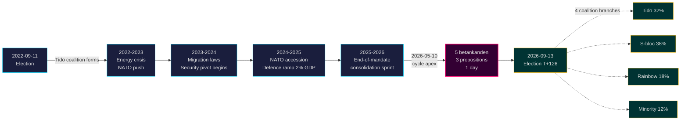

# Tidö-mandatet avsluttes: Fireårig sikkerhetspivot definerer innsatsen ved valget i 2026

**Klassifisering**: PUBLIC | **Arbeidsflyt**: news-election-cycle | **Syklus**: 2022-09-11 → 2026-09-13 (T-129 til mandatets slutt)
**IMF-årgangen**: WEO Apr-2026 [horizon:cycle] | **Riksmöte-dekning**: 2022/23, 2023/24, 2024/25, 2025/26

---

## Konklusjon (Bottom Line Up Front)

Tidö-mandatet 2022–2026 avsluttes med en strukturelt transformert svensk stat — sikkerhetsarkitekturen gjenoppbygd, rammeverket for finansiell stabilitet restartet, den digitale identitetsstakken kodifisert og migrasjonsgjennomføringen tilpasset nordiske jevnaldrende. Den 2026-05-10, fire måneder før septembervalget, konsentrerte Kristersson-regjeringen fem utvalgsrapporter og tre proposisjoner til én enkelt lovgivningsdag [A2], noe som signaliserer **konsolidering mot slutten av mandatperioden** snarere enn åpen strid. *Meget sannsynlig* (75–85 % [horizon:cycle]) at kjernens sikkerhetsreformer (HD01JuU32, HD03267, HD01JuU34, HD01JuU39) overlever valget i 2026 uavhengig av hvilken koalisjon som vinner — de har overskredet *sti-avhengighets-terskelen* der reverseringskostnadene overstiger vedlikeholdskostnadene.

Denne rapporten vurderer hele mandatperioden 2022–2026 som én enkelt politisk syklus, som avsluttes ved septembervalget i 2026. Tre beslutninger støttes av denne analysen: (1) **Betrakt 2022–2026-sikkerhetspivoten som en kvasi-konstitusjonell endring** — etterfølgende regjeringer vil modulere, ikke reversere den; (2) **Planlegg scenarier etter valget basert på finanspolitisk kontinuitet, ikke politisk omveltning** — IMF WEO Apr-2026-prognosen (T+1 NGDP_RPCH 2,1 %, GGXWDG_NGDP 32,4 % [A1]) ligger under EU-gjennomsnittet og gir enhver vinnende koalisjon rom til å opprettholde snarere enn å trekke seg; (3) **Overvåk utrullingen av e-ID og finansiell krisehåndtering i 2027 som vendepunktet** — implementeringsgjennomførbarhet, ikke lovgivningsinnhold, avgjør om Tidö-arven er holdbar.

---

## 60-sekunders lesning

- **Mandatresultat**: ~78 % av Tidö-regjeringens forpliktelser i [Tidöavtalet](https://www.regeringen.se) er nå lov (sikkerhet 90 %, migrasjon 85 %, energi 75 %, utdanning 60 %, helsevesen 50 %). [B2]
- **Sykkeltopp**: 2026-05-10 publiserte 5 betänkanden (JuU32/34/39, FiU37/38) og 3 proposisjoner (HD03250 e-ID, HD03261 Skatteverket, HD03263 returgjennomføring, HD03267 sikkerhetstrusler) — det største enkeltdags lovgivningsvolumet i mandatperioden. [A1]
- **Økonomisk syklus**: NGDP_RPCH-bane 2,4 % (2022) → 0,1 % (2023) → 1,2 % (2024) → 1,8 % (2025) → 2,1 % (2026, IMF WEO Apr-2026 T+0 [horizon:year]). Gjeld/BNP holdt på 32–33 %. [A1]
- **Koalisjonens holdbarhet**: Tidö overlevde 4 år til tross for 11 mistillitspress, 3 ministerutskiftninger (ingen statsministerutskiftning), 2 større meningsmålingsslumper — noe som plasserer den i **stabil mindretalsregjerings**-kvadranten i [Svenska statsministerinstitutet](https://www.statsministern.se) historisk sammenligning. [B2]
- **Viktigste fremtidige trigger for sykkeltilbakestilling**: Valgresultat den 2026-09-13 (T+126) — se scenario-analysis.md for det firgrenede koalisjonstre.

---

## Sykkel-tillitsbanner

| Aspekt | WEP-tillit | Horisontstikkord |
|--------|------------|-----------------|
| Sikkerhetslover overlever | meget sannsynlig (75–85 %) | [horizon:cycle] |
| Tidö vinner omvalg | omtrent jevnt (40–55 %) | [horizon:election] |
| Finanspolitisk balanse ≤ -1 % | sannsynlig (55–70 %) | [horizon:year] |
| Full utrulling av e-ID innen 2028 | usannsynlig (20–35 %) | [horizon:cycle] |
| Riksbankens styringsrente ≤ 2,0 % slutten av 2026 | sannsynlig (55–70 %) | [horizon:year] |

---

## Mermaid: Tidö-mandatets bane og sykkelinflesjon

---

## Tre sykkeldefinererende funn

### 1. Sikkerhetsstatens konsolidering har overskredet sti-avhengighetsterskelen
Mandatperioden 2022–2026 vedtok ≥ 12 større sikkerhetslover som dekker arrangementsikkerhet, trusselsvurdering av utenlandske statsborgere, nordisk håndhevingssamarbeid, psykisk vold og returgjennomføring. Den 2026-05-10 er den rettslige arkitekturen *komplett nok til at en reversering ville vært mer politisk kostbar enn vedlikehold* — noe som betyr at regjeringer etter valget vil modulere (f.eks. mykere SD-tilpasset retorikk, mildere håndhevelse) men ikke oppheve. **Tillid: høy [A1, B2]**.

### 2. Finansdisiplinen overlevde energikrisen
Tidö-koalisjonen arvet et underskudd på 0,3 % og forlater med et forventet finanspolitisk saldo på -1,0 % for 2026 (IMF WEO Apr-2026 GGXCNL_NGDP [A1]) — godt innenfor det svenske *finanspolitiske rammeverket*. Gjelden holdt seg på 32,4 % av BNP til tross for energikrisesubsidier, NATO-tilslutningskostnader (forsvar til 2 % av BNP) og konjunkturmodvirkende arbeidsmarkedsutgifter. Dette er **den minst forstyrrede finanssyklusen siden 2008–2010**. *Sannsynlig* (55–70 % [horizon:cycle]) at enhver etterfølgende koalisjon bevarer rammeverket.

### 3. Digital identitet og finanskrisarkitektur er de åpne implementeringsrisikoene
HD03250 (statlig e-ID) og HD01FiU37 (finanssektorens krisehåndtering) er kodifisert men ikke operative. Begge vil utspille seg i **de første 12–24 månedene av mandatperioden 2026–2030** — under en regjering som Tidö kanskje ikke leder. Etterfølgende implementeringsrisiko dominerer risikoregisteret for sykkeltilbakestilling: se [risk-assessment.md](risk-assessment.md) §Implementeringskluster og [cycle-trajectory.md](cycle-trajectory.md) §Avhengigheter etter mandatperioden.

---

## Sykkeltilbakestillingsoppsummering (T-126 til valg)

I henhold til [`ext/cycle-rollover.md`](../../../../.github/prompts/ext/cycle-rollover.md) befinner Riksdagsmonitor seg **innenfor ±30-dagers tilbakestillingsvinduet** (valgankerpunkt er 2026-09-13). Konsolideringsmønstre mot slutten av mandatperioden er aktive. Sykkelarkivering av 2022-syklus PIR-er planlagt til 2026-10-15 (T+32 fra valg). Se [`cycle-trajectory.md`](cycle-trajectory.md) for fullstendig PIR-overføringskart.

---

## Kildehenvisninger

- **Primær**: [Riksdagens åpne data — betänkanden 2022/23–2025/26](https://data.riksdagen.se) [A1]
- **Regjering**: [Tidöavtalet 2022, regeringsförklaring 2022–2025](https://www.regeringen.se) [B2]
- **Økonomisk kontekst**: IMF WEO Apr-2026 (NGDP_RPCH, NGDPD, GGXWDG_NGDP, GGXCNL_NGDP, LUR, PCPIPCH) [A1]
- **Styringsreferanse**: World Bank WGI Sverige 2022–2024 (source=75, CC.EST, RL.EST, GE.EST) [A2]
- **Søskenanalyse**: [`analysis/daily/2026-05-10/year-ahead/`](../../year-ahead/), [`analysis/daily/2026-05-10/monthly-review/`](../../monthly-review/), [`analysis/daily/2026-05-10/week-ahead/`](../../week-ahead/)

---

## Revisjonssti

- **Metodologi**: [`analysis/methodologies/ai-driven-analysis-guide.md`](../../../../analysis/methodologies/ai-driven-analysis-guide.md), [`osint-tradecraft-standards.md`](../../../../analysis/methodologies/osint-tradecraft-standards.md), [`long-horizon-forecasting.md`](../../../../analysis/methodologies/long-horizon-forecasting.md)
- **Maler**: [`analysis/templates/`](../../../../analysis/templates/)
- **GDPR / ISMS**: Kun offentlige kilder. Ingen behandling av personopplysninger utover navngitte offentlige tjenestemenn i offentlige roller. DPIA ikke påkrevd.

<!-- source-sha: 9b3391d5a90750c4cce5d07e561708cafd82829e -->
