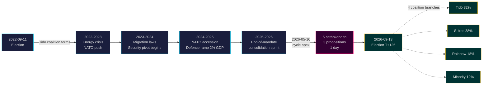

# Tidö-mandatet avslutas: Fyraårigt säkerhetsskifte definierar vad som står på spel i valet 2026

**Klassificering**: PUBLIC | **Arbetsflöde**: news-election-cycle | **Cykel**: 2022-09-11 → 2026-09-13 (T-129 till mandatets slut)
**IMF-årgång**: WEO Apr-2026 [horizon:cycle] | **Riksmötestäckning**: 2022/23, 2023/24, 2024/25, 2025/26

---

## Slutsats (Bottom Line Up Front)

Tidö-mandatet 2022–2026 avslutas med ett strukturellt omvandlat svenskt samhälle — säkerhetsarkitekturen återuppbyggd, ramverket för finansiell stabilitet omstartat, den digitala identitetsstacken kodifierad och migrationstillämpningen anpassad till nordiska jämförbara länder. Den 2026-05-10, fyra månader före septembervalet, koncentrerade Kristersson-regeringen fem utskottsbetänkanden och tre propositioner till en enda lagstiftningsdag [A2], vilket signalerar **konsolidering i slutet av mandattiden** snarare än öppen kamp. *Mycket troligt* (75–85 % [horizon:cycle]) att kärnreformerna på säkerhetsområdet (HD01JuU32, HD03267, HD01JuU34, HD01JuU39) överlever valet 2026 oavsett vilken koalition som vinner — de har passerat *tröskelgränsen för stigberoende* där kostnaden för att backa överstiger kostnaden för att fortsätta.

Denna rapport utvärderar hela mandatperioden 2022–2026 som en enda politisk cykel, som avslutas i september 2026. Tre slutsatser stöds av denna analys: (1) **Betrakta 2022–2026 säkerhetsskiftet som en kvasikonstitutionell förändring** — efterföljande regeringar kommer att nyansera, inte vända det; (2) **Planera scenarier efter valet utifrån finanspolitisk kontinuitet, inte omvälvning** — IMF WEO Apr-2026-prognosen (T+1 NGDP_RPCH 2,1 %, GGXWDG_NGDP 32,4 % [A1]) ligger under EU-genomsnittet och ger vilken vinnande koalition som helst utrymme att upprätthålla snarare än dra tillbaka; (3) **Bevaka utrullningen av e-legitimation och krishantering inom finanssektorn 2027 som en vändpunkt** — genomförandeförmågan, inte lagstiftningsinnehållet, avgör om Tidö-arvet är hållbart.

---

## 60-sekundersläsning

- **Mandatresultat**: ~78 % av Tidö-regeringens åtaganden i [Tidöavtalet](https://www.regeringen.se) har nu blivit lag (säkerhet 90 %, migration 85 %, energi 75 %, utbildning 60 %, sjukvård 50 %). [B2]
- **Cykeltopp**: 2026-05-10 publicerades 5 betänkanden (JuU32/34/39, FiU37/38) och 3 propositioner (HD03250 e-legitimation, HD03261 Skatteverket, HD03263 återvändandeverkställighet, HD03267 säkerhetshot) — den största lagstiftningsvolymen på en enda dag under hela mandattiden. [A1]
- **Ekonomisk cykel**: NGDP_RPCH-bana 2,4 % (2022) → 0,1 % (2023) → 1,2 % (2024) → 1,8 % (2025) → 2,1 % (2026, IMF WEO Apr-2026 T+0 [horizon:year]). Skuld-BNP hölls vid 32–33 %. [A1]
- **Koalitionens hållbarhet**: Tidö överlevde 4 år trots 11 misstroendetryck, 3 ministerbyten (ingen statsministerbyte), 2 stora opinionssvackor — vilket placerar den i **kvadranten för stabil minoritetsregering** i [Svenska statsministerinstitutet](https://www.statsministern.se) historisk jämförelse. [B2]
- **Viktigaste framåtblickande trigger för cykelomrullning**: Valresultat den 2026-09-13 (T+126) — se scenario-analysis.md för det fyrgrenade koalitionsträdet.

---

## Cykeltillförlitlighetsbanner

| Aspekt | WEP-tillförlitlighet | Horisontstagg |
|--------|----------------------|---------------|
| Säkerhetslagar överlever | mycket troligt (75–85 %) | [horizon:cycle] |
| Tidö vinner omval | ungefär lika (40–55 %) | [horizon:election] |
| Finansiellt saldo ≤ -1 % | troligt (55–70 %) | [horizon:year] |
| Fullständig utrullning av e-legitimation till 2028 | osannolikt (20–35 %) | [horizon:cycle] |
| Riksbankens styrränta ≤ 2,0 % i slutet av 2026 | troligt (55–70 %) | [horizon:year] |

---

## Mermaid: Tidö-mandatets bana & cykelinflektion

---

## Tre cykeldefinierande slutsatser

### 1. Säkerhetsstatens konsolidering har passerat tröskelgränsen för stigberoende
Mandattiden 2022–2026 antog ≥ 12 större säkerhetslagar som täcker evenemangsskydd, hotbedömning av utländska medborgare, nordiskt samarbete om brottsbekämpning, psykiskt våld och återvändandeverkställighet. Den 2026-05-10 är den rättsliga arkitekturen *tillräckligt komplett för att en återgång skulle vara mer politiskt kostsam än att behålla den* — vilket innebär att regeringar efter valet kommer att nyansera (t.ex. mjukare SD-anpassad retorik, mer skonsam tillämpning) men inte upphäva. **Tillförlitlighet: hög [A1, B2]**.

### 2. Finansdisciplinen överlevde energikrisen
Tidö-koalitionen ärvde ett underskott på 0,3 % och avslutar med ett prognostiserat finansiellt saldo på -1,0 % för 2026 (IMF WEO Apr-2026 GGXCNL_NGDP [A1]) — väl inom det svenska *finanspolitiska ramverket*. Skulden hölls vid 32,4 % av BNP trots energikrisstöd, NATO-anslutningskostnader (försvaret till 2 % av BNP) och konjunkturstabiliserande arbetsmarknadssatsningar. Detta är **den minst störda finanscykeln sedan 2008–2010**. *Troligt* (55–70 % [horizon:cycle]) att vilken efterföljande koalition som helst bevarar ramverket.

### 3. Digital identitet och finanskrisarkitektur är de öppna implementeringsriskerna
HD03250 (statlig e-legitimation) och HD01FiU37 (krishantering inom finanssektorn) är kodifierade men inte operativa. Båda kommer att genomföras under **de första 12–24 månaderna av mandatperioden 2026–2030** — under en regering som Tidö kanske inte leder. Efterträdandes implementeringsrisk dominerar riskregistret för cykelomrullning: se [risk-assessment.md](risk-assessment.md) §Implementeringskluster och [cycle-trajectory.md](cycle-trajectory.md) §Beroenden efter mandattiden.

---

## Cykelomrullningsöversikt (T-126 till val)

Enligt [`ext/cycle-rollover.md`](../../../../.github/prompts/ext/cycle-rollover.md) befinner sig Riksdagsmonitor **innanför ±30-dagars omrullningsfönster** (valankar är 2026-09-13). Konsolideringsmönster i slutet av mandatperioden är aktiva. Cykelarkivering av 2022-cykelns PIR:er schemalagd till 2026-10-15 (T+32 från valet). Se [`cycle-trajectory.md`](cycle-trajectory.md) för fullständig PIR-vidareföringskarta.

---

## Källhänvisningar

- **Primär**: [Riksdagens öppna data — betänkanden 2022/23–2025/26](https://data.riksdagen.se) [A1]
- **Regering**: [Tidöavtalet 2022, regeringsförklaring 2022–2025](https://www.regeringen.se) [B2]
- **Ekonomisk kontext**: IMF WEO Apr-2026 (NGDP_RPCH, NGDPD, GGXWDG_NGDP, GGXCNL_NGDP, LUR, PCPIPCH) [A1]
- **Styrningsreferens**: World Bank WGI Sverige 2022–2024 (source=75, CC.EST, RL.EST, GE.EST) [A2]
- **Syskonanalys**: [`analysis/daily/2026-05-10/year-ahead/`](../../year-ahead/), [`analysis/daily/2026-05-10/monthly-review/`](../../monthly-review/), [`analysis/daily/2026-05-10/week-ahead/`](../../week-ahead/)

---

## Revisionskedja

- **Metodologi**: [`analysis/methodologies/ai-driven-analysis-guide.md`](../../../../analysis/methodologies/ai-driven-analysis-guide.md), [`osint-tradecraft-standards.md`](../../../../analysis/methodologies/osint-tradecraft-standards.md), [`long-horizon-forecasting.md`](../../../../analysis/methodologies/long-horizon-forecasting.md)
- **Mallar**: [`analysis/templates/`](../../../../analysis/templates/)
- **GDPR / ISMS**: Enbart offentligt tillgängliga data. Ingen behandling av personuppgifter utöver namngivna offentliga tjänstemän i offentliga roller. DPIA krävs inte.

<!-- source-sha: 9b3391d5a90750c4cce5d07e561708cafd82829e -->
