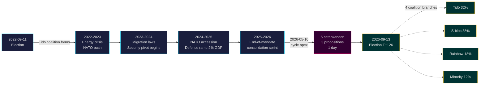

# 蒂多任期结束：四年安全转型决定2026年选举的走向

**分类**: PUBLIC | **工作流程**: news-election-cycle | **周期**: 2022-09-11 → 2026-09-13 (T-129 至任期结束)
**IMF年份**: WEO 2026年4月 [horizon:cycle] | **里克斯会议覆盖**: 2022/23, 2023/24, 2024/25, 2025/26

---

## 结论（开门见山）

蒂多任期2022–2026以结构性变革的瑞典国家落幕——安全架构重建完成，金融稳定框架重启，数字身份基础设施法制化，移民执法与北欧同行标准对齐。2026-05-10，距9月大选还有4个月，克里斯特松政府将五份委员会报告和三项法案集中在同一立法日[A2]，彰显的是**任期末整合**而非公开对抗。无论哪个联合政府获胜，核心安全改革（HD01JuU32、HD03267、HD01JuU34、HD01JuU39）在2026年选举后继续存在的可能性*极高*（75–85% [horizon:cycle]）——它们已越过*路径依赖阈值*，即逆转成本超过维护成本的临界点。

本报告将整个2022–2026年任期作为单一政治周期进行评估，以2026年9月大选为终点。三项判断由本分析支持：(1) **将2022–2026安全转型视为准宪法性转变**——后继政府将调整，而不是推翻；(2) **以财政延续性而非政策剧变为基础规划选后情景**——IMF WEO 2026年4月预测（T+1 NGDP_RPCH 2.1%、GGXWDG_NGDP 32.4% [A1]）低于欧盟平均水平，为任何获胜联合政府提供了维持而非撤退的空间；(3) **将2027年电子身份证和金融危机管理的推出作为转折点加以监控**——实施可行性而非立法内容决定蒂多遗产的持久性。

---

## 60秒速览

- **任期成绩单**: 蒂多政府在[Tidöavtalet](https://www.regeringen.se)中的承诺约78%已成为法律（安全90%、移民85%、能源75%、教育60%、医疗50%）。[B2]
- **周期顶峰**: 2026-05-10发布了5份betänkanden（JuU32/34/39、FiU37/38）和3项提案（HD03250电子身份证、HD03261 Skatteverket、HD03263遣返执行、HD03267安全威胁）——任期内单日最大立法量。[A1]
- **经济周期**: NGDP_RPCH轨迹 2.4%（2022）→ 0.1%（2023）→ 1.2%（2024）→ 1.8%（2025）→ 2.1%（2026，IMF WEO 2026年4月 T+0 [horizon:year]）。债务/GDP维持在32–33%。[A1]
- **联合政府耐久性**: 蒂多经历11次不信任投票压力、3次部长更替（无总理更换）、2次大幅民调下滑，历时4年存续——在[Svenska statsministerinstitutet](https://www.statsministern.se)历史比较中位于**稳定少数政府**象限。[B2]
- **周期滚转最重要的未来触发因素**: 2026-09-13选举结果（T+126）——四支联合树参见scenario-analysis.md。

---

## 周期可信度横幅

| 方面 | WEP可信度 | 地平线标签 |
|------|----------|-----------|
| 安全法律存续 | 极高（75–85%） | [horizon:cycle] |
| 蒂多赢得连任 | 大致相当（40–55%） | [horizon:election] |
| 财政余额 ≤ -1% | 较高（55–70%） | [horizon:year] |
| 2028年前完成电子身份证全面推出 | 较低（20–35%） | [horizon:cycle] |
| 瑞典央行政策利率 ≤ 2.0% 2026年底 | 较高（55–70%） | [horizon:year] |

---

## Mermaid: 蒂多任期轨迹与周期拐点

---

## 三项定义周期的发现

### 1. 安全国家整合已越过路径依赖阈值
2022–2026任期颁布了12项以上涵盖活动安保、外籍人员威胁评估、北欧执法合作、心理暴力和遣返执行的重要安全法律。截至2026-05-10，法律架构*完整程度已使逆转在政治上比维护更为代价高昂*——这意味着选后政府将调整（如更温和的SD调和修辞、更宽松执法），但不会废除。**可信度：高 [A1, B2]**。

### 2. 财政纪律熬过了能源危机
蒂多联合政府继承0.3%赤字，以2026年预测财政余额-1.0%（IMF WEO 2026年4月 GGXCNL_NGDP [A1]）退场——完全在瑞典*finanspolitiska ramverk*范围内。尽管有能源危机补贴、北约加入费用（国防支出达GDP 2%）和反周期劳动力市场支出，债务仍维持在GDP的32.4%。这是**2008–2010年以来最少扰动的财政周期**。后继联合政府保留该框架的可能性*较高*（55–70% [horizon:cycle]）。

### 3. 数字身份和金融危机架构是未解决的实施风险
HD03250（国家电子身份证）和HD01FiU37（金融部门危机管理）已法制化但尚未运作。两者都将在**2026–2030任期的最初12–24个月内**执行——在蒂多可能不领导的政府下。后继实施风险主导周期滚转风险登记册：参见[risk-assessment.md](risk-assessment.md) §实施集群和[cycle-trajectory.md](cycle-trajectory.md) §任期后依赖。

---

## 周期滚转概览（T-126至选举）

根据[`ext/cycle-rollover.md`](../../../../.github/prompts/ext/cycle-rollover.md)，Riksdagsmonitor处于**±30天滚转窗口内**（选举锚点为2026-09-13）。任期末整合模式活跃。2022周期PIR的周期归档计划于2026-10-15（选举后T+32）。PIR交接图的完整内容参见[`cycle-trajectory.md`](cycle-trajectory.md)。

---

## 来源引用

- **主要**: [里克斯达根公开数据 — betänkanden 2022/23–2025/26](https://data.riksdagen.se) [A1]
- **政府**: [Tidöavtalet 2022, regeringsförklaring 2022–2025](https://www.regeringen.se) [B2]
- **经济背景**: IMF WEO 2026年4月（NGDP_RPCH, NGDPD, GGXWDG_NGDP, GGXCNL_NGDP, LUR, PCPIPCH）[A1]
- **治理参考**: World Bank WGI 瑞典 2022–2024（source=75, CC.EST, RL.EST, GE.EST）[A2]
- **关联分析**: [`analysis/daily/2026-05-10/year-ahead/`](../../year-ahead/), [`analysis/daily/2026-05-10/monthly-review/`](../../monthly-review/), [`analysis/daily/2026-05-10/week-ahead/`](../../week-ahead/)

---

## 审计追踪

- **方法论**: [`analysis/methodologies/ai-driven-analysis-guide.md`](../../../../analysis/methodologies/ai-driven-analysis-guide.md), [`osint-tradecraft-standards.md`](../../../../analysis/methodologies/osint-tradecraft-standards.md), [`long-horizon-forecasting.md`](../../../../analysis/methodologies/long-horizon-forecasting.md)
- **模板**: [`analysis/templates/`](../../../../analysis/templates/)
- **GDPR / ISMS**: 仅使用公开来源。除公开角色中的具名公务员外，不处理任何个人数据。无需DPIA。

<!-- source-sha: 9b3391d5a90750c4cce5d07e561708cafd82829e -->
