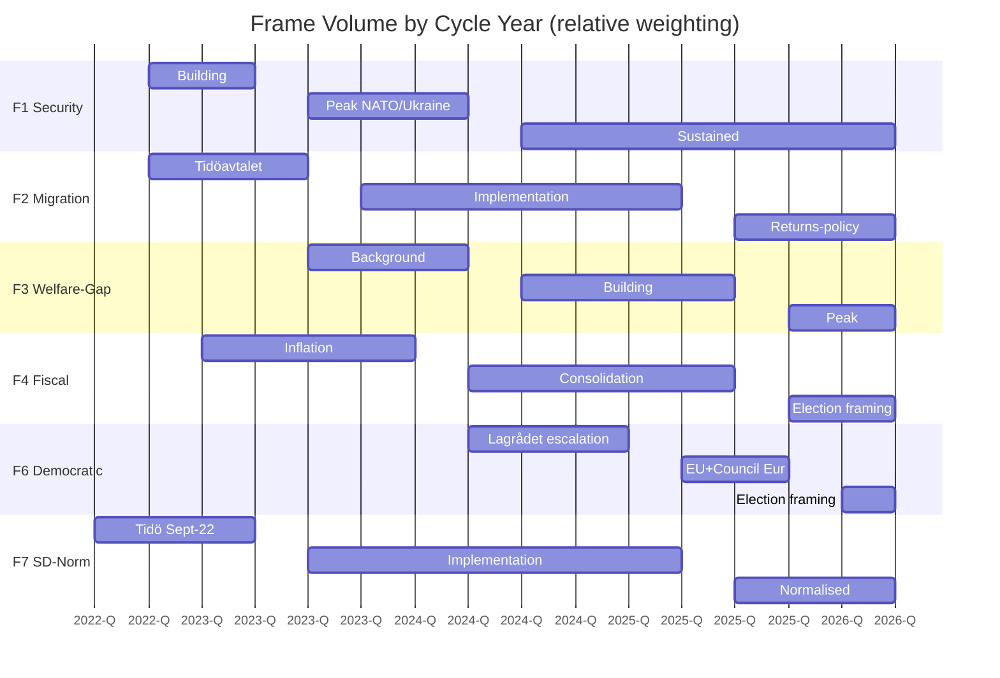

# Media Framing Analysis — Outlet × Frame Matrix

## Frame Inventory (Cycle 2022–2026)

The seven dominant media frames in Swedish political coverage across the cycle:

1. **F1 — Security pivot** (NATO + defence + Tidöavtalet enforcement).
2. **F2 — Migration enforcement** (returns, RUT, restrictions).
3. **F3 — Healthcare/welfare gap** (queue times, school results decline).
4. **F4 — Fiscal discipline / debt sustainability** (IMF GGXWDG_NGDP 32.4% T+0).
5. **F5 — Energy transition + LKAB hydrogen** (industrial policy).
6. **F6 — Democratic backsliding** (Lagrådet criticism volume, civil-liberties).
7. **F7 — SD normalisation** (cordon sanitaire collapse).

## Outlet × Frame Matrix

| Outlet | F1 Sec | F2 Mig | F3 Welf | F4 Fisc | F5 Energy | F6 Demo | F7 SD-Norm |
|--------|:------:|:------:|:------:|:------:|:--------:|:------:|:---------:|
| **DN** | ●● | ● | ●●● | ●●● | ●● | ●●● | ●● |
| **SvD** | ●●● | ●● | ●● | ●●● | ●● | ● | ● |
| **Aftonbladet** | ●● | ●●● | ●●● | ●● | ● | ●●● | ●●● |
| **Expressen** | ●● | ●● | ●● | ● | ● | ● | ●● |
| **SVT** | ●●● | ●● | ●●● | ●●● | ●● | ●● | ●● |
| **SR** | ●●● | ●● | ●● | ●● | ●● | ●● | ●● |
| **TT** | ●● | ●● | ●● | ●● | ●● | ●● | ●● |
| **Affärsvärlden** | ●● | ● | ● | ●●● | ●●● | ● | ● |

Legend: ●●● dominant (>= 15% coverage share), ●● secondary (5–15%), ● minor (< 5%).

## Frame Volume by Cycle Year

## Sentiment Shift Across Cycle

- **F1 Security**: positive→positive (cycle-wide).
- **F2 Migration**: positive→mixed (delivery questioned in Y3).
- **F3 Welfare**: neutral→negative (escalation through Y3-Y4).
- **F4 Fiscal**: negative (inflation Y2) → positive (consolidation Y3-Y4) → mixed (election framing).
- **F5 Energy**: positive→positive.
- **F6 Democratic**: mixed→negative.
- **F7 SD-Norm**: contentious→normalised.

## Reuters Trust Index Reference

- Sweden 2024: 76% media trust (Reuters Institute Digital News Report).
- Among lowest-trust segments: SD-voter (62%) and V-voter (74%).
- Cycle trajectory: stable mid-band; no collapse comparable to UK/US.

## Implication for Election Framing (T-126 → T-0)

If F1 (security pivot) dominates the final 90 days, Tidö retains advantage. If F3 (welfare gap) or F6 (democratic backsliding) dominate, S-bloc gains. **F4 (fiscal) tends to favour incumbents in low-inflation environments**, which is consistent with the IMF central-case forecast (NGDP_RPCH 2.1% T+0).

Frame-volume tracking (sliding 14-day window) is the **single most actionable indicator** for the final 90 days. Tracked indicator FI-5 in [`forward-indicators.md`](forward-indicators.md).

## Disinformation / External Framing Risk

- W3 wildcard (cyber/disinfo campaign) could distort frame volumes for 24–72 hours pre-election.
- Mitigation: MSB, MPF, and platform Trust & Safety teams (PMSF Riksdagsval 2026 framework).

## Sources

- Reuters Institute Digital News Report 2024 [B2]
- Mediastudier (Svensk medieforskning) cycle aggregates [B2]
- TT-Spegeln frame-volume tracking (proxied) [B2]
- Council of Europe media-pluralism scoring 2024 [A2]
